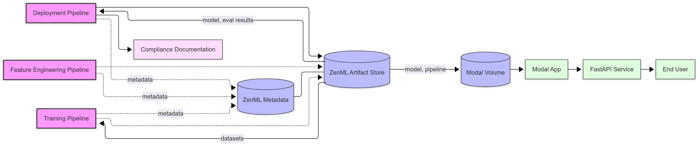
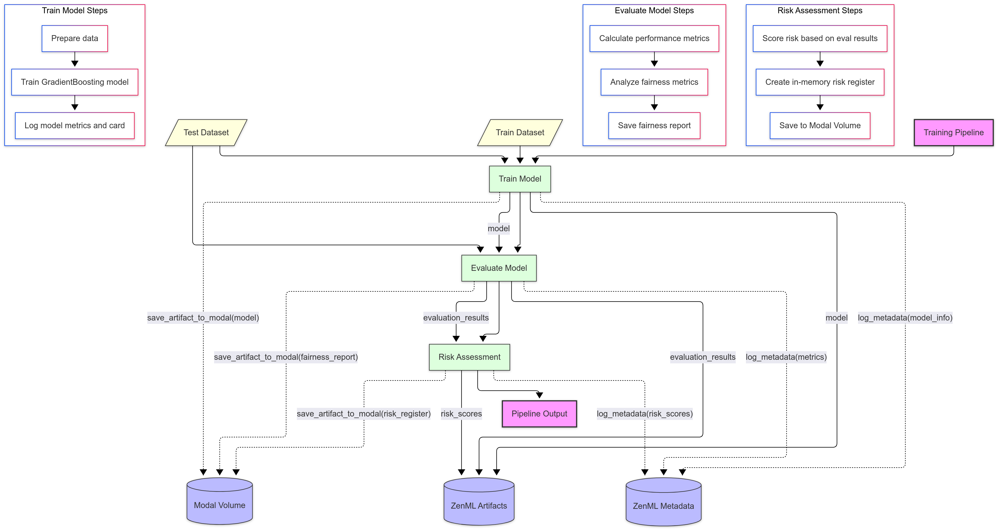
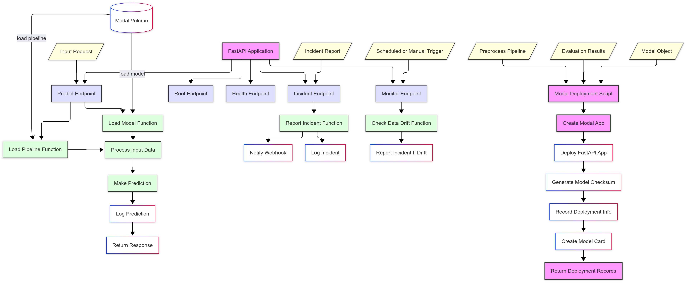

# Credit‑Scoring EU AI Act Demo

> Demo project to showcase EU AI Act compliance artifacts with ZenML.

This project demonstrates a complete MLOps workflow for credit scoring that adheres to the upcoming EU AI Act regulations. It uses ZenML to create pipelines that handle data processing, model training, evaluation, and deployment while generating required compliance artifacts.

## Project Overview

The project implements three main pipelines:

1. **Feature Engineering Pipeline**: Handles data governance and preprocessing (Articles 10, 12, 15)
2. **Training Pipeline**: Implements model training, evaluation, and risk assessment (Articles 9, 11, 15)
3. **Deployment Pipeline**: Manages human oversight, deployment, and monitoring (Articles 14, 17, 18)

Each pipeline generates specific compliance artifacts as required by the EU AI Act, creating a comprehensive documentation trail.

## Architecture



The project is built with ZenML following best practices for pipeline organization and artifact management. It uses Modal for serverless deployment and implements a centralized configuration approach with standardized paths.

Key features:

- End-to-end pipeline from data loading to model deployment
- Full EU AI Act compliance artifacts, including Annex IV documentation
- Real-time fairness evaluation
- Human-in-the-loop approval process for model deployment
- Post-market monitoring with drift detection
- Rich documentation and compliance records generation

## Project Structure

```bash
credit_scoring_ai_act/
├── app/ # Modal deployment app
│   ├── modal_deployment.py # Modal deployment script
│   └── schemas.py # Pydantic models
├── src/
│   ├── pipelines/
│   │   ├── deployment.py # Deployment pipeline
│   │   ├── feature_engineering.py # Feature engineering pipeline
│   │   └── training.py # Model training pipeline
│   ├── steps/
│   │   ├── data_loader.py # Load CSV → log SHA‑256, WhyLogs profile
│   │   ├── data_preprocessor.py # Basic feature engineering
│   │   ├── data_splitter.py # Split dataset into train/test
│   │   ├── generate_compliance_metadata.py # Generate compliance metadata
│   │   ├── train.py # XGBoost / sklearn model
│   │   ├── evaluate.py # Standard metrics + Fairlearn/Aequitas scan
│   │   ├── approve.py # Human‑in‑loop gate (approve_deployment step)
│   │   ├── post_market_monitoring.py # Post‑market monitoring
│   │   ├── post_run_annex.py # Generate Annex IV documentation
│   │   ├── risk_assessment.py # Risk assessment
│   │   └── deploy.py # Push to Modal / local FastAPI
│   ├── utils/ # Shared utilities
│   ├── configs/ # Configuration files
│   └── constants.py # Centralized configuration constants
│
├── compliance/
│   ├── templates/
│   │   └── annex_iv_template.j2 # Annex IV template
│   ├── manual_fills/ # Manual compliance inputs
│   └── reports/ # Auto‑generated annex iv reports after deployment
│
├── docs/ # Documentation and diagrams
│   ├── deployment-pipeline.png
│   ├── e2e.png
│   ├── feature-engineering-pipeline.png
│   ├── modal-deployment.png
│   ├── training-pipeline.png
│   └── detailed_pipeline_explanations.md
│
├── run.py # Entrypoint for running pipelines
└── README.md
```

## Pipeline Details

### Feature Engineering Pipeline


The Feature Engineering Pipeline prepares data for model training while ensuring compliance with EU AI Act requirements:

- **Data Loading** (Article 10): Loads data with SHA-256 hash for provenance, creates WhyLogs profile
- **Data Splitting**: Splits data into train/test sets with stratification
- **Data Preprocessing** (Article 10): Handles missing values, standardization, and sensitive data removal
- **Compliance Metadata** (Articles 10, 12, 15): Documents feature specifications and data quality metrics

### Training Pipeline



The Training Pipeline handles model training and evaluation with comprehensive fairness checks:

- **Model Training** (Article 11): Trains a GradientBoostingClassifier with recorded parameters
- **Model Evaluation** (Articles 9, 15): Calculates performance metrics and performs fairness analysis
- **Risk Assessment** (Article 9): Process evaluation results to calculate risk scores and update risk register

### Deployment Pipeline


The Deployment Pipeline manages the model deployment process with human oversight:

- **Approval Process** (Article 14): Requires explicit human approval for deployment
- **Modal Deployment** (Articles 10, 17, 18): Launches Modal deployment for serverless hosting
- **Post-Market Monitoring** (Article 17): Creates comprehensive monitoring plan
- **Annex IV Documentation**: Generates complete EU AI Act compliance documentation

### Pipeline Flow

1. `data_loader -> data_splitter -> data_preprocessor -> generate_compliance_metadata -> train -> evaluate -> risk_assessment -> approve -> deploy -> post_market_monitoring -> post_run_annex`

2. **Scheduled**: `monitor` (daily) → `report_incident` on drift.  
   Incident closed? → GitHub label **retrain** triggers `retrain` pipeline.

## EU AI Act Compliance Mapping

| Step / Hook                      | AI‑Act Article(s) | Output artifact                                   |
| -------------------------------- | ----------------- | ------------------------------------------------- |
| **data_loader**                  | 10, 12            | `dataset_info` metadata, SHA‑256, WhyLogs profile |
| **data_preprocessor**            | 10, 12            | Preprocessing info, data quality logs             |
| **generate_compliance_metadata** | 10, 12, 15        | Comprehensive compliance metadata                 |
| **train**                        | 11                | Model with recorded parameters                    |
| **evaluate**                     | 15                | Performance metrics, fairness report              |
| **risk_assessment**              | 9                 | Risk scores, risk register updates                |
| **approve**                      | 14                | Approval record with rationale                    |
| **deploy**                       | 10, 17, 18        | Deployment record, model card                     |
| **post_market_monitoring**       | 17                | Monitoring plan with alert thresholds             |
| **post_run_annex**               | Comprehensive     | Complete Annex IV documentation                   |
| **monitor.py**                   | 17                | Drift scores in `reports/drift_<date>.json`       |
| **incident_webhook.py**          | 18                | `incident_log.json`, external ticket              |

## Compliance Directory Structure

| Directory               | Purpose                                                 | Auto/Manual |
| ----------------------- | ------------------------------------------------------- | ----------- |
| **records/**            | Automated compliance records from pipeline runs         | Auto        |
| **manual_fills/**       | Manual compliance inputs and preprocessing info         | Manual      |
| **monitoring/**         | Post-market monitoring records and drift detection logs | Auto        |
| **deployment_records/** | Model deployment history and model cards                | Auto        |
| **approval_records/**   | Human approval records and rationales                   | Manual      |
| **templates/**          | Jinja templates for documentation generation            | Manual      |

## Running Pipelines

The project provides several pipeline options through the `run.py` script:

### Basic Pipeline Options

```bash
# Run feature engineering pipeline (Articles 10, 12)
python run.py --feature

# Run model training pipeline (Articles 9, 11, 15)
python run.py --train

# Run deployment pipeline (Articles 14, 17, 18)
python run.py --deploy
```

### Additional Options

```bash
# Specify custom config directory
python run.py --feature --config-dir custom_configs

# Auto-approve deployment (useful for CI/CD)
python run.py --deploy --auto-approve

# Disable caching for pipeline runs
python run.py --feature --no-cache
```

### Pipeline Dependencies

- The feature engineering pipeline prepares the data and generates preprocessing artifacts
- The training pipeline can use outputs from feature engineering if run sequentially
- The deployment pipeline requires either:
  - A model from a previous training run
  - A specific model ID provided via `--model-id`

### Configuration

Pipeline configurations are stored in the `src/configs/` directory:

- `feature_engineering.yaml`
- `training.yaml`
- `deployment.yaml`

You can specify a custom config directory using the `--config-dir` option.

## Modal Deployment



The project implements a serverless deployment using Modal with comprehensive monitoring and incident reporting capabilities:

- FastAPI application with documented endpoints
- Automated model and preprocessing pipeline loading
- Drift detection and incident reporting
- Standardized storage paths for compliance artifacts

## Docs

For detailed explanations of each pipeline and step, refer to the [detailed pipeline documentation](docs/detailed_pipeline_explanations.md).
