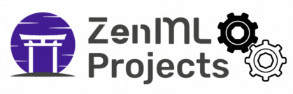
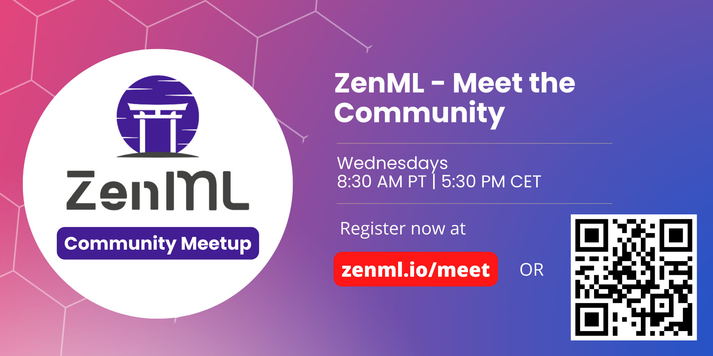

<!-- PROJECT LOGO -->
<br />
<div align="center">
  <a href="https://zenml.io">
    
  </a>

  <h3 align="center">A home for machine learning projects built with <a href="https://github.com/zenml-io/zenml/">ZenML</a> and various integrations.</h3>

  <p align="center">
    Get everything you need to start a project - demo, video, blog, and code.
    <br />
    <a href="https://zenml.io/projects"><strong>ZenML Projects Home Page »</strong></a>
    <br />
    <!-- <div align="center">
      Join our <a href="https://zenml.io/slack" target="_blank">
      
    <b>Slack Community</b> </a> and be part of the ZenML family.
    </div> -->
    <!-- <br />
    <a href="https://zenml.io/features">Features</a>
    ·
    <a href="https://zenml.io/roadmap">Roadmap</a>
    ·
    <a href="https://github.com/zenml-io/zenml/issues">Report Bug</a>
    ·
    <a href="https://zenml.io/discussion">Vote New Features</a>
    ·
    <a href="https://blog.zenml.io/">Read Blog</a>
    ·
    <a href="#-meet-the-team">Meet the Team</a>
    <br /> -->
    <br /> 
    <a href="https://www.linkedin.com/company/zenml/">
    
    </a>
    <a href="https://www.linkedin.com/company/zenml/">
    
    </a>
    <a href="https://twitter.com/zenml_io">
    
    </a>
    <a href="https://www.youtube.com/c/ZenML">
    
    </a>
  </p>
</div>

<!-- MARKDOWN LINKS & IMAGES -->
<!-- https://www.markdownguide.org/basic-syntax/#reference-style-links -->
<!-- SHIELDS -->
[zenmlproject-shield]: https://img.shields.io/badge/ZenML%20Project-Webpage-purple?style=for-the-badge
[youtube-shield]: https://img.shields.io/badge/-YouTube-black.svg?style=for-the-badge&logo=youtube&colorB=red
[github-shield]: https://img.shields.io/badge/-Github-black.svg?style=for-the-badge&logo=github&colorB=black

<!-- NBA -->
[zenmlproject-nba-url]: https://zenml.io/blog/nba-three-pointer-predictor
[youtube-nba-url]: https://www.youtube.com/watch?v=Ne-dt9tu11g&ab_channel=MLOps.community
[github-nba-url]: https://github.com/zenml-io/zenfiles/tree/doc/rename-zenml-project/nba-pipeline

<!-- Atari -->
[zenmlproject-atari-url]: https://zenml.io/blog/playing-atari-games
[youtube-atari-url]: https://www.youtube.com/watch?v=04DbbEzE9ig&ab_channel=ZenML
[github-atari-url]: https://github.com/zenml-io/zenfiles/tree/main/atari-game-play

<!-- Time Series -->
[zenmlproject-timeseries-url]: https://zenml.io/blog/power-forecast
[youtube-timeseries-url]: https://www.youtube.com/watch?v=04DbbEzE9ig&ab_channel=ZenML
[github-timeseries-url]: https://github.com/zenml-io/zenfiles/tree/main/time-series-forecast

<!-- Customer Satisfaction -->
[zenmlproject-satisfaction-url]: https://zenml.io/blog/customer-satisfaction
[youtube-satisfaction-url]: https://www.youtube.com/watch?v=04DbbEzE9ig&ab_channel=ZenML
[github-satisfaction-url]: https://github.com/zenml-io/zenfiles/tree/main/customer-satisfaction

<!-- Customer Churn -->
[zenmlproject-churn-url]: https://zenml.io/blog/customer-churn
[youtube-churn-url]: https://www.youtube.com/watch?v=04DbbEzE9ig&ab_channel=ZenML
[github-churn-url]: https://github.com/zenml-io/zenfiles/tree/main/customer-churn

<!-- Yolov5 -->
[zenmlproject-yolov5-url]: https://zenml.io/blog/sign-language-yolov5
[youtube-yolov5-url]: https://www.youtube.com/watch?v=04DbbEzE9ig&ab_channel=ZenML
[github-yolov5-url]: https://github.com/zenml-io/zenfiles/tree/main/sign-language-detection-yolov5

# 🧱 Project List

A list of updated and maintained Projects by the ZenML team and the community:

| Project                            	| Resources                                                                                                                                                          	| Tags                   	| Stack Components                              	|
|------------------------------------	|--------------------------------------------------------------------------------------------------------------------------------------------------------------------	|------------------------	|-----------------------------------------------	|
| NBA Three-Pointer Predictor        	| [![project][zenmlproject-shield]][zenmlproject-nba-url] [![yt][youtube-shield]][youtube-nba-url] [![yt][github-shield]][github-nba-url]                            	| Time-series            	| mlflow kubeflow evidently sklearn aws discord 	|
| Atari Games Reinforcement Learning 	| [![project][zenmlproject-shield]][zenmlproject-atari-url] [![yt][youtube-shield]][youtube-atari-url] [![yt][github-shield]][github-atari-url]                      	| Reinforcement-learning 	| local                                         	|
| Time Series Forecasting            	| [![project][zenmlproject-shield]][zenmlproject-timeseries-url] [![yt][youtube-shield]][youtube-timeseries-url] [![yt][github-shield]][github-timeseries-url]       	| Time-series            	| vertex                                        	|
| Customer Satisfaction              	| [![project][zenmlproject-shield]][zenmlproject-satisfaction-url] [![yt][youtube-shield]][youtube-satisfaction-url] [![yt][github-shield]][github-satisfaction-url] 	| Tabular                	| mlflow kubeflow                               	|
| Customer Churn                     	| [![project][zenmlproject-shield]][zenmlproject-churn-url] [![yt][youtube-shield]][youtube-churn-url] [![yt][github-shield]][github-churn-url]                      	| Tabular                	| kubeflow seldon                               	|
| YOLOv5 Object Detection            	| [![project][zenmlproject-shield]][zenmlproject-yolov5-url] [![yt][youtube-shield]][youtube-yolov5-url] [![yt][github-shield]][github-yolov5-url]                   	| Computer-vision        	| mlflow vertex                                 	|


# 💻 System Requirements
- Linux or MacOS
- Python 3.7, 3.8 or 3.9


# 🪃 Contributing
We welcome contributions from anyone to showcase your project built using ZenML.

To generate a Project folder we recommend running:

```python
python generate_zenml_project.py PROJECT_NAME  # no requirements needed
```

# 👩‍👩‍👧‍👦 Meet the Team



Every week, the ZenML [core team](https://zenml.io/company#CompanyTeam) will pop in for 30 minutes to interact directly with the community. 
Sometimes we'll be presenting a feature, other times we'll take questions and have fun. 

[Register now](https://zenml.io/meet) for the ZenML Meet the Community session. It's free and open to everyone.

Or subscribe to our [public events calendar](https://calendar.google.com/calendar/u/0/r?cid=Y19iaDJ0Zm44ZzdodXBlbnBzaWplY3UwMmNjZ0Bncm91cC5jYWxlbmRhci5nb29nbGUuY29t) to get notified 
before every community gathering.

# 🆘 Getting Help
By far the easiest and fastest way to get a response is to:

* Ask your questions in [our Slack group](https://zenml.io/slack-invite/).
* [Open an issue](https://github.com/zenml-io/zenml-dashboard/issues/new/choose) on our GitHub repo.


# 🔥 About ZenML
ZenML is an extensible, open-source MLOps framework for creating production-ready ML pipelines. Built for data scientists, it has a simple, flexible syntax, is cloud- and tool-agnostic, and has interfaces/abstractions that are catered towards ML workflows.

If you enjoy these courses and want to learn more:
- Give the <a href="https://github.com/zenml-io/zenml/stargazers" target="_blank">
    
    <b>ZenML Repo</b>
</a> a <b>GitHub Star</b> :star: to show your love!
- Join our <a href="https://zenml.io/slack-invite" target="_blank">
    
    <b>Slack Community</b> 
</a> and become part of the ZenML family!