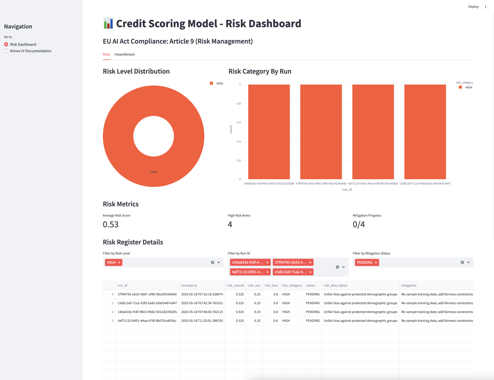

# Credit‑Scoring EU AI Act Demo

> A ZenML‑powered end‑to‑end credit‑scoring workflow that automatically generates the technical evidence required by the [EU AI Act](https://www.zenml.io/blog/understanding-the-ai-act-february-2025-updates-and-implications). This project demonstrates how to build AI systems that meet regulatory requirements while maintaining development efficiency. The EU AI Act, which came into effect in 2024, introduces mandatory compliance requirements for high-risk AI systems, making automated compliance crucial for organizations deploying AI in regulated environments.



## 🚀 Project Overview

The project implements three main pipelines:

1. [**Feature Engineering Pipeline**](src/pipelines/feature_engineering.py): Handles data governance and preprocessing (Articles 10, 12, 15)
   – `ingest → data_splitter → data_preprocessor`

2. [**Training Pipeline**](src/pipelines/training.py): Implements model training, evaluation, and risk assessment (Articles 9, 11, 15)
   – `train_model → evaluate_model → risk_assessment`

3. [**Deployment Pipeline**](src/pipelines/deployment.py): Manages human oversight, deployment, and monitoring (Articles 14, 17, 18)
   – `approve_deployment → modal_deployment → generate_sbom → post_market_monitoring → generate_annex_iv_documentation`

Each run automatically versions its inputs, logs hashes & metrics, and generates a complete Annex IV draft with all required compliance artifacts. These artifacts include an SBOM (Software Bill of Materials), monitoring plan, data profiling reports, risk assessments, and technical documentation.

## Architecture


For detailed diagrams of each pipeline and their compliance mapping, see [Pipeline Diagrams](assets/diagrams.md).

## Project Structure

```bash
credit_scoring_ai_act/
├── modal_app/ # Modal deployment app
│   ├── modal_deployment.py # Modal deployment script
│   └── schemas.py # Pydantic models for API
├── scripts/ # Scripts for updating compliance data
│   ├── update_risk_register.py # Update the risk register
│   └── test_compliance_tracker.py # Test the compliance tracker
├── streamlit_app/ # Streamlit app for compliance tracking
│   ├── components/ # Streamlit components
│   │   ├── executive_summary.py # Executive summary component
│   │   ├── risk_dashboard.py # Risk dashboard component
│   │   └── data_processor.py # Data processing and calculation utilities
│   ├── config.py # Configuration settings
│   └── main.py # Streamlit app entrypoint
├── src/
│   ├── pipelines/
│   │   ├── feature_engineering.py # Feature engineering pipeline
│   │   ├── training.py # Model training pipeline
│   │   └── deployment.py # Deployment pipeline
│   ├── steps/
│   │   ├── feature_engineering/ # Feature engineering steps
│   │   │   ├── ingest.py # Load CSV → log SHA‑256, WhyLogs profile
│   │   │   ├── data_preprocessor.py # Basic feature engineering
│   │   │   └──  data_splitter.py # Split dataset into train/test
│   │   ├── training/ # Training steps
│   │   │   ├── train.py # XGBoost / sklearn model
│   │   │   ├── evaluate.py # Standard + Fairness metrics
│   │   │   └── risk_assessment.py # Risk assessment
│   │   └── deployment/ # Deployment steps
│   │       ├── approve.py # Human‑in‑loop gate (approve_deployment step)
│   │       ├── deploy.py # Deployment to Modal
│   │       ├── post_market_monitoring.py # Post‑market monitoring
│   │       ├── generate_sbom.py # Generate Software Bill of Materials
│   │       └── post_run_annex.py # Generate Annex IV documentation
│   ├── utils/ # Shared utilities
│   │   ├── modal_utils.py # Modal Volume operations
│   │   ├── preprocess.py # Custom sklearn transformers
│   │   ├── eval.py # Evaluation utils
│   │   ├── incidents.py # Incident reporting system
│   │   ├── risk_dashboard.py # Risk visualization dashboard
│   │   ├── annex_iv.py # Annex IV template generation
│   │   ├── compliance/ # Compliance tracking system
│   │   ├── template.py # Template generation utils
│   │   └── visualizations.py # Visualization utils
│   │
│   ├── configs/ # Configuration files
│   └── constants.py # Centralized configuration constants
│
├── docs/
│   ├── compliance.md # EU AI Act Article to Pipeline Step mapping
│   ├── risk/ # Risk assessment documentation
│   │   ├── incident_log.json # Incident tracking
│   │   └── risk_register.xlsx # Risk register
│   ├── releases/ # Compliance artifacts organized by run ID
│   │   └── <run_id>/
│   │      ├── annex_iv_cs_deployment.md  # Annex IV technical documentation
│   │      ├── evaluation_results.yaml    # Model performance metrics and evaluations
│   │      ├── git_info.md                # Git commit and repository information
│   │      ├── monitoring_plan.json       # Model monitoring configuration
│   │      ├── README.md                  # Release-specific information
│   │      ├── risk_scores.yaml           # Risk assessment scores and analysis
│   │      ├── sbom.json                  # Software Bill of Materials
│   │      └── whylogs_profile.html       # Data profiling report
│   └── templates/
│       ├── annex_iv_template.j2 # Annex IV template (Jinja2)
│       ├── sample_inputs.json # Sample inputs for Annex IV template
│       └── qms/ # Quality management system documentation
│           ├── qms_template.md # Core QMS document
│           ├── roles_and_responsibilities.md # Role assignments
│           ├── audit_plan.md # Audit schedule and methodology
│           └── sops/ # Standard Operating Procedures
│               ├── model_release_sop.md # Model release protocol
│               ├── drift_monitoring_sop.md # Monitoring procedures
│               ├── incident_response_sop.md # Incident handling
│               ├── risk_mitigation_sop.md # Risk management process
│               └── data_ingestion_sop.md # Data handling procedures
│
├── assets/ # Pipeline diagrams and documentation
│   ├── deployment-pipeline.png # Deployment pipeline diagram
│   ├── diagrams.md # Detailed pipeline diagrams with explanations
│   ├── e2e.png # End-to-end architecture diagram
│   ├── feature-engineering-pipeline.png # Feature engineering pipeline diagram
│   ├── modal-deployment.png # Modal deployment diagram
│   └── training-pipeline.png # Training pipeline diagram
├── data/ # Dataset directory
│   └── credit_scoring.csv # Credit scoring dataset
├── run.py # CLI entrypoint
└── README.md
```

## Running Pipelines

```bash
# Run feature engineering pipeline (Articles 10, 12)
python run.py --feature

# Run model training pipeline (Articles 9, 11, 15)
python run.py --train

# Run deployment pipeline (Articles 14, 17, 18)
python run.py --deploy
```

Options:

- `--auto-approve` for non‑interactive deployment
- `--no-cache` to disable ZenML caching
- `--config-dir <path>` to override default configs

### Configuration

Pipeline configurations are stored in the `src/configs/` directory:

- [`feature_engineering.yaml`](src/configs/feature_engineering.yaml)
- [`training.yaml`](src/configs/training.yaml)
- [`deployment.yaml`](src/configs/deployment.yaml)

You can specify a custom config directory using the `--config-dir` option.

## Compliance Dashboard

The project includes a Streamlit-based compliance dashboard that provides:

- Real-time visibility into EU AI Act compliance status
- Executive summary of current risk levels and compliance metrics
- Detailed risk assessment visualizations and tracking
- Access to all compliance artifacts from a single interface
- Generated Annex IV documentation with export options

To run the dashboard:

```bash
# Launch the Streamlit compliance dashboard
python run_dashboard.py
```

## Modal Deployment


The project implements a serverless deployment using Modal with basic monitoring and incident reporting capabilities:

- FastAPI application with documented endpoints
- Automated model and preprocessing pipeline loading
- Basic incident reporting functionality
- Standardized storage paths for compliance artifacts

## 🔗 EU AI Act Compliance Mapping

For an overview of how the credit‑scoring pipeline maps to the articles of the EU AI Act, refer to the [compliance_matrix.md](docs/compliance_matrix.md) file.

## Compliance Directory Structure

The repository uses a structured approach to organizing compliance artifacts:

| Directory               | Purpose                                  | Auto/Manual |
| ----------------------- | ---------------------------------------- | ----------- |
| **releases/**           | Compliance artifacts organized by run ID | Auto        |
| **risk/**               | Risk assessment and incident tracking    | Auto/Manual |
| **templates/**          | Templates for document generation        | Manual      |
| **templates/qms/**      | Quality Management System documentation  | Manual      |
| **templates/qms/sops/** | Standard Operating Procedures            | Manual      |

The **releases/** directory contains automatically generated artifacts for each pipeline run, including:

- [Annex IV technical documentation](docs/releases/e7243682-a6f7-4f1d-b8ff-dc8da754994a/annex_iv_cs_deployment.md)
- [Software Bill of Materials](docs/releases/e7243682-a6f7-4f1d-b8ff-dc8da754994a/sbom.json)
- [Model performance metrics](docs/releases/e7243682-a6f7-4f1d-b8ff-dc8da754994a/evaluation_results.yaml)
- [Risk assessment scores](docs/releases/e7243682-a6f7-4f1d-b8ff-dc8da754994a/risk_scores.yaml)
- [Data profiling report](docs/releases/e7243682-a6f7-4f1d-b8ff-dc8da754994a/whylogs_profile.html)
- [Monitoring configuration](docs/releases/e7243682-a6f7-4f1d-b8ff-dc8da754994a/monitoring_plan.json)
- [Git repository information](docs/releases/e7243682-a6f7-4f1d-b8ff-dc8da754994a/git_info.md)

## 📄 Annex IV Documentation

The repository includes an automated Annex IV technical documentation generator that creates comprehensive EU AI Act-compliant documentation for each pipeline run.

### Documentation Components

1. **Template System**:

   - `annex_iv_template.j2` - Jinja2 template for Annex IV documents
   - `sample_inputs.json` - Default inputs for Annex IV fields
   - `src/utils/template.py` - Template rendering utilities
   - `src/utils/annex_iv.py` - Helper functions for metadata collection

2. **Generation Process**:

   - Automatically collects metadata from pipeline runs
   - Extracts metrics from evaluation results
   - Uses sample inputs for standardized sections
   - Assembles a complete technical documentation file

3. **Usage**:
   ```python
   # To customize the template inputs:
   1. Edit docs/templates/sample_inputs.json with your specific values
   2. The template utility will load these values automatically
   ```

## 📋 Quality Management System (Article 17)

This repo delivers all _technical evidence_ (lineage, metadata, logs) required by the EU AI Act. For a complete QMS, you must also maintain formal QMS documentation.

See `docs/templates/qms/` for starter templates:

- **Quality Policy** (`qms_template.md`)
- **Roles & Responsibilities** (`roles_and_responsibilities.md`)
- **Audit Plan** (`audit_plan.md`)
- **SOPs** (`sops/` folder: data ingestion, model release, risk mitigation, etc.)
