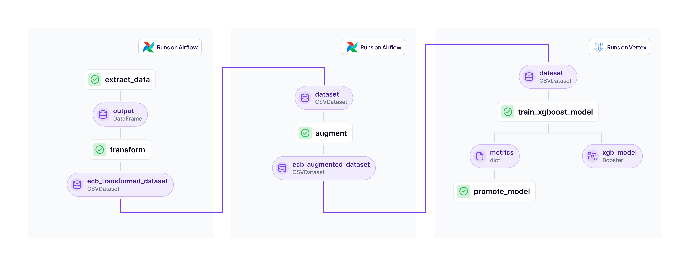

# ZenML ECB Interest Rate Project

This project uses ZenML to create production-ready machine learning pipelines for predicting European Central Bank (ECB) interest rates. It demonstrates best practices for building and iterating on ML pipelines using ZenML's framework and integrations. The [dataset](data/raw_data.csv) is a slightly modified (column names) version of the one available at the [European Central Bank website](https://data.ecb.europa.eu/main-figures/ecb-interest-rates-and-exchange-rates/key-ecb-interest-rates).

## 📊 Project Overview



The project consists of three main pipelines:

1. **ETL Pipeline** (Runs on Airflow)
   - `extract_data`: Extracts raw ECB interest rate data
   - `transform`: Transforms and cleans the data
   - Output: `ecb_transformed_dataset`

2. **Feature Engineering Pipeline** (Runs on Airflow)
   - Input: `ecb_transformed_dataset` 
   - `augment`: Augments the dataset with additional features
   - Output: `ecb_augmented_dataset`

3. **Model Training Pipeline** (Runs on Airflow but the trainer step runs on Vertex AI)
   - Input: `ecb_augmented_dataset` 
   - `train_xgboost_model`: Trains an XGBoost regression model
   - `promote_model`: Evaluates and potentially promotes the new model

## 🚀 Getting Started

The pipelines run in two modes: `develop` and `production`. 

- `develop` mode is the default mode which means no pushing or pulling from GCP occurs. Data is written to and read from
the local file system. This is good to iterate locally, and requires only the `data/raw_data.csv` file to be present.
- `production` mode is what you can switch when you want to run this on a stack that contains Airflow or Vertex AI pipelines. 
It reads from a remote storage location and uses BigQuery to persist the results.

1. Set up a Python virtual environment:

```bash
# Set up a Python virtual environment, if you haven't already
python3 -m venv .venv
source .venv/bin/activate
# Install requirements & integrations
pip install -r requirements.txt
# Install integrations
zenml integration install gcp airflow
```

2. Configure your stack:

- In `develop` mode, the default stack can be used, no changes needed.
- In `production` mode, the default stack can be used as well, but you can build a remote stack like:
  -  A [Cloud Composer pipelines orchestrator](https://docs.zenml.io/stack-components/orchestrators/airflow)
  - A [Vertex AI](https://docs.zenml.io/stack-components/step-operators/vertex)
  - A [GCS artifact store](https://docs.zenml.io/stack-components/artifact-stores/gcp)
  - A [GCP container registry](https://docs.zenml.io/stack-components/container-registries/gcp)

This is very simple using the ZenML [GCP Stack Terraform module](https://registry.terraform.io/modules/zenml-io/zenml-stack/gcp/latest):

```hcl
module "zenml_stack" {
  source  = "zenml-io/zenml-stack/gcp"

  project_id = "your-gcp-project-id"
  region = "europe-west1"
  orchestrator = "vertex" # or "skypilot" or "airflow"
  zenml_server_url = "https://your-zenml-server-url.com"
  zenml_api_key = "ZENKEY_1234567890..."
}
output "zenml_stack_id" {
  value = module.zenml_stack.zenml_stack_id
}
output "zenml_stack_name" {
  value = module.zenml_stack.zenml_stack_name
}
```

To learn more about the terraform script, read the [ZenML documentation.](https://docs.zenml.io/how-to/stack-deployment/deploy-a-cloud-stack-with-terraform) or see
the [Terraform registry](https://registry.terraform.io/modules/zenml-io/zenml-stack).

Looking for a different way to register or provision a stack? Check out the
[in-browser stack deployment wizard](https://docs.zenml.io/how-to/stack-deployment/deploy-a-cloud-stack), or
the [stack registration wizard](https://docs.zenml.io/how-to/stack-deployment/register-a-cloud-stack),
for a shortcut on how to deploy & register a cloud stack.

3. Configure your pipelines:

In order to use `production` mode, please edit the following files with your dataset:

- Point the `data_path` and `table_id` in the [`etl_production`](configs/etl_production.yaml) config to the place where your dataset is
and where you want the data to be stored in BigQuery
- Point the `table_id` in the [`feature_engineering_production`](configs/feature_engineering_production.yaml) config to the place where
you want the output data to be stored.

4. Run the pipelines:

Here are some examples. In general, you should do the etl pipeline first, then the feature engineering, and then the training
pipeline, as they all rely on each other.

```bash
# Run the ETL pipeline
python run.py --etl

# Run the ETL pipeline in production, i.e., using the right keys
python run.py --etl --mode production

# Run the feature engineering pipeline with the latest transformed dataset version
python run.py --feature --mode production

# Run the model training pipeline with the latest augmented dataset version
python run.py --training --mode production

# Run the feature engineering pipeline with a specific transformed dataset version
python run.py --feature --transformed_dataset_version "200"

# Run the model training pipeline with a specific augmented dataset version
python run.py --training --augmented_dataset_version "120"
```

After running the pipelines, you can check the results in the ZenML UI by following the link printed in the terminal.
Next steps:

- Explore the CLI options: python run.py --help
- Review the project structure and code
- Read the ZenML documentation to learn more about ZenML concepts
- Start customizing the project for your specific needs

## 📜 Project Structure

The project follows the recommended ZenML project structure:

├── .assets                  # Asset files for the project
├── .git_cache               # Git cache
├── .zen                     # ZenML configuration files
├── configs                  # Pipeline configuration files
│   ├── etl_develop.yaml
│   ├── etl_production.yaml
│   ├── feature_engineering_develop.yaml
│   ├── feature_engineering_production.yaml
│   ├── training_develop.yaml
│   └── training_production.yaml
├── data                     # Data files
│   └── raw_data.csv
├── materializers            # Custom materializers
│   ├── bq_dataset_materializer.py
│   ├── bq_dataset.py
│   ├── csv_dataset_materializer.py
│   ├── csv_dataset.py
│   └── dataset.py
├── pipelines                # ZenML pipeline implementations
│   ├── etl.py
│   ├── feature_engineering.py
│   └── training.py
├── steps                    # ZenML step implementations
│   ├── extract_data_local.py
│   ├── extract_data_remote.py
│   └── transform.py
├── feature_engineering      # Feature engineering steps
│   ├── augment.py
│   └── promote.py
├── training                 # Training steps
│   └── model_trainer.py
├── tmp                      # Temporary files
├── .dockerignore
├── .gitignore
├── demo.py                  # Demo script
├── LICENSE
├── Makefile
├── README.md                # This file
├── requirements.txt         # Python dependencies
└── run.py                   # CLI tool to run pipelines

Feel free to modify and expand upon this project to suit your specific ECB interest rate prediction needs!