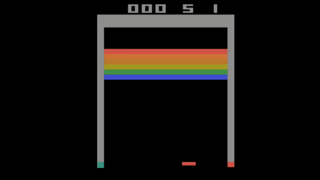

# Atari - Solving Games with AI 🤖

I will be using ZenML to build a model that can solve Atari games using reinforcement learning. I will be using the [Atari 2600](https://en.wikipedia.org/wiki/Atari_2600) game environment. I will be using the [Deep Q-Learning](https://en.wikipedia.org/wiki/Deep_Q-learning) algorithm to solve the game. I found this Github repo, [Building a Powerful DQN in TensorFlow 2.0](https://github.com/sebtheiler/tutorials/tree/main/dqn), to get started with our solution. I will be using OpenAI Gym which is a toolkit that provides a wide variety of simulated environments (Atari games, board games, 2D and 3D physical simulations, and so on), so you can train agents, compare them. I will be using the `BreakoutDeterministic-v4` environment from OpenAI Gym.

ZenML is an extensible, open-source MLOps framework to create production-ready machine learning pipelines. Built for data scientists, it has a simple, flexible syntax, is cloud- and tool-agnostic, and has interfaces/abstractions that are catered towards ML workflows.

In the real world, building reinforcement learning applications can be challenging so I will be using ZenML (an MLOps framework) which allows for the deployment of models which can be used across the organization. ZenML is an extensible, open-source MLOps framework to create production-ready machine learning pipelines. Built for data scientists, it has a simple, flexible syntax, is cloud- and tool-agnostic, and has interfaces/abstractions that are catered towards ML workflows. ZenML pipelines execute ML-specific workflows from sourcing data to splitting, preprocessing, training, all the way to the evaluation of results and even serving.

A fully trained agent that plays Atari Breakout, will look like this: ```



## 🐍 Python Requirements

Before running this project, you have to install some python packages in your environment which you can do by following steps:

```
git clone https://github.com/zenml-io/zenfiles.git
cd atari-game-play
pip install -r requirements.txt
```

## 📓 Diving into the code

We're ready to go now. You can run the code, using the `run_pipeline.py` script.

```
python run.py
```

## 📓 Explanation of Code

Here is a short summary of what each step does:

- `dqn/model.py` This file consists of all the utility functions and classes which we need for developing our steps. All the classes and functions are explained in detail in their respective docstrings.
- `pipelines/training_pipeline` This file has the pipeline for training the model, built using the ZenML pipeline module.

- `steps/game_wrap.py` It is a wrapper for the Gym environment. It will manage the state fed to the DQN.
- `steps/build_dqn.py` It builds the DQN model in Keras.

- `steps/replay_buffer.py` It takes care of managing the stored experiences and sampling from them on demand.
- `steps/agent.py` It will put together the Keras DQN model (including the target network) and the ReplayBuffer. It will take care of things like choosing the action and performing gradient descent.
- `steps/get_information_meta.py` It returns a set of lists like frame number, rewards, and loss lists.
- `steps/train.py` It trains your model.
