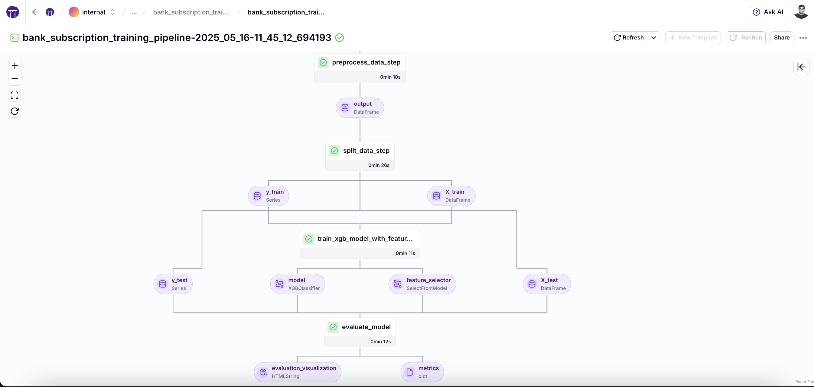

# 🏦 Bank Subscription Prediction

A production-ready MLOps pipeline for predicting bank term deposit subscriptions using XGBoost.

<div align="center">
  <br/>
    
  <br/>
  <p><em>ZenML visualization of the training pipeline DAG</em></p>
</div>

## 🎯 Business Context

In banking, accurate prediction of which customers are likely to subscribe to term deposits helps optimize marketing campaigns and increase conversion rates. This project provides a production-ready prediction solution that:

- Predicts the likelihood of customers subscribing to term deposits
- Handles class imbalance common in marketing datasets
- Implements feature selection to identify key factors influencing subscriptions
- Provides interactive visualizations of model performance

## 📊 Data Overview

This project uses the [Bank Marketing dataset](https://archive.ics.uci.edu/ml/datasets/bank+marketing) from the UCI Machine Learning Repository. The dataset contains:

- Customer demographic information (age, job, marital status, education)
- Financial attributes (housing, loan, balance)
- Campaign details (contact channel, day, month, duration)
- Previous campaign outcomes
- Target variable: whether the client subscribed to a term deposit (yes/no)

The data loader will automatically download and cache the dataset if it's not available locally. No need to manually download the data!

## 🚀 Pipeline Architecture

The project implements a complete ML pipeline with the following steps:

1. **Data Loading**: Auto-download or load the bank marketing dataset
2. **Data Cleaning**: Handle missing values and outliers
3. **Data Preprocessing**: Process categorical variables, drop unnecessary columns
4. **Data Splitting**: Split data into training and test sets
5. **Model Training**: Train an XGBoost classifier with selected features
6. **Model Evaluation**: Evaluate model performance and visualize results with interactive HTML visualization

## 💡 Model Details

This solution uses XGBoost, specifically designed to handle:

- **Class Imbalance**: Targets the common problem in marketing datasets where positive responses are rare
- **Feature Importance**: Automatically identifies and ranks the most influential factors
- **Scalability**: Efficiently processes large customer datasets
- **Performance**: Consistently outperforms traditional classifiers for this type of prediction task

## 🛠️ Getting Started

### Prerequisites

- Python 3.9+
- ZenML installed and configured

### Installation

```bash
# Clone the repository
git clone https://github.com/zenml-io/zenml-projects.git
cd zenml-projects/bank_subscription_prediction

# Install dependencies
pip install -r requirements.txt

# Initialize ZenML (if needed)
zenml init
```

### Running the Pipeline

#### Basic Usage

```bash
python run.py
```

#### Using Different Configurations

```bash
python run.py --config configs/more_trees.yaml
```

### Available Configurations

| Config File | Description | Key Parameters |
|-------------|-------------|----------------|
| `baseline.yaml` | Default XGBoost parameters | Base estimators and depth |
| `more_trees.yaml` | Increased number of estimators | 200 estimators |
| `deeper_trees.yaml` | Increased maximum tree depth | Max depth of 5 |

## 📁 Project Structure

```
bank_subscription_prediction/
├── configs/             # YAML Configuration files
│   ├── __init__.py
│   ├── baseline.yaml    # Baseline experiment config
│   ├── more_trees.yaml  # Config with more trees
│   └── deeper_trees.yaml# Config with deeper trees
├── pipelines/           # ZenML pipeline definitions
│   ├── __init__.py
│   └── training_pipeline.py
├── steps/               # ZenML pipeline steps
│   ├── __init__.py
│   ├── data_loader.py
│   ├── data_cleaner.py
│   ├── data_preprocessor.py
│   ├── data_splitter.py
│   ├── model_trainer.py
│   └── model_evaluator.py
├── utils/               # Utility functions and helpers
│   ├── __init__.py
│   └── model_utils.py
├── __init__.py
├── requirements.txt     # Project dependencies
├── README.md            # Project documentation
└── run.py               # Main script to run the pipeline
```

## 🔧 Creating Custom Configurations

You can create new YAML configuration files by copying and modifying existing ones:

```yaml
# my_custom_config.yaml
# Start with copying an existing config and modify the values
# environment configuration
settings:
  docker:
    required_integrations:
      - sklearn
      - pandas
    requirements:
      - matplotlib
      - xgboost
      - seaborn
      - plotly
      - jupyter

# Model Control Plane config
model:
  name: bank_subscription_classifier
  version: 0.1.0
  license: MIT
  description: A bank term deposit subscription classifier
  tags: ["bank_marketing", "classifier", "xgboost"]

# Custom step parameters
steps:
  # ...other step params...
  train_xgb_model_with_feature_selection:
    n_estimators: 300
    max_depth: 4
    # ...other parameters...
```

## 📈 Example Use Case: Marketing Campaign Optimization

A retail bank uses this pipeline to:

1. Train models on historical marketing campaign data
2. Identify key customer segments most likely to convert
3. Deploy targeted campaigns to high-probability customers
4. Achieve 35% higher conversion rates with 25% lower campaign costs

## 🔄 Integration with Banking Systems

This solution can be integrated with existing banking systems:

- **CRM Systems**: Feed predictions into customer relationship management systems
- **Marketing Automation**: Provide segments for targeted campaign execution
- **BI Dashboards**: Export prediction insights to business intelligence tools
- **Customer Service**: Prioritize high-value potential customers for follow-up

## 👏 Credits

This project is based on the Jupyter notebook [predict_bank_cd_subs_by_xgboost_clf_for_imbalance_dataset.ipynb](https://github.com/IBM/xgboost-financial-predictions/blob/master/notebooks/predict_bank_cd_subs_by_xgboost_clf_for_imbalance_dataset.ipynb) from IBM's xgboost-financial-predictions repository. The original work demonstrates XGBoost classification for imbalanced datasets and has been adapted into a complete ZenML pipeline.

## 📄 License

This project is licensed under the Apache License 2.0. 