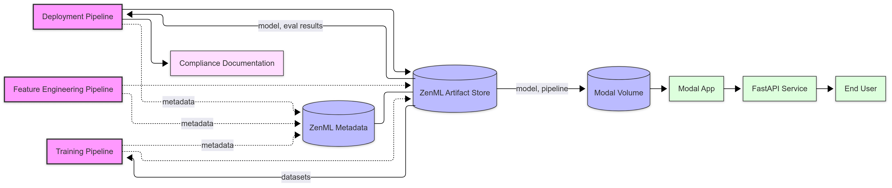

# Credit Scoring EU AI Act Demo

Automatically generate complete EU AI Act compliance documentation with minimal manual effort for credit scoring models.

<div align="center">  </div>

## 🎯 Regulatory Context

Financial institutions must comply with the EU AI Act for any high‑risk AI system. Meeting Articles 9–18 requires extensive documentation and auditing. This pipeline delivers a production‑ready workflow that:

- Generates all required technical evidence automatically
- Ensures robust risk management and human oversight
- Maintains full audit trails with versioned artifacts
- Provides real‑time compliance dashboards for stakeholders

## 🔍 Data Overview

This project uses a credit scoring dataset based on the Home Credit Default Risk data. The raw dataset contains potentially sensitive attributes such as `CODE_GENDER`, `DAYS_BIRTH`, `NAME_EDUCATION_TYPE`, `NAME_FAMILY_STATUS`, and `NAME_HOUSING_TYPE`, which can be filtered using the pipeline's `sensitive_attributes` parameter to comply with fairness requirements.

Key fields used for modeling:

| Field              | Description                                     |
| ------------------ | ----------------------------------------------- |
| `AMT_INCOME_TOTAL` | Annual income of the applicant                  |
| `AMT_CREDIT`       | Credit amount of the loan                       |
| `AMT_ANNUITY`      | Loan annuity amount                             |
| `EXT_SOURCE_1/2/3` | External source scores (credit history proxies) |
| `TARGET`           | Default indicator (0 = no default, 1 = default) |

Automated preprocessing handles:

- Missing value imputation using SimpleImputer
- Feature scaling with StandardScaler (optional)
- Categorical encoding with OneHotEncoder
- Feature engineering including age derivation from `DAYS_BIRTH`

## 🚀 Pipeline Architecture

<div>  </div>

The system implements three main pipelines that map directly to EU AI Act requirements:

| Pipeline                                                        | Key Steps                                                                                                                                                  | EU AI Act Focus |
| --------------------------------------------------------------- | ---------------------------------------------------------------------------------------------------------------------------------------------------------- | --------------- |
| **[Feature Engineering](src/pipelines/feature_engineering.py)** | **Ingest** → Record SHA‑256 provenance 📥<br>**Profile** → WhyLogs data governance 📊<br>**Preprocess** → Impute, encode, normalize 🔧                     | Arts 10, 12, 15 |
| **[Training](src/pipelines/training.py)**                       | **Train** → LightGBM w/ class‑imbalance handling 🎯<br>**Evaluate** → Accuracy, AUC, fairness analysis ⚖️<br>**Assess** → Risk scoring & model registry 📋 | Arts 9, 11, 15  |
| **[Deployment](src/pipelines/deployment.py)**                   | **Approve** → Human oversight gate 🙋‍♂️<br>**Deploy** → Modal API deployment 🚀<br>**Monitor** → SBOM + post‑market tracking 📈                              | Arts 14, 17, 18 |

Each pipeline run automatically versions all inputs/outputs, generates profiling reports, creates risk assessments, produces SBOM, and compiles complete Annex IV technical documentation.

## 🛠️ Project Structure

```
credit-scorer/
│
├── run.py                  # Main pipeline execution script
├── run_dashboard.py        # Dashboard launcher
│
├── src/
│   ├── data/               # Dataset directory
│   ├── pipelines/          # Pipeline definitions
│   ├── steps/              # Pipeline step implementations
│   ├── configs/            # Configuration files
│   ├── utils/              # Utility functions
│   └── constants/          # Project constants
│
├── streamlit_app/          # Compliance dashboard
├── modal_app/              # Modal deployment code
├── docs/                   # Documentation and compliance artifacts
├── models/                 # Saved model artifacts
├── assets/                 # Images and static resources
└── scripts/                # Helper scripts
```

## 🚀 Getting Started

### Prerequisites

- Python 3.12+
- ZenML >= 0.82.1
- Modal account (for deployment pipeline)
- WhyLogs integration (for data profiling)

### Installation & Configuration

1. Install dependencies

```bash
pip install -r requirements.txt
```

2. Set up ZenML

```bash
zenml init
```

3. Install [WhyLogs integration](https://docs.zenml.io/stacks/stack-components/data-validators/whylogs):

```bash
zenml integration install whylogs -y
zenml data-validator register whylogs_data_validator --flavor=whylogs
zenml stack update <STACK_NAME> -dv whylogs_data_validator
```

## 📊 Running Pipelines

### Basic Commands

```bash
# Run individual pipelines
python run.py --feature    # Feature engineering (Articles 10, 12)
python run.py --train      # Model training (Articles 9, 11, 15)
python run.py --deploy     # Deployment (Articles 14, 17, 18)

# Pipeline options
python run.py --train --auto-approve     # Skip manual approval steps
python run.py --feature --no-cache       # Disable ZenML caching
python run.py --deploy --config-dir ./my-configs  # Custom config directory
```

### View Compliance Dashboard

The project includes a Streamlit-based compliance dashboard that provides:

- Real-time visibility into EU AI Act compliance status
- Executive summary of current risk levels and compliance metrics
- Generated Annex IV documentation with export options

To run the dashboard:

```bash
# Launch the Streamlit compliance dashboard
python run_dashboard.py
```

> **Note:** All compliance artifacts are also directly accessible through the ZenML dashboard. The Streamlit dashboard is provided as a convenient additional interface for browsing compliance information interactively.

### 🔧 Configuration

Pipeline configurations are stored in `src/configs/`:

- `feature_engineering.yaml` - Data processing and profiling settings
- `training.yaml` - Model training and evaluation parameters
- `deployment.yaml` - Deployment and monitoring configuration

### ☁️ Cloud Deployment

You can store artifacts and run pipelines locally, but storing them in the cloud enables you to [visualize the data artifacts produced by pipelines](https://docs.zenml.io/concepts/artifacts/visualizations) directly in the ZenML dashboard.

See the [Cloud Deployment Guide](docs/guides/cloud_deployment.md) for step-by-step instructions on setting up a cloud artifact store and orchestrator.

### 📄 Generated Artifacts

Each pipeline run creates a unique release directory in `docs/releases/<run_id>/` containing all compliance artifacts. Here are some guides to help you navigate the artifacts produced and what ZenML features were leveraged to produce them:

- [Data Sources](docs/guides/compliance_data_sources.md)
- [Pipeline Steps → Articles](docs/guides/pipeline_to_articles.md)
- [Article Coverage Matrix](docs/guides/interdependencies.md)
- [ZenML Feature Mapping](docs/guides/zenml_eu_act_features.md)

## 📚 Documentation

- **[ZenML Documentation](https://docs.zenml.io/)**
- **[EU AI Act Compliance Traceability](docs/guides/compliance_traceability.md)**
- **[QMS Templates](docs/templates/qms/)** - Quality management system documentation templates

**Note**: This project provides the technical evidence required by the EU AI Act. For complete compliance, organizations must also maintain formal quality management documentation and processes.

### Additional Resources

- [EU AI Act](https://eur-lex.europa.eu/legal-content/EN/TXT/?uri=CELEX:32024R1689)
- [WhyLogs Documentation](https://whylogs.readthedocs.io/en/latest/index.html)
- [Modal Documentation](https://modal.com/docs)

## 📄 License

This project is licensed under the Apache License 2.0.
