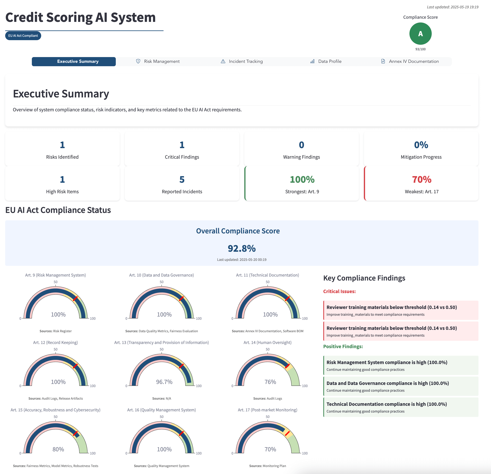

# Annex IV: Technical Documentation for deployment

*Generated on 2025-05-22 19:11:51*

---

## 1. General Description of the AI System

### 1(a) Intended Purpose and Version

| **Field** | **Value** |
|-----------|-----------|
| **System Name** | deployment |
| **Provider** | ZenML GmbH |
| **Description** | EU AI Act Compliant Credit Scoring System for financial institutions |
| **Pipeline Version** | `16be1bde-e2f8-43a8-a2e2-7cc2499ced68` |
| **Pipeline Run Version** | `cf52cd4e-5bc2-45e9-b24d-ad5f2902829f` |

 **Previous Versions:**

|Version|Run ID|Created|Status|
|---|---|---|---|
|||||
|deployment-2025_05_22-23_16_32_538914|`0501a8c2`|2025-05-22 23:16:33|failed|
|||||
|deployment-2025_05_22-21_59_31_333473|`fbe47891`|2025-05-22 21:59:32|completed|
|||||
|deployment-2025_05_22-21_14_54_813231|`8a380195`|2025-05-22 21:14:55|completed|
|||||
|deployment-2025_05_22-01_20_01_128527|`3e3ab14b`|2025-05-22 01:20:02|completed|
|||||
|deployment-2025_05_22-00_46_45_725558|`6ad3a2c8`|2025-05-22 00:46:46|completed|
|||||
|deployment-2025_05_22-00_13_14_536604|`5a1076a7`|2025-05-22 00:13:15|completed|
|||||
|||||

**Intended Purpose:**
To evaluate credit risk for loan applicants by providing an objective, fair, and transparent score based on financial history and demographic data.

### 1(b) System Interactions


**ZenML Stack Configuration:**

- **Stack Name:** local-s3
- **Stack ID:** `7a338bb7-c1b6-4c17-b2d4-6b5ca64c1723` 
- **Created:** 2025-02-24 13:52:30  
- **Updated:** 2025-05-22 17:25:13  

**Stack Components:**


#### Alerter Components

|Name|Flavor|Integration|Component ID|
|---|---|---|---|
|||||
|deployer_slack_alerter|slack|slack|`00930ea9`|
|||||


#### Orchestrator Components

|Name|Flavor|Integration|Component ID|
|---|---|---|---|
|||||
|default|local|built-in|`749034d4`|
|||||


#### Data_validator Components

|Name|Flavor|Integration|Component ID|
|---|---|---|---|
|||||
|whylogs_data_validator|whylogs|whylogs|`c18d0ba6`|
|||||


#### Artifact_store Components

|Name|Flavor|Integration|Component ID|
|---|---|---|---|
|||||
|aws-zenml-dev|s3|s3|`f4d2a196`|
|||||


**Additional System Interactions:**
The system processes applicant data through a standardized input format and provides credit risk scores through a REST API. It integrates with ZenML for model versioning and deployment management, and Modal for serverless deployment. The system maintains a risk register and incident log for compliance tracking.

### 1(c) Software Versions


**Code Version Control:**
- **Pipeline Commit:** `d0912589685ee746ffe5cf2ecda59ad13eb5425f`

- **Repository:** https://github.com/zenml-io/zenml-projects/


**Framework Versions:**

| Framework | Version |
|-----------|---------|
| cyclonedx-python-lib | >=10.0.1 |
| fairlearn | >=0.12.0 |
| pyyaml | >=6.0.0 |
| markdown | >=3.8 |
| matplotlib | >=3.10.3 |
| modal | >=0.74.55 |
| openpyxl | >=3.1.5 |
| pandas | >=2.2.3 |
| plotly | >=6.0.1 |
| scikit-learn | >=1.6.1 |
| seaborn | >=0.13.2 |
| slack-sdk | >=3.35.0 |
| streamlit | >=1.45.1 |
| streamlit-option-menu | >=0.4.0 |
| tabulate | >=0.9.0 |
| weasyprint | >=65.1 |
| whylogs | latest |
| xlsxwriter | >=3.2.3 |
| zenml | >=0.82.1 |


### 1(d) Deployment Forms

**Deployment Configuration:**

- **Type:** Modal + FastAPI (Serverless API deployment with auto-scaling)
- **Environment:** Production
- **Scaling:** Automatic   

||

### 1(e) Hardware Requirements

**Compute Resources:**

Standard deployment: 2 vCPU, 1 GB RAM, 10GB disk


### 1(f) Product Appearance


*Figure 1: System Architecture Overview*


### 1(g) User Interface for Deployer



*Figure 2: Deployment Interface*


### 1(h) Instructions for Use


**Documentation Resources:**
- [User Guide](../../../README.md)
- [API Documentation](../../../modal_app/api_guide.md)


---

## 2. Detailed Description of Elements and Development Process

### 2(a) Development Methods and Third-party Tools

**Pipeline Execution History:**


#### feature_engineering
*Run ID: `382531a2-0e5a-4f5f-a53d-153fc9cd8939`*

| Step Name | Status | Inputs | Outputs |
|-----------|--------|---------|---------|
| **data_preprocessor** | ✅ completed | dataset_tst=`612f3372`, dataset_trn=`c308ead2` | preprocess_pipeline=[`5c7813fa`], train_df=[`c22d17f3`], test_df=[`e48af6c2`] |
| **ingest** | ✅ completed | - | credit_scoring_df=[`084b58a0`] |
| **data_profiler** | ✅ completed | df=`084b58a0` | whylogs_profile=[`a2edf848`] |
| **data_splitter** | ✅ completed | dataset=`084b58a0` | raw_dataset_tst=[`612f3372`], raw_dataset_trn=[`c308ead2`] |


#### training
*Run ID: `0c566746-1146-4a78-acd1-a1c2137b4eec`*

| Step Name | Status | Inputs | Outputs |
|-----------|--------|---------|---------|
| **train_model** | ✅ completed | train_df=`c22d17f3`, test_df=`e48af6c2` | optimal_threshold=[`17a1d151`], credit_scorer=[`50717c46`] |
| **risk_assessment** | ✅ completed | evaluation_results=`28b09408` | risk_scores=[`d5d2eee7`] |
| **evaluate_model** | ✅ completed | optimal_threshold=`17a1d151`, model=`50717c46`, test_df=`e48af6c2` | evaluation_results=[`28b09408`], evaluation_visualization=[`ead5fe10`] |


#### deployment
*Run ID: `cf52cd4e-5bc2-45e9-b24d-ad5f2902829f`*

| Step Name | Status | Inputs | Outputs |
|-----------|--------|---------|---------|
| **generate_annex_iv_documentation** | 🔄 running | evaluation_results=`28b09408`, deployment_info=`60095122`, risk_scores=`d5d2eee7` | - |
| **modal_deployment** | ✅ completed | evaluation_results=`28b09408`, approval_record=`3e1ce211`, model=`50717c46`, preprocess_pipeline=`5c7813fa`, approved=`9ae0d179` | deployment_info=[`60095122`] |
| **approve_deployment** | ✅ completed | evaluation_results=`28b09408`, risk_scores=`d5d2eee7` | approval_record=[`3e1ce211`], approved=[`9ae0d179`] |


**Development Environment:**
- **Source Code Repository:** https://github.com/zenml-io/zenml-projects/
- **Version Control System:** Git
- **CI/CD Platform:** ZenML Pipelines

### 2(b) Design Specifications

| **Specification** | **Details** |
|-------------------|-------------|
| **Model Architecture** | Gradient Boosting Decision Tree (XGBoost) |
| **Optimization Objective** | Maximize balanced accuracy while minimizing fairness disparities across protected demographic groups |

**Design Rationale and Assumptions:**

The model assumes applicants have a reasonably complete financial history and operates under stable macroeconomic conditions. It also assumes data quality standards are maintained across input sources.


**Compliance Trade-offs:**

To ensure EU AI Act compliance, we prioritized model explainability and fairness over maximum predictive performance. We implemented post-processing fairness constraints and transparent feature importance, which slightly reduced raw accuracy but significantly improved demographic fairness and transparency.


### 2(c) System Architecture


*Figure 3: Detailed System Architecture*


**Computational Resources:**

Training infrastructure: 2 vCPU, 1 GB RAM. Inference runs on standard 2 vCPU, 1 GB RAM instances with auto-scaling based on demand. ZenML orchestration requires minimal additional resources.


### 2(d) Data Requirements and Provenance


**Dataset Overview:**
- **Name:** Credit Scoring Dataset
- **Source:** Historical loan application data (5-year span)
- **Size:** ~10,000 records
- **Features:** Age, income, employment, credit history, debt, payment history
- **Target:** Binary credit risk classification


**Data Processing Methodology:**

Training data is derived from a balanced historical loan dataset spanning 5 years with approximately 20,000 records. Sensitive attributes (gender, age) are protected during model training with fairness constraints. Feature engineering follows established credit risk assessment standards, with data cleaning and normalization protocols to handle outliers and missing values.


### 2(e) Human Oversight Assessment


Human oversight is implemented through a mandatory approval workflow before any deployment. The system's risk score output includes confidence intervals and feature importance to assist human reviewers. High-risk cases and those with potential bias are automatically flagged for human review, with specific thresholds established for different demographic groups.


### 2(f) Predetermined Changes and Continuous Compliance


The continuous compliance framework includes: (1) Daily automated monitoring of model drift metrics, (2) Weekly fairness audits across protected attributes, (3) Monthly performance reviews of model outputs, (4) Quarterly comprehensive compliance reassessments with stakeholder reviews, and (5) Incident response protocols for any detected bias or performance issues.


### 2(g) Validation and Testing Procedures

**Performance Metrics:**

| Metric | Value |
|--------|-------|
| Accuracy | None |
| Auc | None |
| Precision | None |
| Recall | None |
| F1_score | None |
| Optimal_threshold | None |


**Fairness Assessment:**

| Fairness Metric | Score |
|-----------------|-------|
| Demographic Parity Gender | None |
| Equal Opportunity Gender | None |
| Accuracy Disparity Gender | None |
| Selection Rate Disparity Gender | None |
| Accuracy Disparity Education | None |
| Selection Rate Disparity Education | None |
| Accuracy Disparity Housing | None |
| Selection Rate Disparity Housing | None |
| Overall Fairness Score | None |


**Bias Mitigation Measures:**

Our comprehensive bias mitigation approach includes: (1) Balanced dataset sampling for training, (2) Regular bias audits across protected attributes including gender, age, education level, family status, and housing type, (3) Post-processing fairness adjustments to equalize performance across demographic groups, and (4) Continuous monitoring of selection rate disparities for real-time fairness assessment.


### 2(h) Cybersecurity Measures


Security measures include: (1) End-to-end encryption for all data in transit and at rest, (2) Access controls with role-based permissions for model interaction, (3) Audit logging of all system access and predictions, (4) Regular vulnerability assessments of the deployment infrastructure, (5) Secure CI/CD pipeline with automated security scanning, and (6) Protection against model extraction or adversarial attacks.


---

## 3. Monitoring, Functioning and Control

**System Capabilities and Limitations:**


- **Expected Accuracy:** *[REQUIRED: Specify expected accuracy level]*


**System Limitations:**

The system has verified limitations including: (1) Lower accuracy for applicants with limited credit history, (2) Potential for reduced performance during significant macroeconomic shifts, (3) Reduced explainability for edge cases, and (4) Applicability only within the regulatory jurisdiction it was trained for. The model should always be used as a decision support tool, not as the sole determining factor for credit decisions.


**Foreseeable Unintended Outcomes:**

Potential unintended outcomes include: (1) Risk of perpetuating historical biases present in training data despite mitigation measures, (2) Possible feedback loops where denied applicants cannot build sufficient credit history for future approval, (3) Over-reliance on algorithmic decisions by human reviewers (automation bias), and (4) Potential for emerging disparities across intersectional demographic groups not specifically monitored.


**Input Data Specifications:**

Required input data includes: (1) Financial history (income, debt-to-income ratio, existing credit), (2) Employment data (job stability, industry sector), (3) Credit bureau information (credit score, previous defaults), (4) Payment history (timeliness, reliability), and (5) Demographic information (used only for fairness assessment). All numerical inputs must be normalized according to the documented preprocessing pipeline.


---

## 4. Appropriateness of Performance Metrics


The selected metrics provide a balanced assessment of model performance and fairness: (1) Accuracy (91.9%) measures overall predictive capability, (2) AUC (0.75) assesses discrimination ability across thresholds, (3) Selection rate disparities across protected groups quantify fairness, and (4) Per-group accuracy measures ensure consistent performance. These metrics align with both regulatory requirements and business objectives of fair lending.


---

## 5. Risk Management System


Our comprehensive risk management system implements Article 9 requirements through:

1) Risk Identification: Cross-functional workshops with stakeholders identify potential risks across technical performance, fairness, data quality, and operational domains.

2) Risk Assessment: Standardized scoring matrix evaluates likelihood and impact of each risk, with special attention to high-risk bias factors with an overall risk score of 0.525.

3) Risk Mitigation: Each identified risk has documented controls and responsible parties, with specific focus on bias mitigation achieving a risk score reduction of approximately 20%.

4) Continuous Monitoring: Automated drift detection alerts stakeholders to potential performance issues, with thresholds calibrated to regulatory requirements.

5) Regular Review: Quarterly reviews evaluate risk control effectiveness, with particular attention to risk measures of accuracy (risk score 0.25) and bias (risk score 0.8).

The system prioritizes monitoring and mitigating risks related to data quality, model fairness, security vulnerabilities, and performance degradation.


---

## 6. Lifecycle Changes Log


```
v1.0.0 (2025-03-01): Initial production model with baseline fairness constraints

v1.1.0 (2025-03-15): Enhanced preprocessing pipeline for improved missing value handling

v1.2.0 (2025-04-10): Implemented post-processing fairness adjustments based on initial performance data

v1.2.1 (2025-04-25): Optimized feature engineering process for protected attributes

v1.3.0 (2025-05-18): Comprehensive update with improved bias mitigation and EU AI Act compliance documentation
```


---

## 7. Standards and Specifications Applied


The system adheres to: (1) ISO/IEC 27001:2022 for information security management, (2) IEEE 7010-2020 for wellbeing impact assessment, (3) ISO/IEC 25024:2015 for data quality, (4) CEN Workshop Agreement 17145-1 for validation methodologies in AI, and (5) ISO/IEC 29119 for software testing.


---

## 8. EU Declaration of Conformity


```

EU Declaration of Conformity

1. Product: Credit Scoring AI System
2. Model/Version: 1.3.0
3. Unique Product Identifier: CS-AI-130-2025
4. Provider: ZenML GmbH
5. Address: Example Street 123, 80331 Munich, Germany
6. Contact: compliance@zenml.io

We, ZenML GmbH, declare under our sole responsibility that the above-mentioned high-risk AI system is in conformity with the relevant requirements of Section 2 of the EU AI Act (Regulation 2024/1689), as well as with the provisions of any other applicable Union harmonization legislation.

The system has undergone the conformity assessment procedure in accordance with Article 43.

The following essential requirements have been fulfilled:

- Risk management (Article 9)
- Data governance (Article 10)
- Technical documentation (Article 11)
- Record keeping (Article 12)
- Transparency and provision of information (Article 13)
- Human oversight (Article 14)
- Accuracy, robustness, and cybersecurity (Article 15)
- Post-market monitoring (Articles 16-17)
- Incident reporting (Articles 18-19)

This declaration is issued under the sole responsibility of ZenML GmbH.

This declaration and supporting technical documentation are kept at the disposal of national competent authorities for 10 years after the system has been placed on the market or put into service, as required by Article 47.

Signed for and on behalf of ZenML GmbH,

[Signature]

Louisa Gerryts  
Chief Compliance Officer  
Munich, May 18, 2025


```


### References

- [EU AI Act 2024/1689 Text](https://eur-lex.europa.eu/legal-content/EN/TXT/?uri=CELEX:32024R1689)
- [EU AI Act, Article 47: EU declaration of conformity](https://artificialintelligenceact.eu/article/47/)

---

## 9. Post-Market Monitoring Plan


The comprehensive post-market monitoring includes: (1) Daily automated performance monitoring with statistical drift detection, (2) Weekly fairness audits across protected attributes, (3) Structured feedback collection through API endpoints for user experience, (4) Quarterly compliance reassessment with stakeholder review, and (5) Incident tracking and response protocols for any detected issues or complaints.


---

*End of Annex IV Documentation*

**Document Version:** cf52cd4e-5bc2-45e9-b24d-ad5f2902829f

**Generated:** 2025-05-22 19:11:51

**Compliance Standard:** EU AI Act (Regulation 2024/1689)