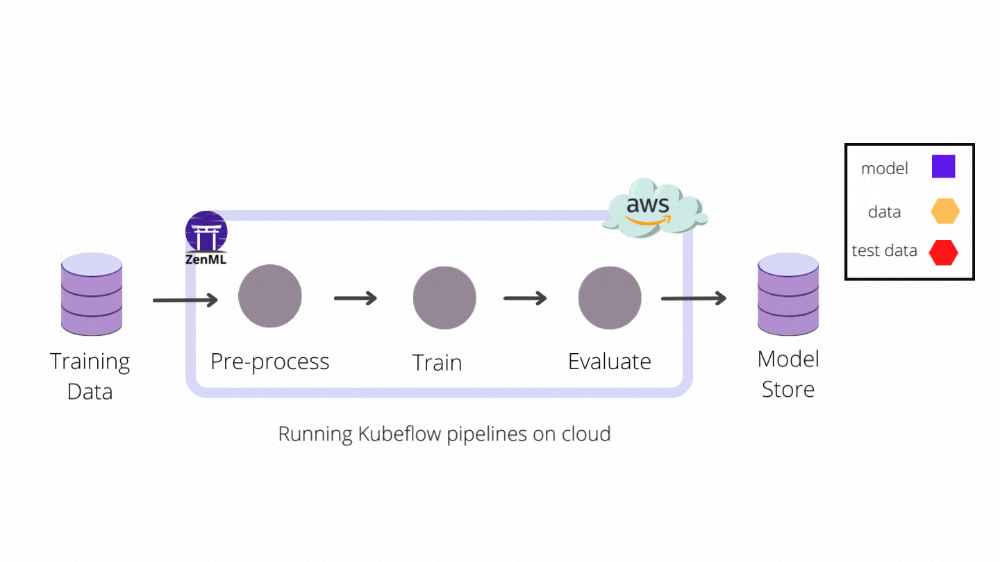
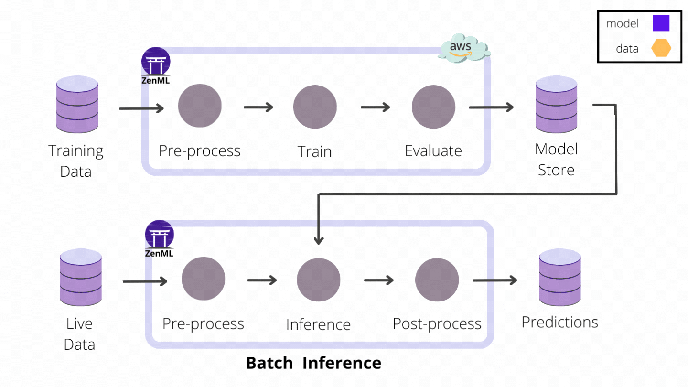
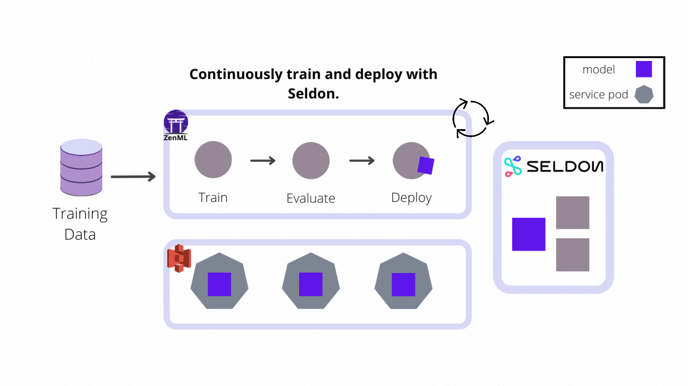

# Will they stay or will they go? Building a Customer Loyalty Predictor

[](https://pypi.org/project/zenml/)

**Problem statement**: For a given customer's historical data, we are asked to predict whether a customer will stop using a company's product or not. We will be using the [Telco Customer Churn](https://www.kaggle.com/datasets/blastchar/telco-customer-churn?datasetId=13996&sortBy=voteCount) dataset for building an end to end production-grade machine learning system that can predict whether the customer will stay loyal or not. The dataset has 20 input features and a target variable for 7043 customers.

When someone leaves a company and when that customer stops paying a business for its services or products, we call that 'churn'. We can calculate a churn rate for a company by dividing the number of customers who churned by the total number of customers and then multiplying that number by 100 to reach a percentage value. If you want to learn more about customer churn, you can read this [Wikipedia article](https://en.wikipedia.org/wiki/Churn_rate).

To achieve this in a real-world scenario, we will be using [ZenML](https://zenml.io/) to build a production-ready pipeline that predicts whether a customer will churn or not ahead of time.
The purpose of this repository is to demonstrate how [ZenML](https://github.com/zenml-io/zenml) empowers your business to build and deploy machine learning pipelines in a multitude of ways:

- By offering you a framework or template to develop within.
- By integrating with popular and useful tools like Kubeflow, Seldon Core, `facets`, and more.
- By allowing you to build and deploy your machine learning pipelines easily using a modern MLOps framework.

## :snake: Python Requirements

Let's jump into the Python packages you need. Within the Python environment of your choice, run:

```bash
git clone https://github.com/zenml-io/zenfiles.git
cd zenfiles/customer-churn
pip install -r requirements.txt
```

We also need to install the following ZenML integrations for this project:

```bash
zenml integration install -y facets sklearn xgboost lightgbm kubeflow
```

## 📙 Resources & References

Make sure to read the blog that introduces this project in detail: [Predicting whether the customer will churn or not before they even did it](https://blog.zenml.io/customer-churn/).

# :thumbsup: The Solution

We showcase two solutions to this problem:

- `Deployment using Kubeflow Pipelines`: We will be using [Kubeflow Pipelines](https://www.kubeflow.org/docs/components/pipelines/) to build and run our ZenML pipeline on the cloud and deploy it in a production environment.
- `Continuous Deployment using Seldon Core`: We will be using [Seldon Core](https://docs.seldon.io/projects/seldon-core/en/latest/index.html), a production-grade open-source model serving platform, to build our continuous deployment pipeline that trains a model and then serves it with Seldon Core.

## Deploy pipelines to production using Kubeflow Pipelines

We will be using ZenML's [Kubeflow](https://github.com/zenml-io/zenml/tree/main/examples/kubeflow) integration to deploy pipelines to production using Kubeflow Pipelines on the cloud.

Our training pipeline `run_kubeflow_pipeline.py` will be built using the following steps:

- `ingest_data`: Ingest the data from the source and create a DataFrame.
- `encode_cat_cols`: Encode categorical columns.
- `drop_cols`: Dropping irrelevant columns.
- `data_splitter`: Split the data into training and test sets.
- `model_trainer`: Train the model.
- `evaluation`: Evaluate the trained model.

Before going on next step, let's review some of the core concepts of ZenML:

- **Artifact store**: Artifacts are the data that power your experimentation and model training. It is steps that produce artifacts; An artifact store is where artifacts are stored. The pipeline steps may have created these artifacts, or they may be the data first ingested into a pipeline via an ingestion step.
- **Metadata store**: Metadata are the pieces of information tracked about the pipelines, experiments, and configurations that you are running with ZenML. Metadata are stored inside the metadata store.
- **Container registry**: Some orchestrators will require you to containerize the steps of your pipeline. A container registry is a store for these (Docker) containers. A ZenML workflow involving a container registry will containerize your code and store the resulting container in the registry.
- **Kubeflow orchestrator**: An orchestrator manages the running of each step of the pipeline, administering the actual pipeline runs. It controls how and where each step within a pipeline is executed.

### Run the pipeline on a local Kubeflow Pipelines deployment

With all the installation and initialization out of the way, all that's left to do is configure our ZenML stack. For this example, the stack we create consists of the following four parts:

- The **local artifact store** stores step outputs on your hard disk.
- The **local metadata store** stores metadata like the pipeline name and step
  parameters inside a local SQLite database.
- The Docker images created to run your pipeline are stored in a local
  Docker **container registry**.
- The **Kubeflow orchestrator** is responsible for running your ZenML pipeline
  in Kubeflow Pipelines.

```bash
zenml container-registry register local_registry --flavor=default --uri=localhost:5000
zenml orchestrator register kubeflow_orchestrator --flavor=kubeflow --synchronous=true
zenml stack register local_kubeflow_stack \
    -m default \
    -a default \
    -o kubeflow_orchestrator \
    -c local_registry

# Activate the newly created stack
zenml stack set local_kubeflow_stack
```

Now, we need to start the Kubeflow Pipelines stack locally; all we need to do is run:

```bash
zenml stack up
```

When the setup is finished, you should see a local URL that you can access in
your browser and take a look at the Kubeflow Pipelines UI (something like
http://localhost:8080).

We can now run the pipelines by simply executing the Python script. To run the
data analysis pipeline:

```bash
python run_kubeflow_pipeline.py analyze
```

To run the model training pipeline:

```bash
python run_kubeflow_pipeline.py train
```

This will build a Docker image containing all the necessary Python packages and
files, push it to the local container registry and schedule a pipeline run in
Kubeflow Pipelines. Once the script is finished, you should be able to see the
pipeline run [here](http://localhost:8080/#/runs). Note that your port value
may differ.

### Run the same pipeline on Kubeflow Pipelines deployed to AWS

We will now run the same pipeline in Kubeflow Pipelines deployed to an AWS EKS cluster. Before running this, you need some additional setup or prerequisites to run the pipeline on AWS: you can refer to our [documentation](https://docs.zenml.io/cloud-guide/aws) which will help you get set up to run the pipeline on AWS.

If you want to run the pipeline on other cloud providers like GCP or Azure, you can follow [the same guide](https://docs.zenml.io/cloud-guide/overview) for more information on those cloud providers. We will be using AWS for this project, but feel free to use any cloud provider.



After you fulfill the prerequisites, we can configure ZenML.

Let's begin by setting up some environment variables to be used in the next steps:

```bash
# AWS region
export AWS_REGION=<your aws region>
# the name of the EKS cluster running in AWS
export EKS_CLUSTER_NAME=<your EKS cluster name>
# a name for the local kubernetes configuration context
export EKS_KUBE_CONTEXT=zenml-eks
# the hostname of the ECR registry (e.g. ID.dkr.ecr.us-east-1.amazonaws.com)
export ECR_REGISTRY_NAME=<your ECR registry name>
# the S3 bucket name
export S3_BUCKET_NAME=<your S3 bucket name>
# the namespace where Kubeflow is installed in the remote cluster
export KUBEFLOW_NAMESPACE=kubeflow
```

1. Install the cloud provider ZenML integrations

```bash
zenml integration install s3 aws -y
```

2. Register the stack components

```bash
# Create a Kubernetes configuration context that points to the EKS cluster
aws eks --region $AWS_REGION update-kubeconfig --name $EKS_CLUSTER_NAME --alias $EKS_KUBE_CONTEXT
```

To configure ECR registry access locally, follow these [instructions](https://docs.aws.amazon.com/AmazonECR/latest/userguide/getting-started-cli.html), or simply type the following with the right container registry address:

```bash
# Point Docker to the ECR registry
aws ecr get-login-password --region $AWS_REGION | docker login --username AWS --password-stdin $ECR_REGISTRY_NAME
```

```bash
zenml container-registry register cloud_registry --flavor=aws \
  --uri=$ECR_REGISTRY_NAME
zenml orchestrator register cloud_orchestrator --flavor=kubeflow \
  --kubernetes_context=$EKS_KUBE_CONTEXT --synchronous=true
zenml metadata-store register kubeflow_metadata_store --flavor=kubeflow
zenml artifact-store register cloud_artifact_store --flavor=s3 \
  --path=s3://$S3_BUCKET_NAME

# Register the cloud stack
zenml stack register cloud_kubeflow_stack \
  -m kubeflow_metadata_store \
  -a cloud_artifact_store \
  -o cloud_orchestrator \
  -c cloud_registry
```

3. Activate and provision the newly-created stack

```bash
zenml stack set cloud_kubeflow_stack
zenml stack up
```

When the setup is finished, you should see a new local URL that you can access
in your browser and take a look at the remote Kubeflow Pipelines UI (something
like http://localhost:8080).

4. Run the pipeline

```bash
python run_kubeflow_pipeline.py train
```

Now, you can go to [the localhost URL](http://localhost:8080/#/runs) to see the
UI (note that your port value may differ).

We can fetch the model from Kubeflow Pipelines and use it in our Inference pipeline.
We'll do a variation of this in the next chapter that also serves the model with
Seldon Core. The following diagram shows the flow of the whole pipeline:


## Continuous model deployment with Seldon Core

While building the real-world workflow for predicting whether a customer will churn or not, you might not want to train the model once and deploy it to production. Instead, you might want to train the model and deploy it to production when something gets triggered. This is where one of our recent integrations is valuable: [Seldon Core](https://github.com/zenml-io/zenml/tree/main/examples/seldon_deployment).

[Seldon Core](https://github.com/SeldonIO/seldon-core) is a production-grade open-source model serving platform. It packs a wide range of features built around deploying models to REST/GRPC microservices, including monitoring and logging, model explainers, outlier detectors, and various continuous deployment strategies such as A/B testing and canary deployments, and more.

In this project, we build a continuous deployment pipeline that trains a model and then serves it with Seldon Core as the industry-ready model deployment tool of choice. If you are interested in learning more about Seldon Core, you can check out the [ZenML example](https://github.com/zenml-io/zenml/tree/main/examples/seldon_deployment). The following diagram shows the flow of the whole pipeline:


For this, you will need Seldon Core to be installed in the same cluster as the Kubeflow Pipelines cluster. Please follow the
[official Seldon Core installation instructions](https://docs.seldon.io/projects/seldon-core/en/latest/nav/installation.html)
applied to the type of Kubernetes cluster that you are using.

Let's start by setting up our full AWS stack to run the pipeline using Seldon Core.

1. Install the Seldon Core integration, a set of ZenML extensions that integrate with Seldon Core.

```bash
zenml integration install seldon -y
```

2. Register the stack components

Extract the URL where the Seldon Core model server exposes its prediction API, e.g.:

```bash
export INGRESS_HOST=$(kubectl -n istio-system get service istio-ingressgateway \
  -o jsonpath='{.status.loadBalancer.ingress[0].hostname}')
```

Updating the stack used at the previous step to include seldon can be done like this:

```shell
# Register the Seldon Core model deployer (Seldon on AWS)
zenml model-deployer register eks_seldon --flavor=seldon \
  --kubernetes_context=$EKS_KUBE_CONTEXT \
  --kubernetes_namespace=$KUBEFLOW_NAMESPACE \
  --base_url=http://$INGRESS_HOST --secret=aws_store

# Register a secret manager
zenml secrets-manager register aws_secret_manager --flavor=aws

# Update the cloud_kubeflow_stack to include Seldon Core as the model deployer
# and the secrets manager
zenml stack update cloud_kubeflow_stack -d eks_seldon -x aws_secret_manager
```

3. Activate the stack (if not already active)

```bash
zenml stack set cloud_kubeflow_stack
```

4. Create the ZenML secret that was referenced in the Seldon Core model deployer
that holds credentials for accessing the S3 bucket. If the EKS cluster is already
associated with the proper I.A.M. role and policies to access the S3 bucket, you can
use in-cluster authentication:

```bash
zenml secret register -s seldon_s3 aws_store --rclone_config_s3_env_auth=True
```

If you need explicit credentials, you can a command like the following:

```bash
zenml secret register -s seldon_s3 aws_store \
    --rclone_config_s3_env_auth=False \
    --rclone_config_s3_access_key_id=<aws-key-id> \
    --rclone_config_s3_secret_access_key=<aws-secret-key> \
    --rclone_config_s3_session_token=@./aws_session_token.txt \
    --rclone_config_s3_region=us-east-1
```

Please look up the variables relevant to your use-case in the
[official Seldon Core documentation](https://docs.seldon.io/projects/seldon-core/en/latest/servers/overview.html#handling-credentials).

5. Do a pipeline run

```shell
python run_seldon_deployment_pipeline.py --deploy
```

You can control which pipeline to run by passing the `--deploy` and the `--predict` flag to the `run_seldon_deployment_pipeline.py` launcher. If you run the pipeline with the `--deploy` flag, the pipeline will train the model and deploy if the model meets the evaluation criteria and then Seldon Core will serve the model for inference. If you run the pipeline with the `--predict` flag, this tells the pipeline only to run the inference pipeline and not the training pipeline.

You can also set the `--min-accuracy` to control the evaluation criteria.

Now, you can go to the [localhost:8080](http://localhost:8080/#/runs) to see the
UI (same as the previous step, your port value may differ).

You can also list the list of models served with Seldon Core by running
`zenml served-models list` and inspect them with `zenml served-models describe`.
For example:

```bash
$ zenml served-models list
┏━━━━━━━━┯━━━━━━━━━━━━━━━━━━━━━━━━━━━━━━━━━━━━━━┯━━━━━━━━━━━━━━━━━━━━━━━━━━━━━━━━┯━━━━━━━━━━━━━━━━━━━━━━━━━━━━┯━━━━━━━━━━━━┓
┃ STATUS │ UUID                                 │ PIPELINE_NAME                  │ PIPELINE_STEP_NAME         │ MODEL_NAME ┃
┠────────┼──────────────────────────────────────┼────────────────────────────────┼────────────────────────────┼────────────┨
┃   ✅   │ 3ef6c58b-793d-4f85-8edd-aad961717f90 │ continuous_deployment_pipeline │ seldon_model_deployer_step │ model      ┃
┗━━━━━━━━┷━━━━━━━━━━━━━━━━━━━━━━━━━━━━━━━━━━━━━━┷━━━━━━━━━━━━━━━━━━━━━━━━━━━━━━━━┷━━━━━━━━━━━━━━━━━━━━━━━━━━━━┷━━━━━━━━━━━━┛

$ zenml served-models describe 3ef6c58b-793d-4f85-8edd-aad961717f90
                                                             Properties of Served Model 3ef6c58b-793d-4f85-8edd-aad961717f90                                                              
┏━━━━━━━━━━━━━━━━━━━━━━━━┯━━━━━━━━━━━━━━━━━━━━━━━━━━━━━━━━━━━━━━━━━━━━━━━━━━━━━━━━━━━━━━━━━━━━━━━━━━━━━━━━━━━━━━━━━━━━━━━━━━━━━━━━━━━━━━━━━━━━━━━━━━━━━━━━━━━━━━━━━━━━━━━━━━━━━━━━━━━━━━━┓
┃ MODEL SERVICE PROPERTY │ VALUE                                                                                                                                                         ┃
┠────────────────────────┼───────────────────────────────────────────────────────────────────────────────────────────────────────────────────────────────────────────────────────────────┨
┃ MODEL_NAME             │ model                                                                                                                                                         ┃
┠────────────────────────┼───────────────────────────────────────────────────────────────────────────────────────────────────────────────────────────────────────────────────────────────┨
┃ MODEL_URI              │ s3://zenfiles/seldon_model_deployer_step/output/2517/seldon                                                                                                   ┃
┠────────────────────────┼───────────────────────────────────────────────────────────────────────────────────────────────────────────────────────────────────────────────────────────────┨
┃ PIPELINE_NAME          │ continuous_deployment_pipeline                                                                                                                                ┃
┠────────────────────────┼───────────────────────────────────────────────────────────────────────────────────────────────────────────────────────────────────────────────────────────────┨
┃ PIPELINE_RUN_ID        │ continuous_deployment_pipeline-27_May_22-12_47_38_918889                                                                                                      ┃
┠────────────────────────┼───────────────────────────────────────────────────────────────────────────────────────────────────────────────────────────────────────────────────────────────┨
┃ PIPELINE_STEP_NAME     │ seldon_model_deployer_step                                                                                                                                    ┃
┠────────────────────────┼───────────────────────────────────────────────────────────────────────────────────────────────────────────────────────────────────────────────────────────────┨
┃ PREDICTION_URL         │ http://abb84c444c7804aa98fc8c097896479d-377673393.us-east-1.elb.amazonaws.com/seldon/kubeflow/zenml-3ef6c58b-793d-4f85-8edd-aad961717f90/api/v0.1/predictions ┃
┠────────────────────────┼───────────────────────────────────────────────────────────────────────────────────────────────────────────────────────────────────────────────────────────────┨
┃ SELDON_DEPLOYMENT      │ zenml-3ef6c58b-793d-4f85-8edd-aad961717f90                                                                                                                    ┃
┠────────────────────────┼───────────────────────────────────────────────────────────────────────────────────────────────────────────────────────────────────────────────────────────────┨
┃ STATUS                 │ ✅                                                                                                                                                            ┃
┠────────────────────────┼───────────────────────────────────────────────────────────────────────────────────────────────────────────────────────────────────────────────────────────────┨
┃ STATUS_MESSAGE         │ Seldon Core deployment 'zenml-3ef6c58b-793d-4f85-8edd-aad961717f90' is available                                                                              ┃
┠────────────────────────┼───────────────────────────────────────────────────────────────────────────────────────────────────────────────────────────────────────────────────────────────┨
┃ UUID                   │ 3ef6c58b-793d-4f85-8edd-aad961717f90                                                                                                                          ┃
┗━━━━━━━━━━━━━━━━━━━━━━━━┷━━━━━━━━━━━━━━━━━━━━━━━━━━━━━━━━━━━━━━━━━━━━━━━━━━━━━━━━━━━━━━━━━━━━━━━━━━━━━━━━━━━━━━━━━━━━━━━━━━━━━━━━━━━━━━━━━━━━━━━━━━━━━━━━━━━━━━━━━━━━━━━━━━━━━━━━━━━━━━━┛

```

## 🕹 Demo App

We built two Streamlit applications for our two different deployment solutions: one which fetches the pipeline from Kubeflow Pipelines and one which fetches the pipeline from the Seldon Core model service. You can view the Streamlit web application [here](https://share.streamlit.io/ayush714/zenfiles/customer-churn/customer-churn/streamlit_app_kubeflow.py).

You can run the following command to run the Streamlit application for the Kubeflow deployment:

```bash
streamlit run streamlit_app_kubeflow.py
```

You can run the following command to run the Streamlit application for the Seldon deployment:

```bash
streamlit run streamlit_app_seldon.py
```
