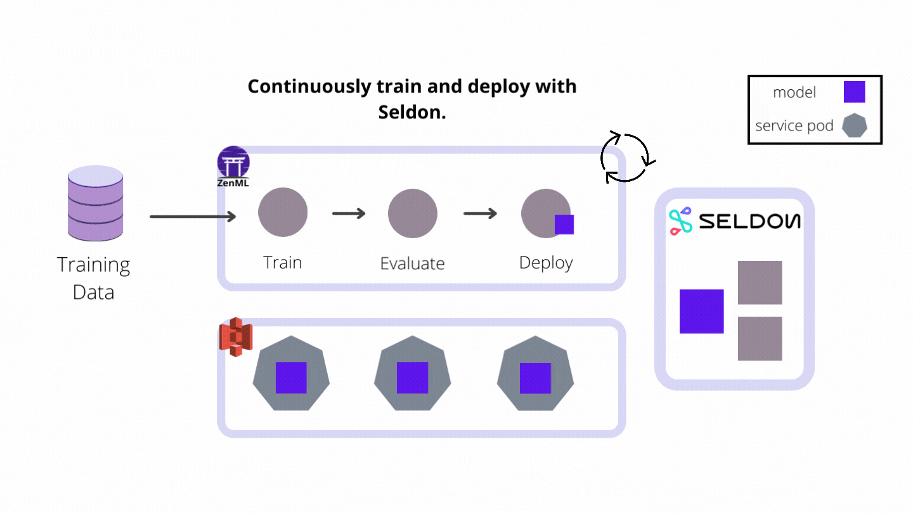

# Predicting whether the customer will churn or not before they even did it

[](https://pypi.org/project/zenml/)

**Problem statement**: For a given customer's historical data, we are asked to predict whether a customer will stop using a company's product or not. We will be using the [Telco Customer Churn](https://www.kaggle.com/datasets/blastchar/telco-customer-churn?datasetId=13996&sortBy=voteCount) dataset for building an end to end production-grade machine learning system that can predict whether the customer will stay loyal or not. The dataset has 20 input features and a target variable for 7043 customers.

When someone leaves a company and when that customer stops paying a business for its services or products, we call that 'churn'. We can calculate a churn rate for a company by dividing the number of customers who churned by the total number of customers and then multiplying that number by 100 to reach a percentage value. If you want to learn more about customer churn, you can read this [Wikipedia article](https://en.wikipedia.org/wiki/Churn_rate).

To achieve this in a real-world scenario, we will be using [ZenML](https://zenml.io/) to build a production-ready pipeline that predicts whether a customer will churn or not ahead of time.
The purpose of this repository is to demonstrate how [ZenML](https://github.com/zenml-io/zenml) empowers your business to build and deploy machine learning pipelines in a multitude of ways:

- By offering you a framework or template to develop within.
- By integrating with popular and useful tools like Kubeflow, Seldon Core, `facets`, and more.
- By allowing you to build and deploy your machine learning pipelines easily using a modern MLOps framework.

## :snake: Python Requirements [WIP]

Let's jump into the Python packages you need. Within the Python environment of your choice, run:

```bash
git clone https://github.com/zenml-io/zenfiles.git
cd zenfiles/customer-churn
pip install -r requirements.txt
```

We need to install the following integrations for this project:

```bash
zemml integration install mlflow -f
zemml integration install kubeflow -f
```

## 📙 Resources & References

Make sure to read the blog that introduces this project in depth: [Predicting whether the customer will churn or not before they even did it](#).

If you'd like to watch the video that explains the project, you can watch the [video](#).

# :thumbsup: The Solution

We showcase two solutions to this problem:

- `Deployment using Kubeflow pipelines`: We will be using Kubeflow pipelines to build and run our ZenML pipeline on the cloud and deploy it in a production environment.
  `Continuous Deployment using Seldon Core`: We will be using Seldon Core, a production-grade open-source model serving platform, to build our continuous deployment pipeline that trains a model and then serves it with Seldon Core.

## Deploy pipelines to production using Kubeflow pipelines

To build a real-world workflow for predicting whether a customer will churn or not, you will probably develop your pipelines on your local machine initially, allowing for quick iteration and debugging. However, at a certain point, when you are finished with its design, you might want to transition to a more production-ready setting and deploy the pipeline to a more robust environment. This is where ZenML comes in.

We will be using [Kubeflow](https://github.com/zenml-io/zenml/tree/main/examples/kubeflow) Integration of ZenML for deploying pipelines to production using Kubeflow pipelines on the cloud.

Our training pipeline `run_kubeflow_pipeline.py` will be built using the following steps:

- `ingest_data`: This step will be used to ingest the data from the source and create a DataFrame.
- `encode_cat_cols`: This step will be used to encode categorical columns.
- `handle_imbalanced_data`: This step will be used to handle imbalanced data.
- `drop_cols`: This step will be used for irrelevant drop columns.
- `data_splitter`: This step will be used to split the data into training and test sets.
- `model_trainer`: This step will be used to train the model.
- `evaluation`: This step will be used to evaluate the trained model.

#### Run the same pipeline on a local Kubeflow Pipelines deployment

With all the installation and initialization out of the way, all that's left to do is configure our ZenML stack. For this example, the stack we create consists of the following four parts:

- The **local artifact store** stores step outputs on your hard disk.
- The **local metadata store** stores metadata like the pipeline name and step
  parameters inside a local SQLite database.
- The docker images created to run your pipeline are stored in a local
  docker **container registry**.
- The **Kubeflow orchestrator** is responsible for running your ZenML pipeline
  in Kubeflow Pipelines.

```bash
# Make sure to create the local registry on port 5000 for it to work
zenml container-registry register local_registry --type=default --uri=localhost:5000
zenml orchestrator register kubeflow_orchestrator --type=kubeflow
zenml stack register local_kubeflow_stack \
    -m local_metadata_store \
    -a local_artifact_store \
    -o kubeflow_orchestrator \
    -c local_registry

# Activate the newly created stack
zenml stack set local_kubeflow_stack
```

Now, we need to start the Kubeflow pipelines locally; all we need to do is run:

```bash
zenml stack up
```

When the setup is finished, you should see a local URL that you can access in
your browser and take a look at the Kubeflow Pipelines UI.

We can now run the pipeline by simply executing the python script:

```bash
python run_kubeflow_pipeline.py
```

This will build a docker image containing all the necessary python packages and
files, push it to the local container registry and schedule a pipeline run-in
Kubeflow Pipelines. Once the script is finished, you should be able to see the
pipeline run [here](http://localhost:8080/#/runs).

#### Run the same pipeline on Kubeflow Pipelines deployed to aws

We will now run the same pipeline in Kubeflow Pipelines deployed to an AWS EKS cluster. Before running this, you need some additional setup or prerequisites to run the pipeline on AWS; you can refer to our [documentation](https://docs.zenml.io/features/guide-aws-gcp-azure#pre-requisites), which will help you installing the requirements for running the pipeline on AWS.

If you want to run the pipeline on other cloud providers like GCP, and Azure, you can follow [this guide](https://docs.zenml.io/features/guide-aws-gcp-azure) for execution on that cloud provider. We will be using AWS for this project, but feel free to use any cloud provider.


After you fulfill the prerequisites, now we need to Integrate with ZenML.

1. Install the cloud provider

```bash
zenml integration install aws
```

2. Register the stack components

```bash
zenml container-registry register cloud_registry --type=default --uri=$PATH_TO_YOUR_CONTAINER_REGISTRY
zenml orchestrator register cloud_orchestrator --type=kubeflow --custom_docker_base_image_name=YOUR_IMAGE
zenml metadata-store register kubeflow_metadata_store --type=kubeflow
zenml artifact-store register cloud_artifact_store --type=s3 --path=$PATH_TO_YOUR_BUCKET

# Register the cloud stack
zenml stack register cloud_kubeflow_stack -m kubeflow_metadata_store -a cloud_artifact_store -o cloud_orchestrator -c cloud_registry
```

3. Activate the newly created stack.

```bash
zenml stack set cloud_kubeflow_stack
```

4. Do a pipeline run

```shell
python run_kubeflow_pipeline.py
```

5. Configure Port Forwarding and Check the Kubeflow UI to see if the model is deployed and running! 🚀

```bash
kubectl --namespace kubeflow port-forward svc/ml-pipeline-ui 8080:80
```

Now, you can go to the localhost:8080 to see the UI.

We can fetch the model from the kubeflow pipeline and use it in our Inference pipeline. Following diagram shows the flow of the whole pipeline:


## Continuous model deployment with Seldon Core

While building the real-world workflow for predicting whether a customer will churn or not, you might not want to train the model once and deploy it to production. Instead, you might want to train the model and deploy it to production when something gets triggered. This is where one of our recent integration comes in, [Seldon Core](https://github.com/zenml-io/zenml/tree/main/examples/seldon_deployment).

[Seldon Core](https://github.com/SeldonIO/seldon-core) is a production-grade open-source model serving platform. It packs a wide range of features built around deploying models to REST/GRPC microservices, including monitoring and logging, model explainers, outlier detectors, and various continuous deployment strategies such as A/B testing and canary deployments, and more.

It also comes equipped with a set of built-in model server implementations designed to work with standard formats for packaging ML models that greatly simplify serving models for real-time inference.

In this project, we build a continuous deployment pipeline that trains a model and then serves it with Seldon Core as the industry-ready model deployment tool of choice. If you are interested in learning more about Seldon Core, you can check out the [ZenML Example](https://github.com/zenml-io/zenml/tree/main/examples/seldon_deployment). Following diagram shows the flow of the whole pipeline:


Now, Let's start setting up our Full AWS stack to run the pipeline using Seldon Core.

1. Install the Seldon Core Integration, a set of ZenML extensions that integrate with Seldon Core.

```bash
zenml integration install Seldon
```

2. Register the stack components

```bash
aws eks --region us-east-1 update-kubeconfig --name zenml-cluster --alias zenml-eks
```

To configure ECR registry access locally, run, e.g.:

```bash
aws ecr get-login-password --region us-east-1 | docker login --username AWS \
  --password-stdin 715803424590.dkr.ecr.us-east-1.amazonaws.com
```

Extract the URL where the Seldon Core model server exposes its prediction API, e.g.:

```bash
export INGRESS_HOST=$(kubectl -n istio-system get service istio-ingressgateway \
  -o jsonpath='{.status.loadBalancer.ingress[0].hostname}')
```

Configuring the stack can be done like this:

```shell
zenml integration install s3 aws kubeflow Seldon

zenml artifact-store register aws --type=s3 --path=s3://mybucket
zenml model-deployer register seldon_aws --type=seldon \
  --kubernetes_context=zenml-eks --kubernetes_namespace=kubeflow \
  --base_url=http://$INGRESS_HOST \
  --secret=s3-store
zenml container-registry register aws --type=default --uri=715803424590.dkr.ecr.us-east-1.amazonaws.com
zenml metadata-store register aws --type=kubeflow
zenml orchestrator register aws --type=kubeflow --kubernetes_context=zenml-eks --synchronous=True
zenml secrets-manager register aws -t aws
zenml stack register aws -m aws -a aws -o aws -c aws -d seldon_aws -x aws
zenml stack set aws
```

4. Do a pipeline run

```shell
python run_seldon_deployment_pipeline.py --deploy
```

You can control which pipeline to run by passing the --deploy and the --predict flag to the `run_seldon_deployment_pipeline.py` launcher. If you run the pipeline with the --deploy flag, the pipeline will train the model and deploy if the model meets the evaluation criteria and then Seldon Core will serve the model for inference. If you run the pipeline with the --predict flag, this tells the pipeline only to run the inference pipeline and not the training pipeline.

You can also set the --min-accuracy to control the evaluation criteria.

5. Configure Port Forwarding and Check the Kubeflow UI to see if the model is deployed and running! 🚀

```bash
kubectl --namespace kubeflow port-forward svc/ml-pipeline-ui 8080:80
```

Now, you can go to the localhost:8080 to see the UI.

## 🕹 Demo App [WIP (To be updated)]

**Ignore this section as of now**
We also made a live demo of this project using [Streamlit](https://streamlit.io/), which you can find [here](https://share.streamlit.io/ayush714/customer-satisfaction/main). Using our trained models takes some input features for the product and predicts the customer satisfaction rate. If you want to run this streamlit app in your local system, you can run the following command:-

```bash
streamlit run streamlit_app.py
```

In the inference part of this application, we are fetching our continuous deployment pipeline from the initialized repository, and the pipeline trains the model and (re) deploys the model, and this application makes use of the latest model from the pipeline to predict the customer satisfaction score for the next order or purchase.

## :question: FAQ [WIP]

To be Updated
