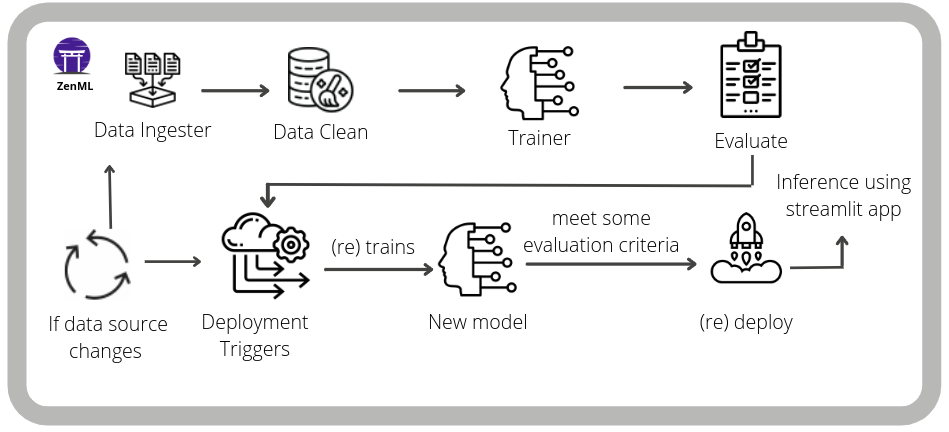

# Predicting how a customer will feel about a product before they even ordered it

[](https://pypi.org/project/zenml/)

**Problem statement**: For a given customer's historical data, predict the review score for the next order or purchase. I will be using the [Brazilian E-Commerce Public Dataset by Olist](https://www.kaggle.com/datasets/olistbr/brazilian-ecommerce). This dataset has information on 100,000 orders from 2016 to 2018 made at multiple marketplaces in Brazil. Its features allow viewing charges from various dimensions: from order status, price, payment, freight performance to customer location, product attributes and finally, reviews written by customers. The objective here is to predict the customer satisfaction score for a given order based on features like order status, price, payment, etc. I will be using [ZenML](https://zenml.io/) to build a production-ready pipeline to predict the customer satisfaction score for the next order or purchase.

The purpose of this repository is to demonstrate how [ZenML](https://github.com/zenml-io/zenml) empowers your business to build and deploy machine learning pipelines in a multitude of ways:

- By offering you a framework or template to develop within
- By integrating with tools like MLflow for deployment, tracking and more
- By allowing you to build and deploy your machine learning pipelines easily

## :snake: Python Requirements

Let's jump into the Python packages you need. Within the Python environment of your choice, run:

```bash
git clone https://github.com/zenml-io/zenfiles.git
cd zenfiles/customer-satisfaction
pip install -r requirements.txt
```

If you are running the `run_deployment.py` script, you will also need to install some integrations using ZenML:

```bash
zenml integration install mlflow -f
```

## :thumbsup: The Task

We built an end-to-end pipeline for predicting the customer satisfaction score for the next order or purchase, which will help businesses make better decisions. We can't just train our model in our local system, and we need to serve the users, so we need it to be deployed in the cloud. We need machine learning pipelines for machine learning at scale, an end-to-end construct that orchestrates the flow of data into and output from a machine learning model (or set of multiple models). It includes raw data input, features, results, the machine learning model and model parameters, and prediction outputs. And all these capabilities are built on top of ZenML.

We built a pipeline to predict the customer satisfaction score for the next order or purchase. We gave special consideration to ZenML standard pipeline and its steps, MLflow tracking to track our metrics and parameters, and MLflow deployment to deploy our model.

Our standard training pipeline consists of several steps:

- `ingest_data`: This step will ingest the data and create a `DataFrame`.
- `clean_data`: This step will clean the data and remove the unwanted columns.
- `model_train`: This step will train the model and save the model using [MLflow autologging](https://www.mlflow.org/docs/latest/tracking.html).
- `evaluation`: This step will evaluate the model and save the metrics -- using MLflow autologging -- into the artifact store.

### Deployment & Inference Pipeline

We have another pipeline, the `deployment_pipeline.py`, that implements a continuous deployment workflow. It ingests and processes input data, trains a model and then (re)deploys the prediction server that serves the model if it meets our evaluation criteria. For us this is the [MSE](https://scikit-learn.org/stable/modules/generated/sklearn.metrics.mean_squared_error.html); you can also set your own minimum MSE.

In the deployment pipeline, ZenML's MLflow tracking integration is used for logging the hyperparameter values and the trained model itself and the model evaluation metrics -- as MLflow experiment tracking artifacts -- into the local MLflow backend. This pipeline also launches a local MLflow deployment server to serve the latest MLflow model if its accuracy is above a configured threshold.

The MLflow deployment server runs locally as a daemon process that will continue to run in the background after the example execution is complete.

The deployment pipeline has caching enabled to avoid re-training the model if the training data and hyperparameter values don't change. When a new model is trained and passes the accuracy threshold validation, the pipeline automatically updates the currently running MLflow deployment server to serve the new model instead of the old one.

We also have an inference pipeline that interacts with the continuous prediction server deployed to get online predictions based on live data. The inference pipeline simulates loading data from a dynamic external source and then uses that data to perform online predictions using the running MLflow prediction server.



## :notebook: Diving into the code

You have two pipelines to run, `run_pipeline.py`, a traditional ZenML Pipeline, and `run_deployment.py`, a continuous deployment pipeline. So, if you want to run `run_pipeline.py`, you can run the following command:

```bash
python run_pipeline.py
```

And this will run the standard ZenML pipeline. If you want to run deployment part of this project; you can run `run_deployment.py` script, for running this script, you can run the following command:

```bash
python run_deployment.py
```

## 🕹 Demo App

We also made a live demo of this project using [Streamlit](https://streamlit.io/) which you can find [here](https://share.streamlit.io/ayush714/customer-satisfaction/main). It takes some input features for the product and predicts the customer satisfaction rate using our trained models.

## :question: FAQ

1. When running the continuous deployment pipeline, I get an error stating: `No Step found for the name mlflow_deployer`.

Solution: It happens because your artifact store is overridden after running the continuous deployment pipeline. So, you need to delete the artifact store and rerun the pipeline. You can get the location of the artifact store by running the following command:

```bash
zenml artifact-store describe
```

and then you can delete the artifact store with the following command:

**Note**: This is a dangerous / destructive command! Please enter your path carefully, otherwise it may delete other folders from your computer.

```bash
rm -rf PATH
```

2. When running the continuous deployment pipeline, I get the following error: `No Environment component with name mlflow is currently registered.`

Solution: You forgot to install the MLflow integration in your ZenML environment. So, you need to install the MLflow integration by running the following command:

```bash
zenml integration install mlflow -f
```
