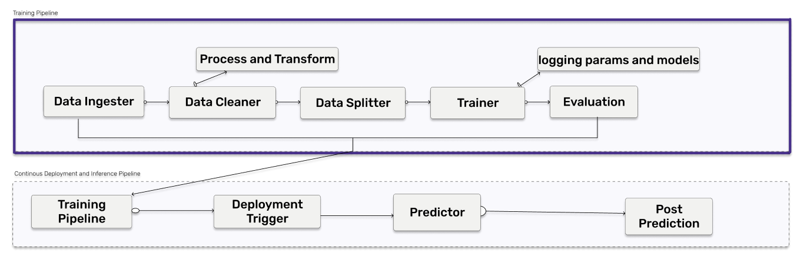

# End to End Customer Satisfaction Pipeline with ZenML 
[](https://pypi.org/project/zenml/)

**Problem statement**:- For a given historical data of the customer predict the review score for the next order or purchase. I will be using [Brazilian E-Commerce Public Dataset by Olist](https://www.kaggle.com/datasets/olistbr/brazilian-ecommerce) dataset, The data-set has information of 100k orders from 2016 to 2018 made at multiple marketplaces in Brazil. Its features allow viewing orders from multiple dimensions: from order status, price, payment, and freight performance to customer location, product attributes and finally reviews written by customers. The objective here is to predict the customer satisfaction score for a given order based on the given features like order status, price, payment, etc. I will be using the [ZenML](https://zenml.io/) framework to build a production ready pipeline to predict the customer satisfaction score for the next order or purchase.

The Purpose of this repository is to demonstrate how [ZenML](https://github.com/zenml-io/zenml) empowers your business to build and deploy machine learning pipelines in a multitude of ways:

* By offering you a framework or template to develop within
* By integration of tools like mlflow deployment, mlflow tracking and more
* By allowing you to easily build and deploy your machine learning pipelines 

## :snake: Python Requirements

Let's jump into the Python packages you need. Within the Python environment of your choice, run:

```bash
git clone https://github.com/zenml-io/zenfiles.git
cd customer_satisfaction
pip install -r requirements.txt
```

If you are running the `run_deployment.py` script, you will also need to install some integrations using zenml:

```bash
zenml integration install mlflow -f
```

## :thumbsup: The Task

Our team at ZenML was looking for a project which is model centric, data centric and zenml centirc for our next Zenfile. During our intiial discussions we listed out several questions like What will be the usecase for this zenfile? what's the impact of this zenfile?, etc. to evaluate a zenfile. We found out that it would be really great if we build an end to end pipeline for predicting the customer satisfaction score for the next order or purchase which will help businesses to take better decisions. We can't just train our model in our local system and we need to serve to the users, so we need it to be deployed in the cloud. For doing Machine learning at scale we need machine learning pipelines which is an end-to-end construct that orchestrates the flow of data into, and output from, a machine learning model (or set of multiple models). It includes raw data input, features, outputs, the machine learning model and model parameters, and prediction outputs. and All these capbilities are built on top of the zenml framework.

As a result of this discussion we decided to build a pipeline which will predict the customer satisfaction score for the next order or purchase. We given special consideration to ZenML standard pipeline and its steps, MLflow tracking to track our metrics and parameters, MLflow deployment to deploy our model. 

Our standard training pipeline consists of several steps: 

* ingest_data  :- This step will ingest the data from the dataset and will create a dataframe.
* clean_data   :- This step will clean the data and remove the unwanted columns. 
* model_train  :- This step will train the model and will save the model using mlfow autlogging. 
* evaluation   :- This step will evaluate the model and will save the metrics using mlfow autlogging into the artifact store.  

### Depoloyment & Inference Pipeline 

We have another pipeline which is the deployment_pipeline.py that implements a continuous deployment workflow. It ingests and processes input data, trains a model and then (re)deploys the prediction server that serves the model if it meets some evaluation criteria.

In the deployment pipeline, ZenML's MLflow tracking integration is used to log the hyperparameter values -- as well as the trained model itself and the model evaluation metrics -- as MLflow experiment tracking artifacts into the local MLflow backend. This pipeline also launches a local MLflow deployment server to serve the latest MLflow model if its accuracy is above a configured threshold.

The MLflow deployment server is running locally as a daemon process that will continue to run in the background after the example execution is complete.

The deployment pipeline has caching enabled to avoid re-training the model if the training data and hyperparameter values don't change. When a new model is trained that passes the accuracy threshold validation, the pipeline automatically updates the currently running MLflow deployment server so that the new model is being served instead of the old one.

We also have an inference pipeline that interacts with the prediction server deployed by the continuous deployment pipeline to get online predictions based on live data. The inference pipeline simulates loading data from a dynamic external source, then uses that data to perform online predictions using the running MLflow prediction server.



## :notebook: Diving into the code

You have two pipelines to run, `run_pipeline.py` which is traditional ZenML Pipeline and `run_deployment.py` which is continuous deployment pipeline. So, if you want to run `run_pipeline.py` you can run the following command: 

```bash
python run_pipeline.py
```

and this will run the standard ZenML pipeline. If you want to run `run_deployment.py` you can run the following command:

```bash
python run_deployment.py
```

## :question: FAQ

1. When running the continuous deployment pipeline, I get an error about No Step found for name `mlflow_deployer`.

Solution: It happens because your artifact store is getting overriden after running the continuous deployment pipeline. So, you need to delete the artifact store and run the pipeline again.You can get to know the location of the artifact store by running the following command:

```bash
zenml artifact-store describe
``` 
and then you can delete the artifact store by following command:- 

```bash
rm -rf PATH
```

2. When running the continuous deployment pipeline, I get an error about ```No Environment component with name mlflow is currently registered.``` 

Solution: It happens because you forgot to install the mlflow integration in your ZenML environment. So, you need to install the mlflow integration by running the following command:

```bash
zenml integration install mlflow -f
```


