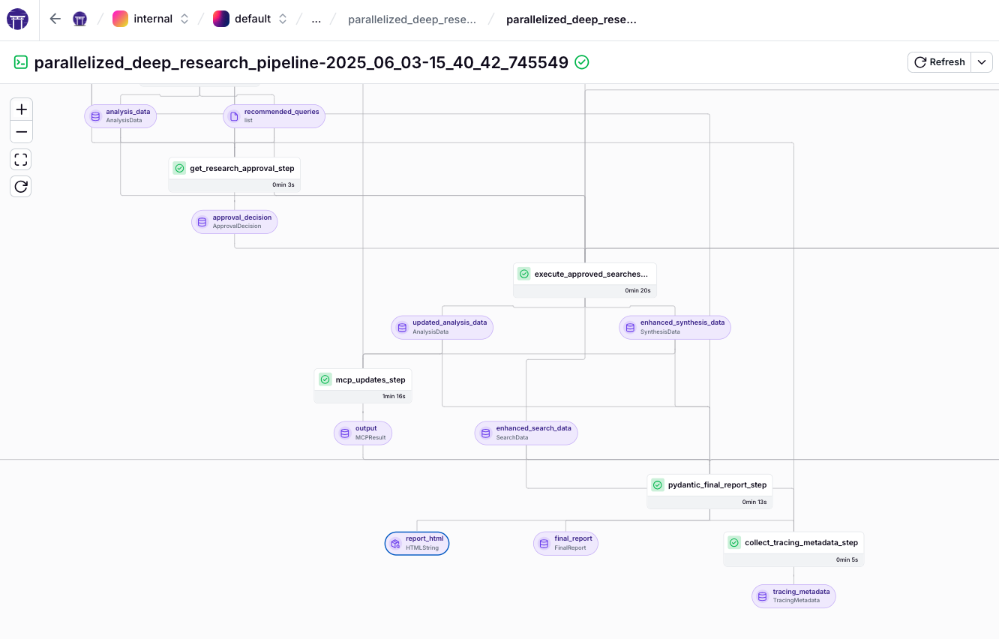
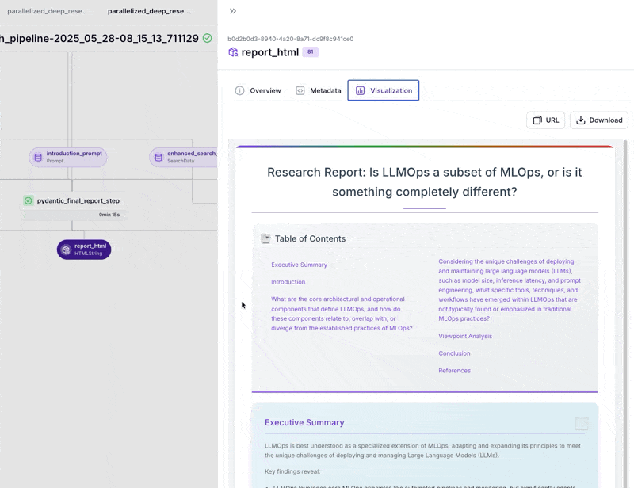

# 🔍 ZenML Deep Research Agent

A production-ready MLOps pipeline for conducting deep, comprehensive research on any topic using LLMs and web search capabilities.

<div align="center">
  
  <p><em>ZenML Deep Research pipeline flow</em></p>
</div>

## 🎯 Overview

The ZenML Deep Research Agent is a scalable, modular pipeline that automates in-depth research on any topic. It:

- Creates a structured outline based on your research query
- Researches each section through targeted web searches and LLM analysis
- **NEW**: Performs additional MCP-powered searches using Anthropic's Model Context Protocol with Exa integration
- Iteratively refines content through reflection cycles
- Produces a comprehensive, well-formatted research report
- Visualizes the research process and report structure in the ZenML dashboard

This project transforms exploratory notebook-based research into a production-grade, reproducible, and transparent process using the ZenML MLOps framework.

## 📝 Example Research Results

The Deep Research Agent produces comprehensive, well-structured reports on any topic. Here's an example of research conducted on quantum computing:

<div align="center">
  
  <p><em>Sample report generated by the Deep Research Agent</em></p>
</div>

## 🚀 Pipeline Architecture

The pipeline uses a parallel processing architecture for efficiency and breaks down the research process into granular steps for maximum modularity and control:

1. **Initialize Prompts**: Load and track all prompts as versioned artifacts
2. **Query Decomposition**: Break down the main query into specific sub-questions
3. **Parallel Information Gathering**: Process multiple sub-questions concurrently for faster results
4. **Merge Results**: Combine results from parallel processing into a unified state
5. **Cross-Viewpoint Analysis**: Analyze discrepancies and agreements between different perspectives
6. **Reflection Generation**: Generate recommendations for improving research quality
7. **Human Approval** (optional): Get human approval for additional searches
8. **Execute Approved Searches**: Perform approved additional searches to fill gaps
9. **MCP-Powered Search**: Use Anthropic's Model Context Protocol to perform additional targeted searches via Exa
10. **Final Report Generation**: Compile all synthesized information into a coherent HTML report
11. **Collect Tracing Metadata**: Gather comprehensive metrics about token usage, costs, and performance

This architecture enables:
- Better reproducibility and caching of intermediate results
- Parallel processing for faster research completion
- Easier debugging and monitoring of specific research stages
- More flexible reconfiguration of individual components
- Enhanced transparency into how the research is conducted
- Human oversight and control over iterative research expansions

## 💡 Under the Hood

- **LLM Integration**: Uses litellm for flexible access to various LLM providers
- **Web Research**: Utilizes Tavily API for targeted internet searches
- **MCP Integration**: Leverages Anthropic's Model Context Protocol with Exa for enhanced research capabilities
- **ZenML Orchestration**: Manages pipeline flow, artifacts, and caching
- **Reproducibility**: Track every step, parameter, and output via ZenML
- **Visualizations**: Interactive visualizations of the research structure and progress
- **Report Generation**: Uses static HTML templates for consistent, high-quality reports
- **Human-in-the-Loop**: Optional approval mechanism via ZenML alerters (Discord, Slack, etc.)
- **LLM Observability**: Integrated Langfuse tracking for monitoring LLM usage, costs, and performance

## 🛠️ Getting Started

### Prerequisites

- Python 3.9+
- ZenML installed and configured
- API key for your preferred LLM provider (configured with litellm)
- Tavily API key
- Anthropic API key (for MCP integration)
- Exa API key (for MCP-powered searches)
- Langfuse account for LLM tracking (optional but recommended)

### Installation

```bash
# Clone the repository
git clone <repository-url>
cd zenml_deep_research

# Install dependencies
pip install -r requirements.txt

# Set up API keys
export OPENAI_API_KEY=your_openai_key  # Or another LLM provider key
export TAVILY_API_KEY=your_tavily_key  # For Tavily search (default)
export EXA_API_KEY=your_exa_key        # For Exa search and MCP integration (required for MCP)
export ANTHROPIC_API_KEY=your_anthropic_key  # For MCP integration (required)

# Set up Langfuse for LLM tracking (optional)
export LANGFUSE_PUBLIC_KEY=your_public_key
export LANGFUSE_SECRET_KEY=your_secret_key
export LANGFUSE_HOST=https://cloud.langfuse.com  # Or your self-hosted URL

# Initialize ZenML (if needed)
zenml init
```

### Setting up Langfuse for LLM Tracking

The pipeline integrates with [Langfuse](https://langfuse.com) for comprehensive LLM observability and tracking. This allows you to monitor LLM usage, costs, and performance across all pipeline runs.

#### 1. Create a Langfuse Account

1. Sign up at [cloud.langfuse.com](https://cloud.langfuse.com) or set up a self-hosted instance
2. Create a new project in your Langfuse dashboard (e.g., "deep-research")
3. Navigate to Settings → API Keys to get your credentials

#### 2. Configure Environment Variables

Set the following environment variables with your Langfuse credentials:

```bash
export LANGFUSE_PUBLIC_KEY=pk-lf-...     # Your public key
export LANGFUSE_SECRET_KEY=sk-lf-...     # Your secret key
export LANGFUSE_HOST=https://cloud.langfuse.com  # Or your self-hosted URL
```

#### 3. Configure Project Name

The Langfuse project name can be configured in any of the pipeline configuration files:

```yaml
# configs/enhanced_research.yaml
langfuse_project_name: "deep-research"  # Change to match your Langfuse project
```

**Note**: The project must already exist in your Langfuse dashboard before running the pipeline.

#### What Gets Tracked

When Langfuse is configured, the pipeline automatically tracks:

- **All LLM calls** with their prompts, responses, and token usage
- **Pipeline trace information** including:
  - `trace_name`: The ZenML pipeline run name for easy identification
  - `trace_id`: The unique ZenML pipeline run ID for correlation
- **Tagged operations** such as:
  - `structured_llm_output`: JSON generation calls
  - `information_synthesis`: Research synthesis operations
  - `find_most_relevant_string`: Relevance matching operations
- **Performance metrics**: Latency, token counts, and costs
- **Project organization**: All traces are organized under your configured project

This integration provides full observability into your research pipeline's LLM usage, making it easy to optimize performance, track costs, and debug issues.

### Running the Pipeline

#### Basic Usage

```bash
# Run with default configuration
python run.py
```

The default configuration and research query are defined in `configs/enhanced_research.yaml`.

#### Using Research Mode Presets

The pipeline includes three pre-configured research modes for different use cases:

```bash
# Rapid mode - Quick overview with minimal depth
python run.py --mode rapid

# Balanced mode - Standard research depth (default)
python run.py --mode balanced

# Deep mode - Comprehensive analysis with maximum depth
python run.py --mode deep
```

**Mode Comparison:**

| Mode | Sub-Questions | Search Results* | Additional Searches | Best For |
|------|---------------|----------------|-------------------|----------|
| **Rapid** | 5 | 2 per search | 0 | Quick overviews, time-sensitive research |
| **Balanced** | 10 | 3 per search | 2 | Most research tasks, good depth/speed ratio |
| **Deep** | 15 | 5 per search | 4 | Comprehensive analysis, academic research |

*Can be overridden with `--num-results`

#### Using Different Configurations

```bash
# Run with a custom configuration file
python run.py --config configs/custom_enhanced_config.yaml

# Override the research query from command line
python run.py --query "My research topic"

# Specify maximum number of sub-questions to process in parallel
python run.py --max-sub-questions 15

# Combine mode with other options
python run.py --mode deep --query "Complex topic" --require-approval

# Combine multiple options
python run.py --config configs/custom_enhanced_config.yaml --query "My research topic" --max-sub-questions 12
```

### Advanced Options

```bash
# Enable debug logging
python run.py --debug

# Disable caching for a fresh run
python run.py --no-cache

# Specify a log file
python run.py --log-file research.log

# Enable human-in-the-loop approval for additional research
python run.py --require-approval

# Set approval timeout (in seconds)
python run.py --require-approval --approval-timeout 7200

# Use a different search provider (default: tavily)
python run.py --search-provider exa                      # Use Exa search
python run.py --search-provider both                     # Use both providers
python run.py --search-provider exa --search-mode neural # Exa with neural search

# Control the number of search results per query
python run.py --num-results 5                            # Get 5 results per search
python run.py --num-results 10 --search-provider exa     # 10 results with Exa
```

### MCP (Model Context Protocol) Integration

The pipeline includes a powerful MCP integration step that uses Anthropic's Model Context Protocol to perform additional targeted searches. This step runs after the reflection phase and before final report generation, providing an extra layer of research depth.

#### How MCP Works

The MCP step:
1. Receives the synthesized research data and analysis from previous steps
2. Uses Claude (via Anthropic API) with MCP tools to identify gaps or areas needing more research
3. Performs targeted searches using Exa's advanced search capabilities including:
   - `research_paper_search`: Academic paper and research content
   - `company_research`: Company website crawling for business information
   - `competitor_finder`: Find company competitors
   - `linkedin_search`: Search LinkedIn for companies and people
   - `wikipedia_search_exa`: Wikipedia article retrieval
   - `github_search`: GitHub repositories and issues

#### MCP Requirements

To use the MCP integration, you need:
- `ANTHROPIC_API_KEY`: For accessing Claude with MCP capabilities
- `EXA_API_KEY`: For the Exa search tools used by MCP

The MCP step uses Claude Sonnet 4.0 (claude-sonnet-4-20250514) which supports the MCP protocol.

### Search Providers

The pipeline supports multiple search providers for flexibility and comparison:

#### Available Providers

1. **Tavily** (Default)
   - Traditional keyword-based search
   - Good for factual information and current events
   - Requires `TAVILY_API_KEY` environment variable

2. **Exa**
   - Neural search engine with semantic understanding
   - Better for conceptual and research-oriented queries
   - Supports three search modes:
     - `auto` (default): Automatically chooses between neural and keyword
     - `neural`: Semantic search for conceptual understanding
     - `keyword`: Traditional keyword matching
   - Requires `EXA_API_KEY` environment variable

3. **Both**
   - Runs searches on both providers
   - Useful for comprehensive research or comparing results
   - Requires both API keys

#### Usage Examples

```bash
# Use Exa with neural search
python run.py --search-provider exa --search-mode neural

# Compare results from both providers
python run.py --search-provider both

# Use Exa with keyword search for exact matches
python run.py --search-provider exa --search-mode keyword

# Combine with other options
python run.py --mode deep --search-provider exa --require-approval
```

### Human-in-the-Loop Approval

The pipeline supports human approval for additional research queries identified during the reflection phase:

```bash
# Enable approval with default 1-hour timeout
python run.py --require-approval

# Custom timeout (2 hours)
python run.py --require-approval --approval-timeout 7200

# Approval works with any configuration
python run.py --config configs/thorough_research.yaml --require-approval
```

When enabled, the pipeline will:
1. Pause after the initial research phase
2. Send an approval request via your configured ZenML alerter (Discord, Slack, etc.)
3. Present research progress, identified gaps, and proposed additional queries
4. Wait for your approval before conducting additional searches
5. Continue with approved queries or finalize the report based on your decision

**Note**: You need a ZenML stack with an alerter configured (e.g., Discord or Slack) for approval functionality to work.

**Tip**: When using `--mode deep`, the pipeline will suggest enabling `--require-approval` for better control over the comprehensive research process.

## 📊 Visualizing Research Process

The pipeline includes built-in visualizations to help you understand and monitor the research process:

### Viewing Visualizations

After running the pipeline, you can view the visualizations in the ZenML dashboard:

1. Start the ZenML dashboard:
   ```bash
   zenml up
   ```

2. Navigate to the "Runs" tab in the dashboard
3. Select your pipeline run
4. Explore visualizations for each step:
   - **initialize_prompts_step**: View all prompts used in the pipeline
   - **initial_query_decomposition_step**: See how the query was broken down
   - **process_sub_question_step**: Track progress for each sub-question
   - **cross_viewpoint_analysis_step**: View viewpoint analysis results
   - **generate_reflection_step**: See reflection and recommendations
   - **get_research_approval_step**: View approval decisions
   - **pydantic_final_report_step**: Access the final research state
   - **collect_tracing_metadata_step**: View comprehensive cost and performance metrics

### Visualization Features

The visualizations provide:
- An overview of the report structure
- Details of each paragraph's research status
- Search history and source information
- Progress through reflection iterations
- Professionally formatted HTML reports with static templates

### Sample Visualization

Here's what the report structure visualization looks like:

```
Report Structure:
├── Introduction
│   └── Initial understanding of the topic
├── Historical Background
│   └── Evolution and key developments
├── Current State
│   └── Latest advancements and implementations
└── Conclusion
    └── Summary and future implications
```

## 📁 Project Structure

```
zenml_deep_research/
├── configs/                    # Configuration files
│   ├── __init__.py
│   └── enhanced_research.yaml  # Main configuration file
├── materializers/             # Custom materializers for artifact storage
│   ├── __init__.py
│   └── pydantic_materializer.py 
├── pipelines/                 # ZenML pipeline definitions
│   ├── __init__.py
│   └── parallel_research_pipeline.py
├── steps/                     # ZenML pipeline steps
│   ├── __init__.py
│   ├── approval_step.py         # Human approval step for additional research
│   ├── cross_viewpoint_step.py
│   ├── execute_approved_searches_step.py  # Execute approved searches
│   ├── generate_reflection_step.py         # Generate reflection without execution
│   ├── iterative_reflection_step.py       # Legacy combined reflection step
│   ├── mcp_step.py                        # MCP integration for additional searches
│   ├── merge_results_step.py
│   ├── process_sub_question_step.py
│   ├── pydantic_final_report_step.py
│   └── query_decomposition_step.py
├── utils/                      # Utility functions and helpers
│   ├── __init__.py
│   ├── approval_utils.py       # Human approval utilities
│   ├── helper_functions.py
│   ├── llm_utils.py            # LLM integration utilities 
│   ├── prompts.py              # Contains prompt templates and HTML templates
│   ├── pydantic_models.py      # Data models using Pydantic
│   └── search_utils.py         # Web search functionality
├── __init__.py
├── requirements.txt           # Project dependencies
├── logging_config.py          # Logging configuration
├── README.md                  # Project documentation
└── run.py                     # Main script to run the pipeline
```

## 🔧 Customization

The project supports two levels of customization:

### 1. Command-Line Parameters

You can customize the research behavior directly through command-line parameters:

```bash
# Specify your research query
python run.py --query "Your research topic"

# Control parallelism with max-sub-questions
python run.py --max-sub-questions 15

# Combine multiple options
python run.py --query "Your research topic" --max-sub-questions 12 --no-cache
```

These settings control how the parallel pipeline processes your research query.

### 2. Pipeline Configuration

For more detailed settings, modify the configuration file:

```yaml
# configs/enhanced_research.yaml

# Enhanced Deep Research Pipeline Configuration
enable_cache: true

# Research query parameters
query: "Climate change policy debates"

# Step configurations
steps:
  initial_query_decomposition_step:
    parameters:
      llm_model: "sambanova/DeepSeek-R1-Distill-Llama-70B"
  
  cross_viewpoint_analysis_step:
    parameters:
      llm_model: "sambanova/DeepSeek-R1-Distill-Llama-70B"
      viewpoint_categories: ["scientific", "political", "economic", "social", "ethical", "historical"]
  
  iterative_reflection_step:
    parameters:
      llm_model: "sambanova/DeepSeek-R1-Distill-Llama-70B"
      max_additional_searches: 2
      num_results_per_search: 3
  
  # Human approval configuration (when using --require-approval)
  get_research_approval_step:
    parameters:
      timeout: 3600  # 1 hour timeout for approval
      max_queries: 2  # Maximum queries to present for approval
  
  pydantic_final_report_step:
    parameters:
      llm_model: "sambanova/DeepSeek-R1-Distill-Llama-70B"

# Environment settings
settings:
  docker:
    requirements:
      - openai>=1.0.0
      - tavily-python>=0.2.8
      - PyYAML>=6.0
      - click>=8.0.0
      - pydantic>=2.0.0
      - typing_extensions>=4.0.0 
```

To use a custom configuration file:

```bash
python run.py --config configs/custom_research.yaml
```

### Available Configurations

**Mode-Based Configurations** (automatically selected when using `--mode`):

| Config File | Mode | Description |
|-------------|------|-------------|
| `rapid_research.yaml` | `--mode rapid` | Quick overview with minimal depth |
| `balanced_research.yaml` | `--mode balanced` | Standard research with moderate depth |
| `deep_research.yaml` | `--mode deep` | Comprehensive analysis with maximum depth |

**Specialized Configurations:**

| Config File | Description | Key Parameters |
|-------------|-------------|----------------|
| `enhanced_research.yaml` | Default research configuration | Standard settings, 2 additional searches |
| `thorough_research.yaml` | In-depth analysis | 12 sub-questions, 5 results per search |
| `quick_research.yaml` | Faster results | 5 sub-questions, 2 results per search |
| `daily_trends.yaml` | Research on recent topics | 24-hour search recency, disable cache |
| `compare_viewpoints.yaml` | Focus on comparing perspectives | Extended viewpoint categories |
| `parallel_research.yaml` | Optimized for parallel execution | Configured for distributed orchestrators |

You can create additional configuration files by copying and modifying the base configuration files above.

## 🎯 Prompts Tracking and Management

The pipeline includes a sophisticated prompts tracking system that allows you to track all prompts as versioned artifacts in ZenML. This provides better observability, version control, and visualization of the prompts used in your research pipeline.

### Overview

The prompts tracking system enables:
- **Artifact Tracking**: All prompts are tracked as versioned artifacts in ZenML
- **Beautiful Visualizations**: HTML interface in the dashboard with search, copy, and expand features
- **Version Control**: Prompts are versioned alongside your code
- **Pipeline Integration**: Prompts are passed through the pipeline as artifacts, not hardcoded imports

### Components

1. **PromptsBundle Model** (`utils/prompt_models.py`)
   - Pydantic model containing all prompts used in the pipeline
   - Each prompt includes metadata: name, content, description, version, and tags

2. **PromptsBundleMaterializer** (`materializers/prompts_materializer.py`)
   - Custom materializer creating HTML visualizations in the ZenML dashboard
   - Features: search, copy-to-clipboard, expandable content, tag categorization

3. **Prompt Loader** (`utils/prompt_loader.py`)
   - Utility to load prompts from `prompts.py` into a PromptsBundle

### Integration Guide

To integrate prompts tracking into a pipeline:

1. **Initialize prompts as the first step:**
   ```python
   from steps.initialize_prompts_step import initialize_prompts_step
   
   @pipeline
   def my_pipeline():
       prompts_bundle = initialize_prompts_step(pipeline_version="1.0.0")
   ```

2. **Update steps to receive prompts_bundle:**
   ```python
   @step
   def my_step(state: ResearchState, prompts_bundle: PromptsBundle):
       prompt = prompts_bundle.get_prompt_content("synthesis_prompt")
       # Use prompt in your step logic
   ```

3. **Pass prompts_bundle through the pipeline:**
   ```python
   state = synthesis_step(state=state, prompts_bundle=prompts_bundle)
   ```

### Benefits

- **Full Tracking**: Every pipeline run tracks which exact prompts were used
- **Version History**: See how prompts evolved across different runs
- **Debugging**: Easily identify which prompts produced specific outputs
- **A/B Testing**: Compare results using different prompt versions

### Visualization Features

The HTML visualization in the ZenML dashboard includes:
- Pipeline version and creation timestamp
- Statistics (total prompts, tagged prompts, custom prompts)
- Search functionality across all prompt content
- Expandable/collapsible prompt content
- One-click copy to clipboard
- Tag-based categorization with visual indicators

## 📊 Cost and Performance Tracking

The pipeline includes comprehensive tracking of costs and performance metrics through the `collect_tracing_metadata_step`, which runs at the end of each pipeline execution.

### Tracked Metrics

- **LLM Costs**: Detailed breakdown by model and prompt type
- **Search Costs**: Tracking for both Tavily and Exa search providers
- **Token Usage**: Input/output tokens per model and step
- **Performance**: Latency and execution time metrics
- **Cost Attribution**: See which steps and prompts consume the most resources

### Viewing Metrics

After pipeline execution, the tracing metadata is available in the ZenML dashboard:

1. Navigate to your pipeline run
2. Find the `collect_tracing_metadata_step` 
3. View the comprehensive cost visualization including:
   - Total pipeline cost (LLM + Search)
   - Cost breakdown by model
   - Token usage distribution
   - Performance metrics

This helps you:
- Optimize pipeline costs by identifying expensive operations
- Monitor token usage to stay within limits
- Track performance over time
- Make informed decisions about model selection

## 📈 Example Use Cases

- **Academic Research**: Rapidly generate preliminary research on academic topics
- **Business Intelligence**: Stay informed on industry trends and competitive landscape
- **Content Creation**: Develop well-researched content for articles, blogs, or reports
- **Decision Support**: Gather comprehensive information for informed decision-making

## 🔄 Integration Possibilities

This pipeline can integrate with:

- **Document Storage**: Save reports to database or document management systems
- **Web Applications**: Power research functionality in web interfaces
- **Alerting Systems**: Schedule research on key topics and receive regular reports
- **Other ZenML Pipelines**: Chain with downstream analysis or processing

## 📄 License

This project is licensed under the Apache License 2.0.
