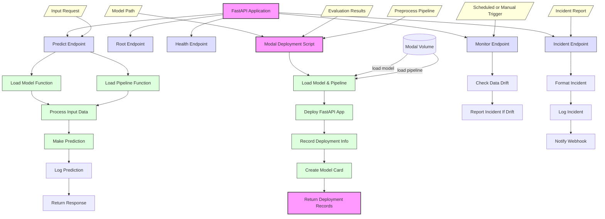

EU AI Act Compliant Credit Scoring Pipeline Architecture

## PIPELINE EXECUTION FLOW DIAGRAMS

### Feature Engineering Pipeline

```mermaid
  graph TD
      %% Main Pipeline Flow
      Start[Feature Engineering Pipeline] --> DL[Data Loader]
      DL --> DS[Data Splitter]
      DS --> DP[Data Preprocessor]
      DP --> GCM[Generate Compliance Metadata]
      GCM --> End[Pipeline Output]

      %% Data Flow
      RawData[/HuggingFace Dataset/] --> DL
      DL -- raw_data --> DS
      DS -- dataset_trn,dataset_tst --> DP
      DP -- train_df,test_df,preprocess_pipeline --> GCM
      DP -- preprocessing_metadata --> GCM
      DP -- Save to Modal Volume --> ModelVolume[(Modal Volume)]
      GCM -- Save to Compliance Directory --> ComplianceFiles[(Compliance Files)]
      GCM -- compliance_info --> End

      %% ZenML Metadata Logging
      DL -. "log_metadata(dataset_info, profile)" .-> ZenML[(ZenML Metadata)]
      DP -. "log_metadata(preprocessing_metadata)" .-> ZenML
      GCM -. "log_metadata(compliance_record)" .-> ZenML

      %% Local Storage Operations
      DL -- "save_profile" --> WhylogsProfile[(WhyLogs Profile)]
      DP -- "pipeline.fit" --> TrainDf[/Processed Train Dataset/]
      DP -- "pipeline.transform" --> TestDf[/Processed Test Dataset/]

      %% Subgraph for Data Loader
      subgraph "Data Loader Steps"
          DL_load[Load dataset] --> DL_hash[Calculate SHA-256 hash]
          DL_hash --> DL_stats[Generate dataset stats]
          DL_stats --> DL_sensitive[Identify sensitive attributes]
          DL_sensitive --> DL_profile[Create WhyLogs profile]
      end

      %% Subgraph for Data Preprocessor
      subgraph "Data Preprocessor Steps"
          DP_drop_na[Drop NA values] --> DP_drop_cols[Drop specified columns]
          DP_drop_cols --> DP_normalize[Normalize numeric features]
          DP_normalize --> DP_transform[Transform data with pipeline]
          DP_transform --> DP_save[Save preprocessing artifacts]
      end

      %% Subgraph for Compliance Metadata
      subgraph "Compliance Documentation"
          GCM_features[Generate feature metadata] --> GCM_sensitive[Identify sensitive attributes]
          GCM_sensitive --> GCM_compliance[Create compliance record]
      end

      classDef pipeline fill:#f9f,stroke:#333,stroke-width:2px
      classDef storage fill:#bbf,stroke:#333,stroke-width:1px
      classDef step fill:#dfd,stroke:#333,stroke-width:1px
      classDef data fill:#ffd,stroke:#333,stroke-width:1px

      class Start,End pipeline
      class ModelVolume,ZenML,ComplianceFiles,WhylogsProfile storage
      class DL,DS,DP,GCM step
      class RawData,TrainDf,TestDf data
```

### Training Pipeline

```mermaid
  graph TD
      %% Main Pipeline Flow
      Start[Training Pipeline] --> TM[Train Model]
      TM --> EM[Evaluate Model]
      EM --> RA[Risk Assessment]
      RA --> End[Pipeline Output]

      %% Data Flow
      TrainDf[/Train Dataset/] --> TM
      TestDf[/Test Dataset/] --> TM
      TM -- model_path --> EM
      TestDf --> EM
      EM -- evaluation_results --> RA
      ModelVolume[(Modal Volume)] -- volume_metadata --> TM
      ModelVolume -- volume_metadata --> EM
      ModelVolume -- volume_metadata --> RA

      %% ZenML Metadata Logging
      TM -. "log_metadata(model_info)" .-> ZenML[(ZenML Metadata)]
      EM -. "log_metadata(metrics)" .-> ZenML
      RA -. "log_metadata(risk_scores)" .-> ZenML

      %% Modal Volume Operations
      TM -- "save_model_to_modal" --> ModelVolume
      EM -- "save_artifact_to_modal(fairness_report)" --> ModelVolume
      RA -- "save_artifact_to_modal(risk_register)" --> ModelVolume

      %% Local Storage Operations
      TM -- "joblib.dump" --> ModelFile[/Local Model File/]
      RA -- "update Excel risk register" --> RiskRegister[/Risk Register Excel/]
      RA -- "export Markdown snapshot" --> RiskRegisterMd[/Risk Register Markdown/]

      %% Subgraph for Train Model
      subgraph "Train Model Steps"
          TM_prepare[Prepare data] --> TM_train[Train GradientBoosting model]
          TM_train --> TM_save[Save model locally and to Modal]
          TM_save --> TM_log[Log model metrics and card]
      end

      %% Subgraph for Evaluate Model
      subgraph "Evaluate Model Steps"
          EM_load[Load model] --> EM_metrics[Calculate performance metrics]
          EM_metrics --> EM_fairness[Analyze fairness metrics]
          EM_fairness --> EM_save[Save fairness report]
      end

      %% Subgraph for Risk Assessment
      subgraph "Risk Assessment Steps"
          RA_score[Score risk based on eval results] --> RA_update[Update Excel risk register]
          RA_update --> RA_export[Export Markdown snapshot]
      end

      classDef pipeline fill:#f9f,stroke:#333,stroke-width:2px
      classDef storage fill:#bbf,stroke:#333,stroke-width:1px
      classDef step fill:#dfd,stroke:#333,stroke-width:1px
      classDef data fill:#ffd,stroke:#333,stroke-width:1px

      class Start,End pipeline
      class ModelVolume,ZenML,ModelFile,RiskRegister,RiskRegisterMd storage
      class TM,EM,RA step
      class TrainDf,TestDf data
```

### Deployment Pipeline

```mermaid
  graph TD
      %% Main Pipeline Flow
      Start[Deployment Pipeline] --> AD[Approve Deployment]
      AD --> MD[Modal Deployment]
      MD --> PMM[Post Market Monitoring]
      MD --> GAIV[Generate Annex IV Documentation]
      PMM --> End[Pipeline Output]
      GAIV --> End

      %% Data Flow
      EvalResults[/Evaluation Results/] --> AD
      RiskScores[/Risk Scores/] --> AD
      PrepipeLine[/Preprocess Pipeline/] --> MD
      ModelVolume[(Modal Volume)] -- volume_metadata --> AD
      ModelVolume -- volume_metadata --> MD
      ModelVolume -- volume_metadata --> GAIV
      AD -- approved --> MD
      MD -- deployment_info --> PMM
      EvalResults --> MD
      EvalResults --> PMM
      EvalResults --> GAIV
      RiskScores --> GAIV

      %% ZenML Metadata Logging
      AD -. "log_metadata(approval_record)" .-> ZenML[(ZenML Metadata)]
      MD -. "log_metadata(deployment_info)" .-> ZenML
      PMM -. "log_metadata(monitoring_plan)" .-> ZenML
      GAIV -. "log_metadata(compliance_artifacts)" .-> ZenML

      %% Modal Volume Operations
      MD -- "deploy to Modal endpoint" --> ModalEndpoint[(Modal API Endpoint)]
      MD -- "save_compliance_artifacts_to_modal" --> ModelVolume
      GAIV -- "save_compliance_artifacts_to_modal" --> ModelVolume

      %% Local Storage Operations
      AD -- "save approval record" --> ApprovalDir[/Approval Records/]
      PMM -- "save monitoring plan" --> MonitoringDir[/Monitoring Plan/]
      GAIV -- "save Annex IV docs" --> ReportsDir[/Compliance Reports/]

      %% Subgraph for Approve Deployment
      subgraph "Approval Process"
          AD_summary[Display performance summary] --> AD_decision[Get human approval decision]
          AD_decision --> AD_record[Create approval record]
      end

      %% Subgraph for Modal Deployment
      subgraph "Modal Deployment Steps"
          MD_load[Import deployment module] --> MD_run[Execute deployment script]
          MD_run --> MD_record[Create deployment record]
          MD_record --> MD_save[Save artifacts to Modal]
      end

      %% Subgraph for Post-Market Monitoring
      subgraph "Monitoring Setup"
          PMM_thresholds[Define monitoring thresholds] --> PMM_plan[Create monitoring plan]
          PMM_plan --> PMM_save[Save monitoring plan]
      end

      %% Subgraph for Annex IV Documentation
      subgraph "Documentation Generation"
          GAIV_metadata[Collect ZenML metadata] --> GAIV_manual[Load manual inputs]
          GAIV_manual --> GAIV_render[Render template]
          GAIV_render --> GAIV_save[Save documentation]
      end

      classDef pipeline fill:#f9f,stroke:#333,stroke-width:2px
      classDef storage fill:#bbf,stroke:#333,stroke-width:1px
      classDef step fill:#dfd,stroke:#333,stroke-width:1px
      classDef data fill:#ffd,stroke:#333,stroke-width:1px

      class Start,End pipeline
      class ModelVolume,ZenML,ModalEndpoint,ApprovalDir,MonitoringDir,ReportsDir storage
      class AD,MD,PMM,GAIV step
      class EvalResults,RiskScores,PrepipeLine data
```

### Modal Deployment Implementation

