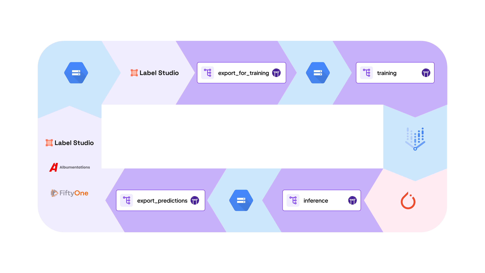
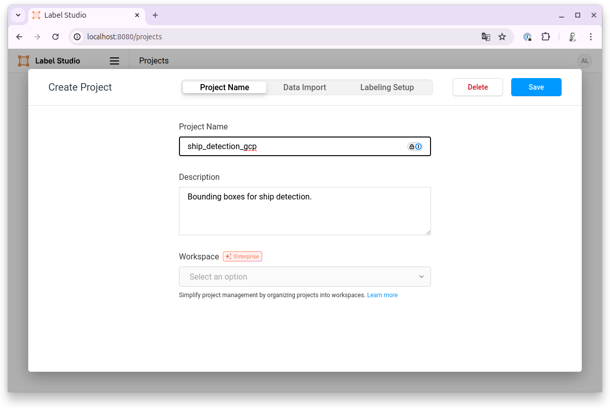
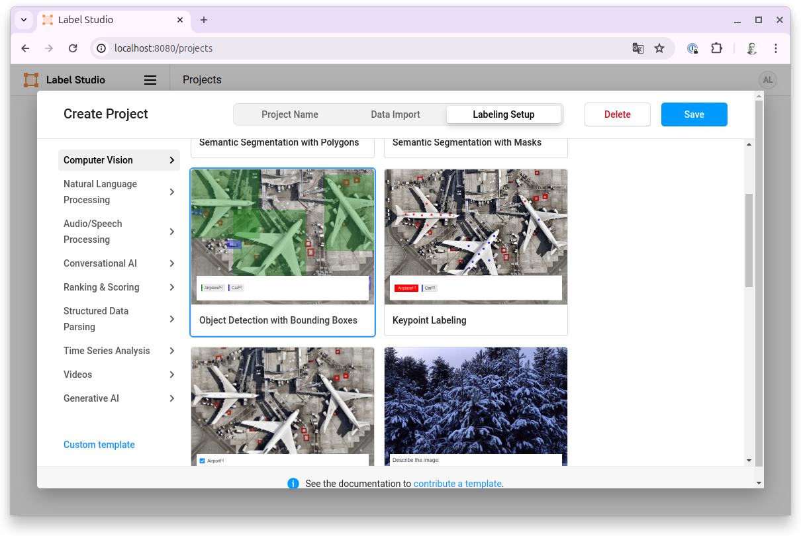
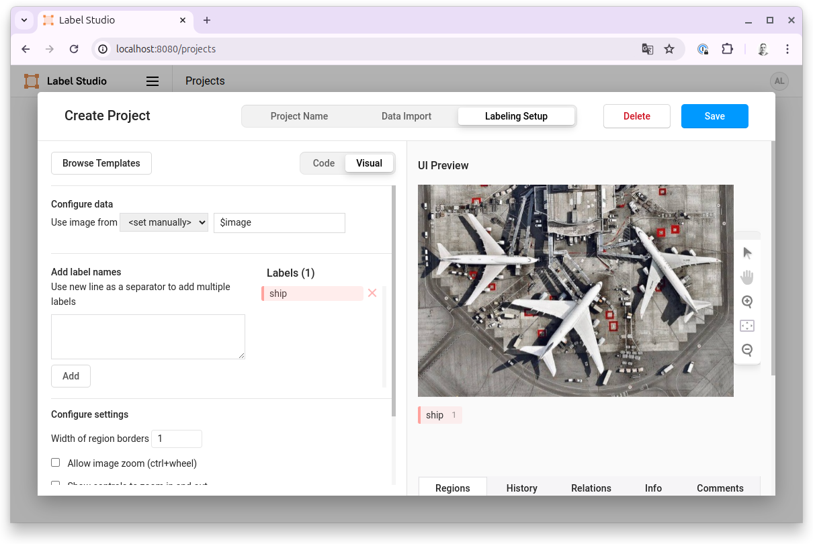

# End-to-end Computer Vision 🌄

This is a project that demonstrates an end-to-end computer vision pipeline using
ZenML. The pipeline is designed to be modular and flexible, allowing for easy
experimentation and extension.



The project showcases the full lifecycle of a computer vision project, from data
collection and preprocessing to model training and evaluation. The pipeline also
incorporates a human-in-the-loop (HITL) component, where human annotators can
label images to improve the model's performance, as well as feedback using
[Voxel51's FiftyOne](https://voxel51.com/fiftyone/) tool.

The project uses the [Ship Detection
dataset](https://huggingface.co/datasets/datadrivenscience/ship-detection) from
[DataDrivenScience](https://datadrivenscience.com/) on the Hugging Face Hub,
which contains images of ships in satellite imagery. The goal is to train a
model to detect ships in the images. Note that this isn't something that our
YOLOv8 model is particularly good at out of the box, so it serves as a good
example of how to build a pipeline that can be extended to other use cases.

This project needs some infrastructure and tool setup to work. Here is a list of
things that you'll need to do.

## ZenML

We recommend using our [ZenML Pro offering](https://cloud.zenml.io/) to get a
deployed instance of ZenML:

### Set up your environment

```bash
pip install uv
uv venv .venv
source .venv/bin/activate
uv pip install -r requirements.txt
zenml integration install pytorch gcp mlflow label_studio -y
pip uninstall wandb  # This comes in automatically
```

And to use the Albumentations and annotation plugins in the last step, you'll
need to install them:

```bash
fiftyone plugins download https://github.com/jacobmarks/fiftyone-albumentations-plugin
fiftyone plugins download https://github.com/voxel51/fiftyone-plugins --plugin-names @voxel51/annotation
```

You should also set up the following environment variables:

```bash
export DATA_UPLOAD_MAX_NUMBER_FILES=1000000
export WANDB_DISABLED=True
```

### Connect to your deployed ZenML instance

```bash
zenml login <INSERT_ZENML_URL_HERE>
```

## Cloud Provider

We will use GCP in the commands listed below, but it will work for other cloud
providers.

1) Follow our guide to set up your credentials for GCP [here](https://docs.zenml.io/how-to/auth-management/gcp-service-connector)
2) Set up a bucket in GCP to persist your training data
3) Set up a bucket to use as artifact store within ZenML
Learn how to set up a GCP artifact store stack component within ZenML
[here](https://docs.zenml.io/stack-components/artifact-stores)
4) Set up Vertex for pipeline orchestration
Learn how to set up a Vertex orchestrator stack component within ZenML
[here](https://docs.zenml.io/stack-components/orchestrators/vertex)
5) For training on accelerators like GPUs/TPUs set up Vertex
Learn how to set up a Vertex step operator stack component within ZenML
[here](https://docs.zenml.io/stack-components/step-operators/vertex)
6) Set up a Container Registry in GCP. Learn how to set up a Google Cloud Container Registry component within ZenML
[here](https://docs.zenml.io/stack-components/container-registries/gcp)

## Label Studio

1) [Start Label Studio locally](https://labelstud.io/guide/start)
    For Label Studio we recommend using docker/docker-compose to deploy a local instance
    ```bash
    git clone https://github.com/HumanSignal/label-studio.git
    cd label-studio
    docker-compose up -d # starts label studio at http://localhost:8080
    ```
2) [Follow these ZenML instructions to set up Label Studio as a stack component](https://docs.zenml.io/stack-components/annotators/label-studio#how-to-deploy-it)
3) Create a project within Label Studio and name it `ship_detection_gcp`

4) Configure your project to use `Object Detection with Bounding Boxes` as Labeling Setup

In the following screen you now need to configure the labeling interface. This is where you define the different classes that you want to detect. In our case this should be a single `ship` class.

Additionally, you might want to allow users to zoom during labeling. This can be configured when you scroll down on this same screen.
5) [Set up Label Studio to use external storage](https://labelstud.io/guide/storage) 
Use the first bucket that you created for data persistence

## Hugging Face

This specific project relies on a dataset loaded from Hugging Face. As such a free Hugging Face account is needed.

1) Login in the CLI. Simply follow the instructions from this command.
```commandline
huggingface-cli login
```

## ZenML Stacks

### Local Stack

The local stack should use the `default` orchestrator, a gcp remote artifact
store that we'll call `gcp_artifact_store` here and a local label-studio
annotator that we'll refer to as `label_studio_local`.

```bash
# Make sure to replace the names with the names that you choose for your setup
zenml stack register <local_stack> -o default -a <gcp_artifact_store> -an <label_studio_local>
```

### Remote Stack

The remote stack should use the `vertex_orchestrator` , a `gcp_artifact_store`,
a `gcp_container_registry` and a `vertex_step_operator`.


```bash
# Make sure to replace the names with the names that you choose for your setup
zenml stack register <gcp_stack> -o <vertex_orchestrator> -a <gcp_artifact_store> -c <gcp_container_registry> -s <vertex_step_operator>
```

The project consists of the following pipelines:

## `data_ingestion_pipeline`

This pipeline downloads the [Ship Detection
dataset](https://huggingface.co/datasets/datadrivenscience/ship-detection). This
dataset contains some truly huge images with a few hundred million pixels. In
order to make these usable, we break down all source images into manageable
tiles with a maximum height/width of 1000 pixels. After this preprocessing is
done, the images are uploaded into a cloud bucket and the ground truth
annotations are uploaded to a local Label Studio instance.

### Configure this pipeline

The configuration file for this pipeline lives at `./configs/ingest_data.yaml`.
Make sure in particular to change `data_source` to point at the GCP bucket which
is dedicated to be the storage location for the data. Also make sure to adjust
the `ls_project_id` to correspond to the id of your project within Label Studio.

### Run this pipeline

Label Studio should be up and running for the whole duration of this pipeline
run. 
Also in `configs/ingest_data.yaml`, make sure to change the dataset name to the name of the dataset in Label Studio. You'll also want to make sure the storage type is set to `gcs` if you are using GCP, and don't forget to set `ls_storage_id` and `ls_project_id` 
to the correct values.

```bash
zenml stack set <local_stack>
python run.py --ingest
```

## `data_export_pipeline`

This pipeline exports the annotations from Label Studio and loads it into the
ZenML artifact store to make them accessible to downstream pipelines.

### Configure this pipeline

The configuration file for this pipeline lives at `./configs/data_export.yaml`.
Make sure in particular to change `dataset_name` to reflect the name of the
dataset within Label Studio.

### Run this pipeline

Label Studio should be up and running for the whole duration of this pipeline
run.

```bash
zenml stack set <local_stack>
python run.py --export
```

## `training_pipeline`

This pipeline trains a YOLOv8 object detection model. 

### Configure this pipeline

You can choose to run this pipeline locally or on the cloud. These two options
use two different configuration files. For local training:
`./configs/training_pipeline.yaml`. For training on the cloud:
`./configs/training_pipeline_remote_gpu.yaml`. Make sure `data_source` points to
your cloud storage bucket.

### Run this pipeline

This pipeline requires the associated model (see the model section of the
configuration yaml file) to have a version in the `staging` stage. In order to
promote the model produced by the latest run of the `data_export_pipeline`, run
the following code:

```bash
zenml model version update <MODEL_NAME> latest -s staging 
```

For local training run the following code:

```bash
zenml stack set <local_stack>
python run.py --training --local
```

For remote training run the following code:

```bash
zenml stack set <remote_stack>
python run.py --training
```

## `inference_pipeline`

This pipeline performs inference on the object detection model.

### Configure this pipeline
You can configure this pipeline at the following yaml file
`./configs/inference_pipeline.yaml`.  Make sure `data_source` points to your
cloud storage bucket that contains images that you want to perform batch
inference on

### Run this pipeline

This pipeline requires the associated model (see the model section of the
configuration yaml file) to have a version in the `production` stage. In order
to promote the model produced by the latest run of the `training_pipeline`, run
the following code:

```bash
zenml model version update <MODEL_NAME> staging -s production 
```

```bash
zenml stack set <local_stack>
python run.py --inference
```


## Analyze and Curate your data through FiftyOne

Now to close the loop, we will import the predictions into FiftyOne. All you'll
need to do is run:

```bash
python run.py --fiftyone
```

Within FiftyOne, you can now analyze all the predictions and export them back to
Label Studio for fine-tuned labeling and retraining.
