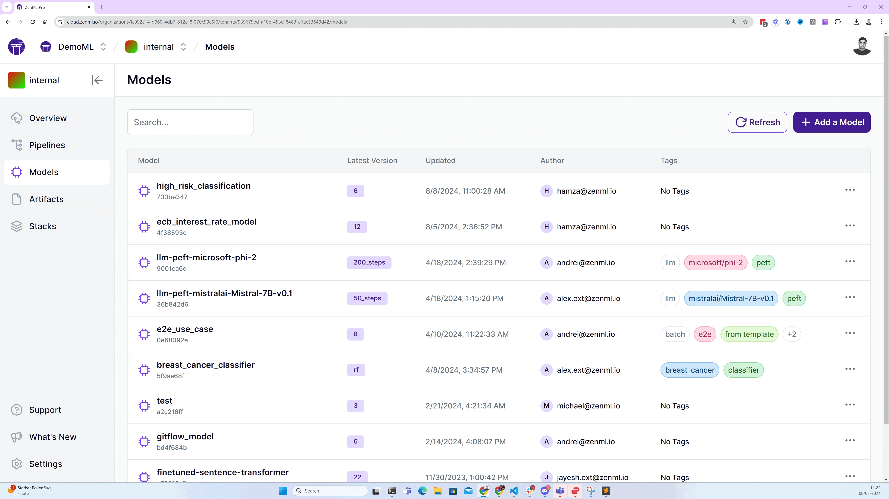

# 🌸 Iris Classification MLOps Pipeline with ZenML

Welcome to the Iris Classification MLOps project! This project demonstrates how to build a production-ready machine learning pipeline using ZenML. It showcases various MLOps practices including data preparation, model training, evaluation, explainability, and data drift detection.

## 🌟 Features

- Data loading and splitting using scikit-learn's iris dataset
- SVM model training with hyperparameter configuration
- Model evaluation with accuracy metrics
- Model explainability using SHAP (SHapley Additive exPlanations)
- Data drift detection between training and test sets
- Artifact and metadata logging for enhanced traceability

<div align="center">
  <br/>
    
  <br/>
</div>

## 🏃 How to Run

Before running the pipeline, set up your environment as follows:

```bash
# Set up a Python virtual environment
python3 -m venv .venv
source .venv/bin/activate

# Install requirements
pip install -r requirements.txt
```

To run the Iris Classification pipeline:

```shell
python run.py
```

## 🧩 Pipeline Steps

1. **Load Data**: Loads the iris dataset and splits it into train and test sets.
2. **Train Model**: Trains an SVM classifier on the training data.
3. **Evaluate Model**: Evaluates the model on the test set and generates predictions.
4. **Explain Model**: Generates SHAP values for model explainability.
5. **Detect Data Drift**: Detects potential data drift between training and test sets.

## 📊 Visualizations

The pipeline generates a SHAP summary plot to explain feature importance:

<div align="center">
  <br/>
    
  <br/>
</div>

## 🛠️ Customization

You can customize various aspects of the pipeline:

- Adjust the `SVC` hyperparameters in the `train_model` step
- Modify the train-test split ratio in the `load_data` step
- Add or remove features from the iris dataset
- Implement additional evaluation metrics in the `evaluate_model` step

## 📜 Project Structure

```
.
├── run.py                            # Main pipeline file
├── requirements.txt                  # Python dependencies
└── README.md                         # This file
```

## 🤝 Contributing

Contributions to improve the pipeline are welcome! Please feel free to submit a Pull Request.

## 📄 License

This project is licensed under the Apache License 2.0. See the LICENSE file for details.