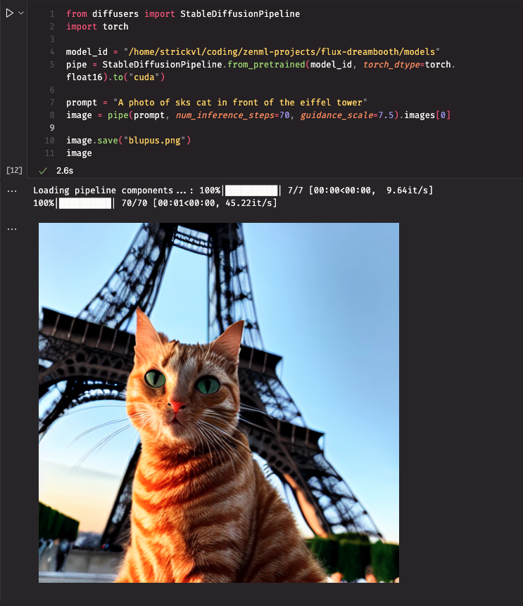
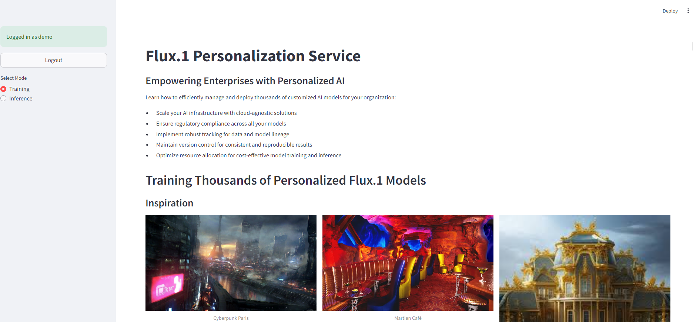
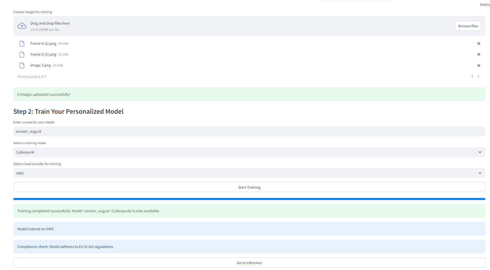

# Scaling Personalized AI with Flux.1 and DreamBooth

This project demonstrates how to build a scalable system for creating
personalized AI models using Flux.1 and DreamBooth. The goal is to enable
thousands of users to create their own personalized AI models with just a few
clicks.

## Overview

The project tackles the technical challenges of scaling generative AI services and leverages open-source tools like ZenML to construct pipelines for mass AI personalization on any cloud platform. It covers various aspects, including:

- Techniques for deploying on any cloud
- Strategies for keeping the AI watchdogs at bay (e.g., EU AI Act)
- Tracking data and models for better organization
- Versioning models, data, and code
- Ensuring consistent behavior in distributed setups
- Leveraging open-source tools like ZenML to build robust GenAI systems

## Getting Started

To get started with this project, follow these steps:

1. Clone the repository: `git clone https://github.com/your-repo/personalized-ai.git`
2. Install the required dependencies: `pip install -r requirements.txt`
3. Prepare your instance data (images or text) and place it in the appropriate directory.
4. Configure the project settings in the provided configuration files.
5. Run the ZenML pipeline: `zenml run dreambooth_pipeline`

## Project Structure

The project is structured as follows:

- `notebooks/paris-ai-tinkerers-demo.ipynb`: The main Jupyter Notebook containing the project code and explanations.
- `instance_examples/`: Directory for storing the instance data (e.g., images) used for training the personalized models.
- `config/`: Directory for configuration files.
- `models/`: Directory for storing trained models.
- `outputs/`: Directory for storing generated outputs (e.g., images).

## Frontend

The project ships with a streamlit frontend to showcase how you can juggle between the models:

## Contributing

Contributions to this project are welcome! If you find any issues or have suggestions for improvements, please open an issue or submit a pull request.

## License

This project is licensed under the [MIT License](LICENSE).
