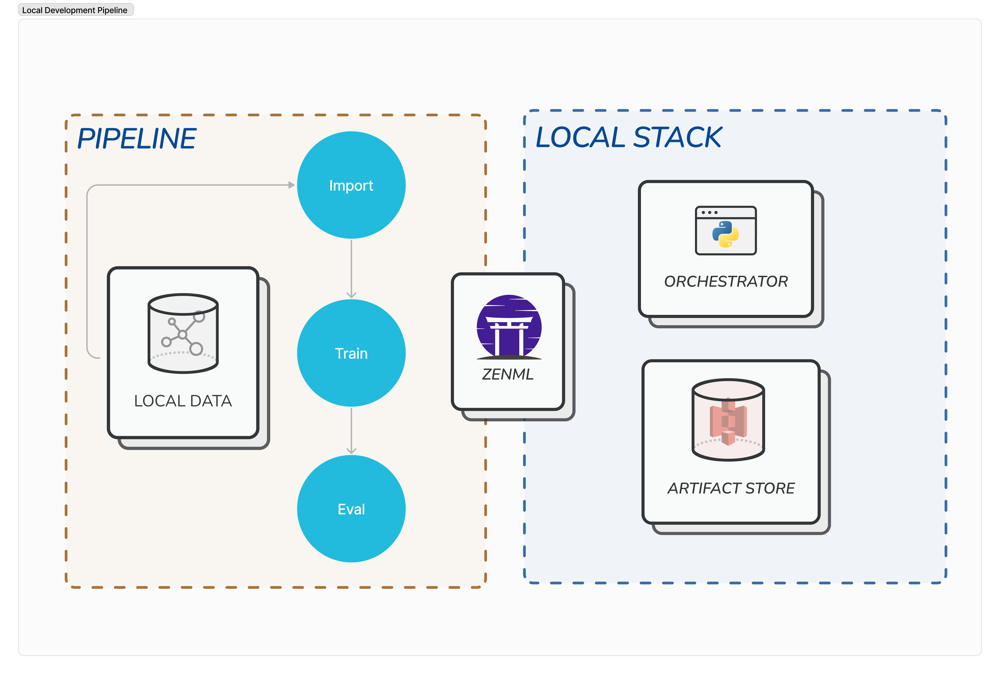
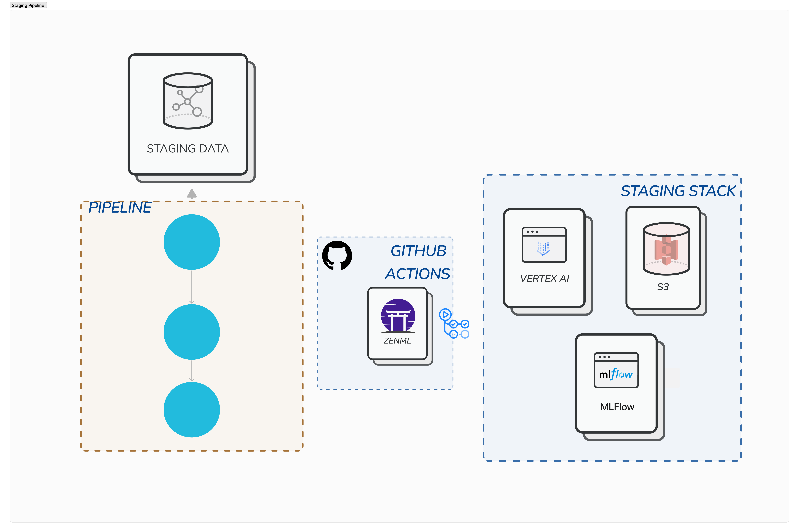
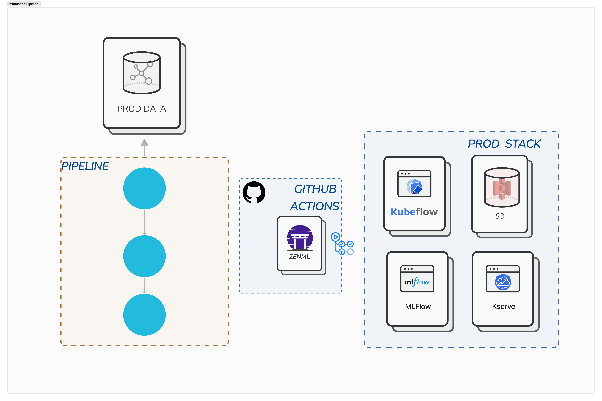

# ZenML - GitHub Action Workflow

<div align="center">
  <a href="https://zenml.io">
    
  </a>

  <h3 align="center">Build portable, production-ready MLOps pipelines.</h3>

  <p align="center">
    A simple yet powerful open-source framework that integrates all your ML tools.
    <br />
    <a href="https://docs.zenml.io/"><strong>Explore the docs »</strong></a>
    <br />
    <div align="center">
      Join our <a href="https://zenml.io/slack-invite" target="_blank">
      
    <b>Slack Community</b> </a> and be part of the ZenML family.
    </div>
    <br />
    <a href="https://zenml.io/features">Features</a>
    ·
    <a href="https://zenml.io/roadmap">Roadmap</a>
    ·
    <a href="https://github.com/zenml-io/zenml/issues">Report Bug</a>
    ·
    <a href="https://zenml.io/discussion">Vote New Features</a>
    ·
    <a href="https://blog.zenml.io/">Read Blog</a>
    ·
    <a href="#-meet-the-team">Meet the Team</a>
    <br />
    <br />
    <a href="https://www.linkedin.com/company/zenml/">
    
    </a>
    <a href="https://twitter.com/zenml_io">
    
    </a>
    <a href="https://www.youtube.com/c/ZenML">
    
    </a>
  </p>
</div>


## 🖼️ Overview

This repository showcases how ZenML can be used for machine learning with a
GitHub workflow that automates CI/CD with continuous model training and
continuous model deployment to production. This allows data scientists to
experiment with data processing and model training locally and then have code
changes automatically tested and validated through the standard GitHub PR peer
review process. Changes that pass the CI and code-review are then deployed
automatically to production.

This repository is also meant to be used as a template: you can fork it and
easily adapt it to your own MLOps stack, infrastructure, code and data.

Here's an architecture diagram of what this can look like:


The workflow works as follows:

A data scientist wants to make improvements to the ML pipeline. They clone the 
repository, create a new branch, and experiment with new models or data 
processing steps on their local machine.




Once the data scientist thinks they have improved the pipeline, they create a 
pull request for his branch on GitHub. This automatically triggers a GitHub Action 
that will run the same pipeline in the staging environment (e.g. a pipeline 
running on a cloud stack in GCP), potentially with different test data. As long
as the  pipeline does not run successfully in the staging environment, the PR
cannot be  merged. The pipeline also generates a set of metrics and test results
that are automatically published to the PR, where they can be peer-reviewed to
decide if the changes should be merged.



Once the PR has been reviewed and passes all checks, the branch is merged into 
main. This automatically triggers another GitHub Action that now runs a 
pipeline in the production environment, which trains the same model on 
production data, runs some checks to compare its performance with the model
currently served in production and then, if all checks pass, automatically
deploys the new model.



The pipeline implementations follow a set of best practices for MLOps summarized
below:

* **Experiment Tracking**: All experiments are logged with an experiment tracker
(MLflow), which allows for easy comparison of different runs and models and
provides quick access to visualization and validation reports.
* **Data and Model validation**: The pipelines include a set of Deepchecks-powered
steps that verify integrity of the data and evaluate the model after
training. The results are gathered, analyzed and then a report is generated with
a summary of the findings and a suggested course of action. This provides useful
insights into the quality of the data and the performance of the model and helps to
catch potential issues early on, before the model is deployed to production.
* **Pipeline Tracking**: All pipeline runs and their artifacts are of course
versioned and logged with ZenML. This enables features such as lineage tracking,
provenance, caching and reproducibility.
* **Continuous Integration**: All changes to the code are tested and validated
automatically using GitHub Actions. Only changes that pass all tests are merged
into the main branch. This applies not only to the code itself, but also to
the ML artifacts, such as the data and the model.
* **Continuous Deployment**: When a change is merged into the main branch, it is
automatically deployed to production using ZenML and GitHub Actions. There are also
additional checks in place to ensure that the model is not deployed if it is
not fit for production or performs worse than the model currently deployed.
* **Software Dependency Management**: All software dependencies are managed
in a way that guarantees full reproducibility and are automatically installed
by ZenML in the pipeline runtime environments. Python package versions are frozen
and pinned to ensure that the pipeline runs are fully reproducible.
* **Reproducible Randomness**: All randomness is controlled and seeded to ensure
reproducibility and caching of the pipeline runs.

## 📦 Local workflow for development and experimentation

This workflow is meant to be run on a local machine by someone who wants to make
local code changes e.g. to build a better model or to use a different
data source. Aside from training the model, the training pipeline also includes
a set of Deepchecks steps that check the data integrity and evaluate the model.
The results are gathered, analyzed and then a report with the results is
generated and printed out.

### 🏇 How to run

1. Clone the repository and create a development branch

```
git clone git@github.com:zenml-io/zenml-gitflow.git
git checkout -b <your-branch-name>
```

2. Install local requirements in a virtual environment

```
virtualenv .venv
source .venv/bin/activate
pip install -r requirements.txt
```

3. Set up your local stack

```
stacks/setup_local_stack.sh
```

NOTE: this script registers a stack that consists of the following components:

* the default local orchestrator and artifact store
* a local MLflow tracking server
* a local MLflow model deployer
* Deepchecks as a data/model validator

4. Iterate on making local code changes and run the training pipeline locally to
test your changes:

```
python run.py
```

A report will be printed to the console and the model as well as the metrics
and check results generated by Deepchecks will be saved in the MLflow experiment
tracker. You can view the results in the MLflow UI by starting the MLFlow UI
server on your local machine, as instructed in the run output.

You can optionally exercise the end-to-end workflow locally by running the
pipeline involved in the GitHub automated CI/CD workflow. The end-to-end
pipeline adds model deployment to model training. It also includes steps that
compare the performance of the recently trained model with the performance of
the model currently deployed:

```
python run.py --pipeline=end-to-end
```

5. When you're ready, push a PR with your changes to `main`. This will trigger
the GitHub CI workflow that will check your code changes using a different
stack running on Vertex AI in GCP!

## 📦 GitHub staging workflow for automated CI

This workflow is meant to be run as part of a automated gating CI/CD job that is
triggered to test code changes before they are incorporated into the main
repository branch on GitHub.

### 🏇 How to trigger

1. publish a PR with your code changes to the GitHub repository, or push
additional to an existing PR.

2. this next part is automated with the help of GitHub Actions. A GitHub
workflow is triggered automatically when PR code changes are detected. The
workflow will run the same training pipeline as in the local setup, but this
time it will use a different dataset as input, a remote ZenML server and a cloud
ZenML stack consisting of the following:

* a Vertex AI orchestrator
* a GCS artifact store
* a remote MLflow tracking server
* Deepchecks as a data/model validator

The training results will be saved in the remote MLflow tracking server and the
report will be attached to the PR as a comment, where it can be analyzed by
other team members as part of the PR review process.

3. When the PR is merged to `main`, the production workflow is triggered and
will deploy a new model to production with AWS and Kubeflow!

### 🏇 How to run locally

If you need to run the GitHub staging workflow locally e.g. to debug it or to
update it, you can do so by replicating [the steps in the staging GitHub workflow](./.github/workflows/staging.yaml).
However, you need to be granted write access to the remote ZenML server and 
credentials to access cloud resources used in the stack, which is why you should
fork the repository, deploy ZenML and run the workflow on your own stack.

Assuming you have already done so, this is how you can run the workflow locally:

1. Install cloud requirements in a virtual environment (these are different
from the local requirements because you're using a GCP cloud stack):

```
virtualenv .venv-staging
source .venv-staging/bin/activate
pip install -r requirements-gcp.txt
```

2. Connect to the remote ZenML server (NOTE: the default local ZenML deployment
or a local ZenML server will not work because there are remote components in the
stack that also need to access the remote ZenML server):

```
zenml connect --url <ZENML_HOST> --username <ZENML_USERNAME> --password <ZENML_PASSWORD>
```
3. Authenticate to GCP:

```
gcloud auth configure-docker --project zenml-demos
```

4. Register and/or activate your GCP stack:

```
stacks/setup_staging_stack.sh

# or

zenml stack set gcp_gitflow_stack
```

5. Run the staging workflow:

```
python run.py --requirements=requirements-gcp.txt --dataset staging
```


## 📦 GitHub production workflow for automated CD

This workflow is meant to be run as part of a automated continuous deployment
job that is used to deploy a new model to production whenever a change is merged
into the main repository branch on GitHub.

### 🏇 How to trigger

1. merge a PR to the main branch in the GitHub repository, or push
changes directly to the main branch.

2. this next part is automated with the help of GitHub Actions. A GitHub
workflow is triggered automatically when code changes land in the main branch.
The workflow will run an end-to-end pipeline that goes through model training,
same as the training pipeline, compares the model to the one already deployed
in production, then deploys the new model if it passes tests. This workflow
uses a remote ZenML server and a cloud ZenML stack consisting of the
following:

* a Kubeflow orchestrator deployed in an AWS EKS cluster
* an S3 artifact store
* a remote MLflow tracking server
* Deepchecks as a data/model validator
* KServe as a model deployer, running on the same EKS cluster

### 🏇 How to run locally

If you need to run the GitHub staging workflow locally e.g. to debug it or to
update it, you can do so by replicating [the steps in the GitHub production workflow](./.github/workflows/production.yaml).
However, you need to be granted write access to the remote ZenML server and 
credentials to access cloud resources used in the stack, which is why you should
fork the repository, deploy ZenML and run the workflow on your own stack.

Assuming you have already done so, this is how you can run the workflow locally:

1. Install cloud requirements in a virtual environment (these are different
from the local requirements because you're using a GCP cloud stack):

```
virtualenv .venv-prod
source .venv-prod/bin/activate
pip install -r requirements-aws.txt
```

2. Connect to the remote ZenML server (NOTE: the default local ZenML deployment
or a local ZenML server will not work because there are remote components in the
stack that also need to access the remote ZenML server):

```
zenml connect --url <ZENML_HOST> --username <ZENML_USERNAME> --password <ZENML_PASSWORD>
```

3. Authenticate to AWS:

```
aws ecr get-login-password --region us-east-1 | docker login --username AWS --password-stdin 715803424590.dkr.ecr.us-east-1.amazonaws.com
aws eks --region eu-central-1 update-kubeconfig --name kubeflowmultitenant --alias zenml-eks
```

4. Set up environment variables to access the multi-user Kubeflow orchestrator:

```
export KUBEFLOW_USERNAME=<username>
export KUBEFLOW_PASSWORD=<password>
export KUBEFLOW_NAMESPACE=<namespace>
```

5. Register and/or activate your AWS stack:

```
stacks/setup_prod_stack.sh

# or

zenml stack set aws_gitflow_stack
```

6. Run the staging workflow:

```
python run.py \
            --pipeline end-to-end \
            --requirements requirements-aws.txt \
            --model iris-classifier \
            --dataset production
```

## 📦 Software requirements management

In building ML pipelines and their dependencies for production, you want to make
sure that your builds are predictable and deterministic. This requires
Python packages to be pinned to very specific versions, including ZenML itself.

A series of `requirements.in` files are maintained to contain loosely defined
package dependencies that are either required by the project or derived from the
ZenML integrations. A tool like `pip-compile` is then used to generate frozen
versions of those requirements that are used in the CI/CD pipelines to guarantee
deterministic builds and pipeline runs.

* `requirements-base.in` contains the base requirements for the project,
including ZenML itself. Note that these are not requirements that are otherwise
managed by ZenML as integrations (e.g. deepchecks, scikit-learn, etc.).
* `requirements-local.in` contains the requirements needed by the local stack.
* `requirements-gcp.in` contains the requirements needed by the GCP stack.
* `requirements-aws.in` contains the requirements needed by the AWS stack.
* `requirements.txt` are frozen package requirements that you use in your
local development workflow.
* `requirements-gcp.txt` are frozen package requirements that you use in your
GCP staging workflow.
* `requirements-aws.txt` are frozen package requirements that you use in your
AWS production workflow.

### 🏇 How to update requirements

The frozen requirements files need to be updated whenever you make a change to
the project dependencies. This includes the following:

* when you add, update or remove a new package to the project that is not
covered by ZenML or a ZenML integration
* when you update ZenML itself to a new version (which may also include updates
to the ZenML integrations and their requirements)
* when you add or remove a ZenML integration to/from the project (also reflected
in the code changes or stacks that you use for the various workflows)

Whenever one of these happens, you need to update the `requirements.in` files to
reflect the changes.

Example: you update ZenML to version 0.50.0:

1. Update the ZenML version in `requirements-base.in`:

```
zenml==0.50.0
```

2. Run `zenml integration export-requirements` commands to extract the
dependencies required by all the integrations used for each workflow and update
the corresponding `requirements.in` files:

```
# for the local workflow; these should go in requirements-local.in
zenml integration export-requirements sklearn mlflow deepchecks
# for the staging (GCP) workflow; these should go in requirements-gcp.in
zenml integration export-requirements sklearn mlflow deepchecks gcp
# for the staging (AWS) workflow; these should go in requirements-aws.in
zenml integration export-requirements sklearn mlflow deepchecks kubeflow s3 aws kserve
```

3. Run `pip-compile` to update the frozen requirements files:

```
pip-compile -v -o requirements.txt requirements-base.in requirements-local.in  --resolver=backtracking
pip-compile -v -o requirements-gcp.txt requirements-base.in requirements-gcp.in  --resolver=backtracking
pip-compile -v -o requirements-aws.txt requirements-base.in requirements-aws.in  --resolver=backtracking
```

4. Commit the changes to the `requirements.in` and `requirements.txt` files.

5. (Optional) Update the local python virtual environment that you are using for
development:

```
pip install -r requirements.txt
```

## 📦 How to fork and use this repository template

Create a new repository from this template by clicking the "Use this template"
button on the top right of the GitHub repository page. This will create a new
repository in your GitHub account that is a copy of this one.

You'll need to set up a few more things to connect your new repository to a
ZenML server and a cloud stack:

* [deploy a ZenML server using a method of your choice](https://docs.zenml.io/platform-guide/set-up-your-mlops-platform/deploy-zenml)
somewhere where the GitHub Actions workflows can access it (e.g. in the cloud, on a server or local
machine with a public IP, etc.)
* set up the resources needed by the ZenML stacks that you'll be using for the
staging and production workflows. You can use one of the
[ZenML MLOps recipes](https://docs.zenml.io/platform-guide/set-up-your-mlops-platform/deploy-and-set-up-a-cloud-stack/deploy-a-stack-using-stack-recipes)
to speed this up. You'll need the following components to be part of your stack:
  * a remote [ZenML artifact store](https://docs.zenml.io/user-guide/component-guide/artifact-stores) (e.g. GCS, S3, etc.)
  * a remote [ZenML orchestrator](https://docs.zenml.io/user-guide/component-guide/orchestrators) (e.g. Kubeflow, Airflow, Vertex AI or a basic Kubernetes orchestrator)
  * (optional) a remote [MLFlow experiment tracker](https://docs.zenml.io/user-guide/component-guide/experiment-trackers).
  Alternatively, you can use a different experiment tracker if you make changes
  to the code to use it instead of MLFlow.
  * a Kubernetes cluster with the [KServe model deployer](https://docs.zenml.io/user-guide/component-guide/model-deployers)
  installed. NOTE: due to a current ZenML limitation, KServe needs to be
  installed in the same Kubernetes cluster as the orchestrator. Alternatively,
  you can use a different model deployer if you make changes to the code to use
  a different model deployment step.
  * (optional) [a secrets manager](https://docs.zenml.io/user-guide/component-guide/secrets-managers)
  is recommended to store the credentials for the other stack components. The
  secrets manager service also needs to be accessible from the runtime used
  to run pipelines.

Once you have the ZenML server and the cloud stack set up, you'll need to do the
following to update the repository with the information about your own
environments:

1. Register the stack(s) that you'll be using for the local, staging and
production workflows. Take a look at the `stacks` directory to see an example
of how the stacks are defined.

2. Update the software dependencies in the `requirements.in` files to match
your own project requirements.

3. Update the GitHub workflow files to reference the correct secrets.

4. Finally, configure your GitHub action secrets to contain the information
needed to connect to your ZenML server and cloud stack.
