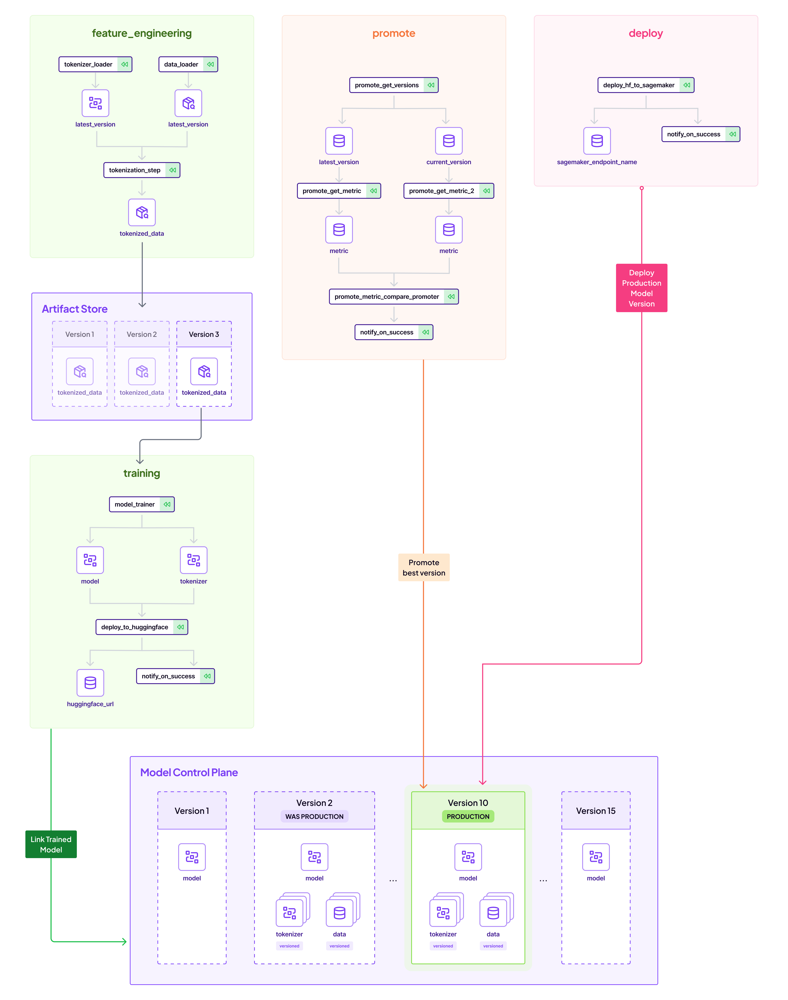
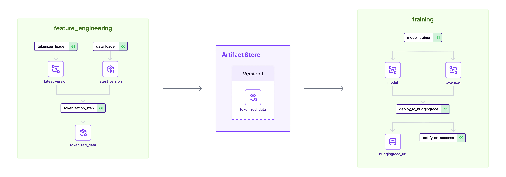
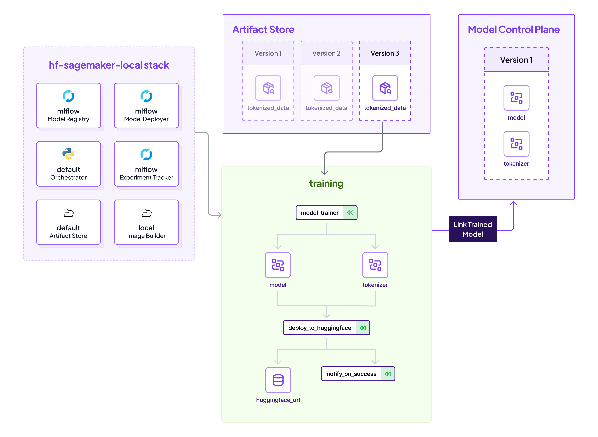
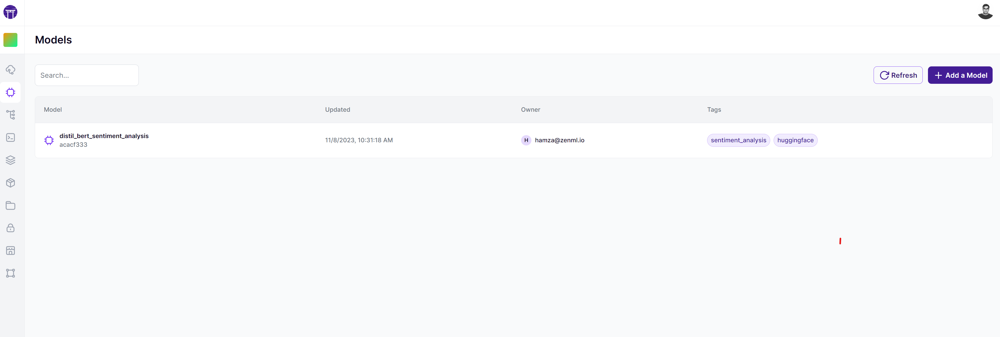
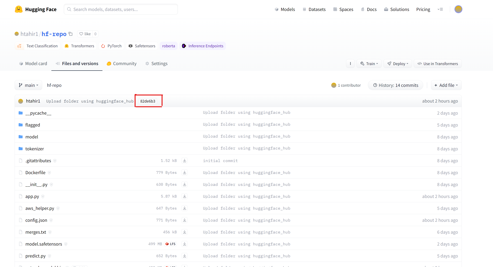
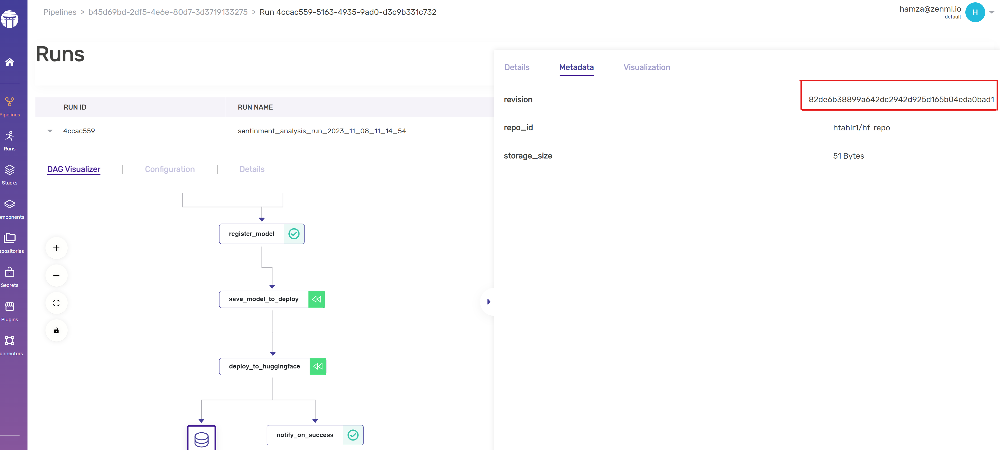
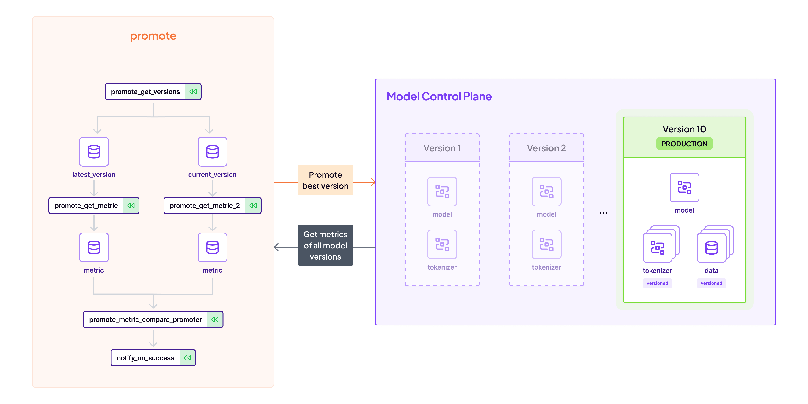
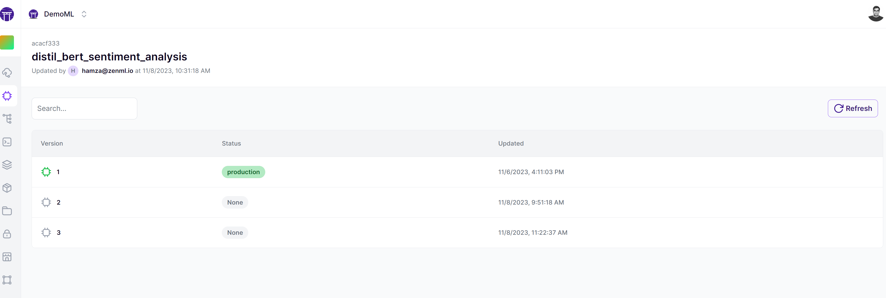
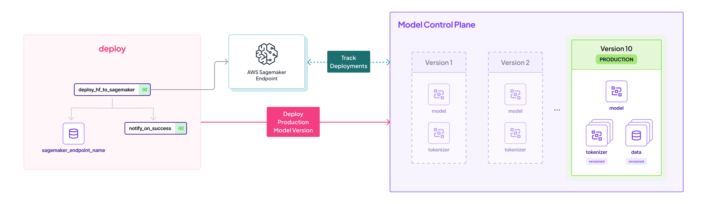

<!-- TABLE OF CONTENTS -->
<details>
  <summary>🏁 Table of Contents</summary>
  <ol>
    <li><a href="#-huggingface-model-to-sagemaker-endpoint-mlops-with-zenml">Introduction</a></li>
    <li><a href="#-get-started">Get Started</a></li>
    <li>
      <a href="#-how-to-run-this-project">How To Run This Project</a>
      <ul>
        <li><a href="#-either-use-a-jupyter-notebook">EITHER: Use a Jupyter notebook</a></li>
        <li><a href="#-or-run-it-locally">OR: Run it locally</a>
          <ul>
            <li><a href="#-step-1-start-with-feature-engineering">Step 1: Start with feature engineering</a></li>
            <li><a href="#-step-2-train-the-model">Step 2: Train the model</a></li>
            <li><a href="#-step-3-promote-the-model">Step 3: Promote the model</a></li>
            <li><a href="#-step-4-deploy-the-model">Step 4: Deploy the model</a></li>
            <li><a href="#-step-5-run-the-demo-app">Step 5: Run the demo app</a></li>
          </ul>
        </li>
      </ul>
    </li>
    <li><a href="#-getting-help">Getting Help</a></li>
  </ol>
</details>

# 🤖 Huggingface Model to Sagemaker Endpoint: Automated MLOps with ZenML

While almost every Huggingface model can be easily deployed to AWS Sagemaker endpoints with a few lines of code, it is often desirous to automate this flow, and have this process track the entire lineage of the model as it goes from training to production.

This project showcases one way of using [ZenML](https://zenml.io) pipelines to achieve this:

- Create and version a dataset in a `feature_engineering_pipeline`.
- Train/Finetune a BERT-based Sentiment Analysis NLP model and push to Huggingface Hub in a `training_pipeline`.
- Promote this model to `Production` by comparing to previous models in a `promotion_pipeline`.
- Deploy the model at the `Production` Stage to a [AWS Sagemaker](https://aws.amazon.com/pm/sagemaker/) endpoint with a `deployment_pipeline`.

Here is an overview of the entire process:



The above flow is achieved in a repeatable, fully tracked pipeline that is observable across the organization. Let's
see how this works.

## 👋 Get started

What to do first? You can start by giving the the project a quick run. The
project is ready to be used and can run as-is without any further code
changes! You can try it right away by installing ZenML, the needed
ZenML integration and then calling the CLI included in the project.

<details>
<summary><h3>Install requirements</h3></summary>

```bash
# Clone this repo
git clone git@github.com:zenml-io/zenml-huggingface-sagemaker.git
cd zenml-huggingface-sagemaker

# Set up a Python virtual environment, if you haven't already
python3 -m venv .venv
source .venv/bin/activate

# Install requirements & integrations
# Alternatively see the Makefile for commands to use
make setup
```

</details>

<details>
<summary><h3>Connect to a deployed ZenML and register secrets</h3></summary>

After this, you should have ZenML and all of the requirements of the project installed locally.
Next thing to do is to connect to a [deployed ZenML instance](https://docs.zenml.io/deploying-zenml/). You can
create a free trial using [ZenML Cloud](https://cloud.zenml.io) to get setup quickly.

Once you have your deployed ZenML ready, you can connect to it using:

```shell
zenml connect --url YOUR_ZENML_SERVER_URL
```

This will open up the browser for you to connect to a deployed ZenML!

We now need to register your Huggingface API token to run this demo. This can be found in your [settings](https://huggingface.co/settings/tokens) page. Register this as a ZenML secret with:

```shell
zenml secret create huggingface_creds --username=HUGGINGFACE_USERNAME --token=HUGGINGFACE_TOKEN
```

</details>

<details>
<summary><h3>Set up your local stack</h3></summary>

To run this project, you need to create a [ZenML Stack](https://docs.zenml.io/user-guide/starter-guide/understand-stacks) with the required components to run the pipelines.

```shell
make install-stack

zenml stack hf-sagekamer-local
```

</details>

<details>
<summary><h3>Set up AWS access</h3></summary>

To deploy to AWS SageMaker, your local AWS client needs the necessary permissions. Ensure that you have been granted SageMaker access on your AWS account. For more information about configuring AWS for programmatic access, refer to the [AWS documentation on setting up the AWS CLI](https://docs.aws.amazon.com/cli/latest/userguide/cli-configure-quickstart.html).

Please set the appropriate environment variables for your session with the following export commands:

```shell
export AWS_ACCESS_KEY_ID=your_access_key_id
export AWS_SECRET_ACCESS_KEY=your_secret_access_key
export AWS_SESSION_TOKEN=your_session_token # if you are using temporary credentials
```

Replace `your_access_key_id`, `your_secret_access_key`, and `your_session_token` with your actual AWS credentials. These credentials will allow your local AWS client to interact securely with SageMaker and other AWS services.

</details>

## 🧑‍💻 How To Run This Project

There are two paths you can take this with the project. You can either
use a notebook or run it in scripts. Choose whichever path suits your learning
style.

You can also watch a full video walkthrough on YouTube:

[](https://www.youtube.com/watch?v=Q1EH2H8Akgo)

### 📓 EITHER: Use a Jupyter notebook

```shell
# Install jupyter
pip install notebook

# Go to run.ipynb
jupyter notebook
```

### ✍️ OR: Run it locally

If you're note the notebook type, you can use this README to run the pipelines one by one.

<details>

<summary><h3>Instructions to run locally</h3></summary>

At any time, you can look at the CLI help to see what you can do with the project:
  
```shell
python run.py --help
```

Let's walk through the process one by one:

#### 👶 Step 1: Start with feature engineering

The first pipeline is the feature engineering pipeline. This pipeline loads some data from
huggingface and uses a base tokenizer to create a tokenized dataset.



Run it as follows:

```shell
python run.py --feature-pipeline --no-cache
```

Each time you run this pipeline, a new base tokenizer and tokenized dataset is produced.
In the dashboard, you can click on these artifacts and note their ID's, as they will be used
downstream in the training pipeline.

You can watch a YouTube tutorial for this part of the tutorial [here](https://youtu.be/7OTV--X9bKk).

#### 💪 Step 2: Train the model

The training pipeline trains the model on the produced data.



Run it as follows:

```shell
python run.py --training-pipeline --num-epochs 1 --train-batch-size 128 --eval-batch-size 12
```

Or if you'd like to use a specific version of data from the `feature_engineering_pipeline`, you can pass them into the CLI as follows:

```shell
python run.py --training-pipeline --num-epochs 2 --train-batch-size 32 --eval-batch-size 32 --dataset-artifact-id 678986c4-11f8-442c-9b9a-3c32ab454e02 --tokenizer-artifact-id 922787cb-151e-484a-8fd0-18f373a488ff
```

Note that if the `dataset-artifact-id` and `tokenizer-artifact-id` are not specified, the training pipeline simply appends the feature engineering pipeline to itself to create a fresh dataset.

This will train a model from Huggingface and register a new ZenML model on the Model Control Plane:



Please note the above screens are a cloud-only feature in [ZenML Cloud](https://zenml.io/cloud), and
the CLI `zenml models list` should be used instead for OSS users.

At the end of the pipeline, the model will also be pushed the Huggingface, and a link estabilished between the ZenML Control Plane and the Huggingface model repository.





Notice the linkage of the revision made on Huggingface to the metadata tracked on the ZenML pipeline. This estabilishes lineage.

You can watch a YouTube tutorial for this part of the tutorial [here](https://youtu.be/YoQoT5eSMek).

#### 🫅 Step 3: Promote the model

You can run the training pipeline a few times to produce many versions of the model. Feel free to edit the parameters accordingly.



When the time is right, you now run the promotion pipeline:

```shell
python run.py --promoting-pipeline --no-cache
```

This pipeline finds the best model from the last pipelines that were run, and promotes it to production. That simply means its marked as production in the Model Control Plane:



You can watch a YouTube tutorial for this part of the tutorial [here](https://youtu.be/_A2l3OMezvE).

#### 💯 Step 4: Deploy the model

Finally, when the time is right, its time to deploy the latest `Production` model with the deploymnet pipeline.



```shell
python run.py --deploying-pipeline
```

This uses the latest Huggingface revision, and deploys it on Sagemaker:

```shell
Creating model with name: huggingface-pytorch-inference-2023-11-08-10-33-02-272
Creating endpoint-config with name huggingface-pytorch-inference-2023-11-08-10-33-03-291
Creating endpoint with name huggingface-pytorch-inference-2023-11-08-10-33-03-291```
```

Verify that the endpoint is up:

```shell
aws sagemaker list-endpoints
```

You should see a deployed endpoint to sagemaker.

You can watch a YouTube tutorial for this part of the tutorial [here](https://youtu.be/0-dSE4vzwHY).

#### 🏃 Step 5: Run the demo app

```shell
cd gradio
python app.py
```


The demo has two modes: `sagemaker` and `local`. If sagemaker is selected, the client pings ZenML, finds the latest Production model, and uses the associated sagemaker endpoint to make the prediction. Otherwise, it just downloads the model and runs it locally. Naturally, the Sagemaker endpoint will usually be faster!

And there you go, you have successfully trained and pushed a model to Huggingface, and deplyoed it to AWS Sagemaker, in a ZenML pipeline. Read more on the [ZenML docs](https://docs.zenml.io)

</details>

## 🆘 Getting Help

Something didn't work? No problem!

The first point of call should
be [the ZenML Slack group](https://zenml.io/slack/).
Ask your questions about bugs or specific use cases, and someone from
the [core team](https://zenml.io/company#CompanyTeam) will respond.
Or, if you
prefer, [open an issue](https://github.com/zenml-io/zenml-huggingface-sagemaker/issues/new/choose) on
this GitHub repo.
