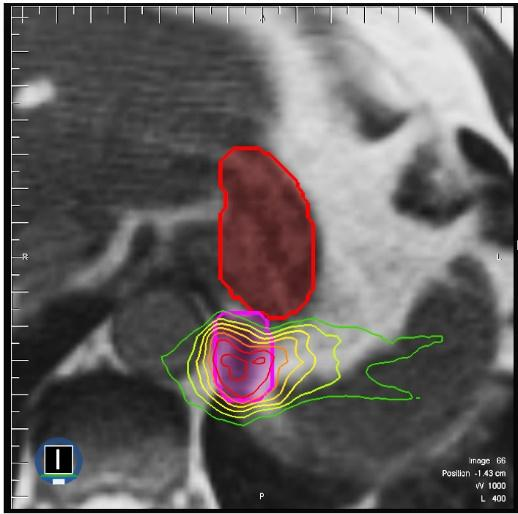

# UW-Madison GI Tract Image Segmentation

[](https://pypi.org/project/zenml/)

## 🎯 Purpose
The aim of this ZenFile is to show you how to use some of ZenML's features to build and deploy production ready machine-learning pipeline. 

By the end, you'll learn how to -
- Use ZenML as a framework to develop and a PyTorch image segmentation model.
- Integrate third-party tools like `wandb` into ZenML.
- Use step operator to offload a training job to a cloud provider.
- Utilize other features like caching to speed up your workflow. 


## 💡 The Big Picture
In 2019, an estimated 5 million people were diagnosed with a cancer of the gastro-intestinal tract worldwide.
One of the most common treatments for this type of cancer is by radiation therapy which involves delivering high doses of X-ray beams pointed to the tumors while avoiding the stomach and intestines.

With technologies like MRI, doctors are now able to visualize the position of the tumors, stomach and intestines precisely to deliver the radiation.

But here comes the tricky part.
Before the radiation can be administered, doctors must manually outline the position of tumors, stomach and intestines.
The outlining procedure is time-consuming and can delay treatment anywhere from 15 minutes to 1 hour daily.

The image below shows an example of a manually outlined position of the tumor and stomach.



The tumor is outlined in thick pink line and the stomach in thick red line.
The radiation doses are represented by the rainbow of outlines, with higher doses represented by red and lower doses represented by green.


Cancer takes enough of a toll. If successful, we'll enable doctors to safely deliver higher doses of radiation to tumors while avoiding the stomach and intestines. 

This accelerates the procedure and allows patients to get more effective treatment with less side effects and better long-term cancer control.

## 🖼 Dataset
We will be segmenting organs cells in images. For that, we'll be using data from [UW-Madison GI Tract Image Segmentation Kaggle Competiton](https://www.kaggle.com/competitions/uw-madison-gi-tract-image-segmentation/data). 

The training examples consist of image-mask pair. The images are in 16-bit grayscale PNG format and the masks are in RLE-encoded format.

## ⚙ Installation
Let's begin setting up by installing necessary Python packages. 

In your terminal, run

```bash
git clone https://github.com/zenml-io/zenfiles.git
cd zenfiles/image-segmentation
pip install -r requirements.txt
```

Since we will be using [wandb](https://github.com/wandb/client) to monitor our experiments, let's also install the `wandb` integration

```bash
zenml integration install -y wandb
```

## 🛠 Defining Pipeline and Steps
First let's define our `pipeline` and the `steps` in it.

To do that, let's create a file in `pipelines/` folder and name it `image_seg_pipeline.py`.
In this file we define a simple function `image_segmentation_pipeline` and put the `@pipeline` decorator above the function. This tells ZenML that the function is a pipeline.

```python
@pipeline(enable_cache=True, required_integrations=[WANDB])
def image_segmentation_pipeline(
    prepare_df,
    create_stratified_fold,
    augment_df,
    ..
): 

    df = prepare_df() # Step 1
    fold_dfs = create_stratified_fold(df) # Step 2
    data_transforms = augment_df() # Step 3
    ..
    ..
    ..
```

The argument `enable_cache=True` will enable caching for all the runs in the pipeline.
The `required_integrations` argument specifies the ZenML integration required to run the pipeline.
In this example, we will be using the `wandb` integration to track our experiments. 

See the full pipeline function definition [here](./pipelines/run_image_seg_pipeline.py).

We can then define all the `steps` within the function -

- `prepare_df`: Reads and pre-processes data into the right format.
- `create_stratified_fold`: Creates stratified K-folds.
- `augment_df`: This step returns a dictionary of data transforms (the transformation we need to apply to our data).
- `prepare_dataloaders`: This step takes in the dataframe, and the data transforms and returns the train and validation dataloaders.
- `initialize_model_and_optimizer`: This step initializes the U-Net model, Adam optimizer, scheduler.
- `train_model`: Starts training and returns the trained model and history.


## 🏋️‍♀️ Running the Pipeline
With a defined pipeline, we can choose to run them locally or on the cloud.
Depending on the infrastructure of choice, we will use different stacks and components to run the pipeline.

In this example, we will run all steps locally, except for the training step which will run on the Sagemaker cloud provider.

This possible with the `StepOperator` stack component. 
The `StepOperator` component allows us to run individual `steps` on a specialized environment not available locally.
With this, you can run the `pipeline` on a local CPU but offload only the training `step` to a cloud GPU and return the results locally when training completes.
More on `StepOperator` [here](https://docs.zenml.io/v/docs/mlops-stacks/step-operators).

In this example we will use Sagemaker as our cloud provider for the training job.

But before we can use them, we must install the `aws` integrations by

```bash
zenml integration install aws -y
```

and register the Sagemaker `StepOperator` with

```
zenml step-operator register sagemaker \
    --flavor=sagemaker \
    --role=<SAGEMAKER_ROLE> \
    --instance_type=<SAGEMAKER_INSTANCE_TYPE>
    --base_image=<CUSTOM_BASE_IMAGE>
    --bucket_name=<S3_BUCKET_NAME>
    --experiment_name=<SAGEMAKER_EXPERIMENT_NAME>
```


In ZenML all data that pass through a pipeline is cached and stored. The stored data are called artifacts.
By default, artifacts are stored locally. But in this example we'd like to store them on an Amazon S3 bucket.

To do that, we must install the `s3` ZenML integration

```
zenml integration install s3 -y
```

And register the artifact store

```
zenml artifact-store register s3_store \
    --flavor=s3 \
    --path=<S3_BUCKET_PATH>
```

And the container registry

```
zenml container-registry register ecr_registry --flavor=aws --uri=<ACCOUNT_ID>.dkr.ecr.us-east-1.amazonaws.com
```

To use wandb let's install the `wandb` integration

```
zenml integration install wandb -y
```

and register it

```bash
zenml experiment-tracker register wandb_tracker --type=wandb \
    --api_key=<WANDB_API_KEY> \
    --entity=<WANDB_ENTITY> \
    --project_name=<WANDB_PROJECT_NAME>
```

Finally, we can register and activate our stack.

```
zenml stack register sagemaker_stack_with_wandb \
    -m default \
    -o default \
    -c ecr_registry \
    -a s3_store \
    -s sagemaker \
    -e wandb_tracker
    --set
```

<!-- If you have other cloud service providers like Azure or GCP, feel free to visit [this example](https://github.com/zenml-io/zenml/tree/main/examples/step_operator_remote_training) for setting up the stack for the different remote backend. -->

We created a stack named `sagemaker_stack_with_wandb` with the `StepOperator` component as Sagemaker, and `wandb` as experiment tracker.

Now you can run the `run_image_seg_pipeline.py` by the following command:

```bash
python run_image_seg_pipeline.py
```
