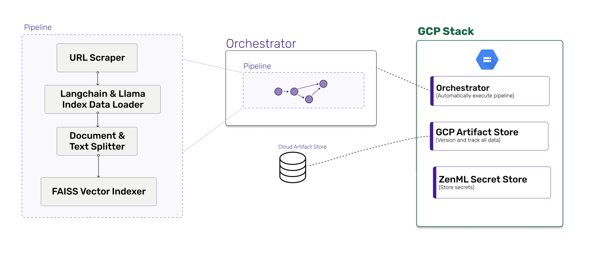
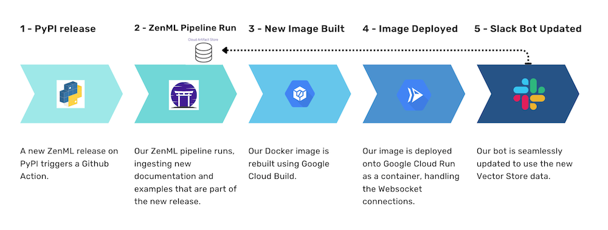

# Using LangChain and LlamaIndex in Production to Help Community Slack Support

Large language models (LLMs) have become a cornerstone of natural language processing, offering unparalleled capabilities for knowledge generation and reasoning. The past few weeks have seen a number of high profile releases of models and interfaces. However, despite their immense potential, incorporating custom, private data into these models [remains a challenge](https://docs.google.com/presentation/d/1VXQkR65ieROCmJP_ga09gGt8wkTGtTAdvaDRxMB67GI/edit#slide=id.p). This is where tools like [LangChain](https://github.com/hwchase17/langchain) and [LlamaIndex](https://github.com/jerryjliu/llama_index) (formerly 'GPT Index') come into play, offering innovative solutions for data ingestion and indexing, enabling developers to augment LLMs with their unique datasets.

LangChain and LlamaIndex facilitate in-context learning, an emerging paradigm that allows developers to insert context into input prompts, leveraging LLM's reasoning capabilities for generating more relevant and accurate responses. This differs from finetuning, which requires retraining models using custom datasets, often demanding significant computational resources and time.

By addressing data ingestion and indexing, LangChain and LlamaIndex provide a streamlined framework for integrating custom data into LLMs. Their flexible design simplifies incorporating external data sources, enabling developers to focus on creating powerful applications that harness LLMs' full potential.

These tools bridge the gap between external data and LLMs, ensuring seamless integration while maintaining performance. By utilizing LangChain and LlamaIndex, developers can unlock LLMs' true potential and build cutting-edge applications tailored to specific use cases and datasets.

🛣️ The project we built uses both `langchain` and `llama_index` as well as some
extra code for the Slack bot itself.
## ZenML 🤝 LLM frameworks

There are various terms being tried out to describe this new paradigm — from LLMOps to Big Model Ops. Not only the words used to describe how engineering will work are new, but the underlying structures and frameworks are also being developed from the ground up. We wanted to witness these changes first-hand by participating and getting our hands dirty.

In particular, we wanted to experience how users of ZenML might go about using our framework to integrate with these tools and models. We had seen lots of demos showcasing useful and striking use cases, but none were some of the complexities around deploying these in production were raised.

Starting out, we wanted to get a feel for the two well-known options for developing on top of large language models — that is, LangChain and Llama Index — by trying out some of their core functionality. In particular, loading a series of documents, doing some kind of querying of those documents and packaging this all up into some kind of frontend user experience seemed like good places to start.


We approached the problem by dividing it into two main parts, each addressing a specific aspect of the project. The first part focused on creating the ZenML pipeline, while the second part concentrated on the larger workflow that would automate the bot updates.

## Part 1: Creating the Index with a ZenML Pipeline

In the first part of the project, we built a ZenML pipeline to handle data ingestion, construct the vector store, and save the resulting data in the ZenML artifact store. The pipeline consisted of the following big-picture actions:

- Data Ingestion: We used the `langchain` and `llama_index` frameworks to load a series of documents from various sources such as GitHub and Slack. This data would serve as the basis for our vector store.
- Vector Store Construction: Once the data was ingested, we applied the necessary preprocessing and transformed it into a suitable format for querying. We then used the large language models to create a vector store, which would enable us to search and retrieve relevant information efficiently.
- Saving to ZenML Artifact Store: The final piece was to save the resulting vector store in the ZenML artifact store. This allowed us to have a versioned and easily accessible storage system for our indexed data.



We thought about the kinds of data sources we'd want to be queried when users entered their queries. We take a lot of pride and effort to maintain our documentation so that was an obvious one to include. We considered adding [the `README` files of our `examples`](https://github.com/zenml-io/zenml/tree/main/examples) since that's often a starting point for our users, and we thought [our release notes](https://github.com/zenml-io/zenml/blob/main/RELEASE_NOTES.md) would also be useful to be part of the context.

Getting all of this together was not too hard, and LangChain and Llama Index released new versions that helped with obtaining Slack messages and documentation from Gitbook. In the end we wanted more flexibility than was available from the pre-built document loaders, so we just used the generic loader for web content along with a custom scraper to get a list of all URLs available for our docs and examples READMEs.

We settled on using a vector store as the way to query our documentation. This seems to be a common way to do this when your texts are quite large. You don't want to have to send your entire corpus over to OpenAI (or whoever is providing your LLM) since most of it will be irrelevant to the specific question at hand. Instead, what you want is a way to get only the top handful of useful chunks of information and pass them on to your LLM along with a prompt and the original question.

We used the [FAISS](https://faiss.ai) Vector Store. FAISS (Facebook AI Similarity Search) is a library developed by Facebook AI Research for efficient similarity search and clustering of high-dimensional vectors. It is particularly useful for tasks that involve large-scale information retrieval or finding nearest neighbors in high-dimensional spaces. Moreover, it's fast and open-source and was quite well documented for this use case. (LangChain and Llama Index have quite a few other options, particularly if you want your vector store hosted and deployed somewhere in the cloud.)

The documents downloaded in earlier steps are split up into small 1000-character chunks, then combined together with embeddings and fed into the vector store. This special combination is what allows us to query a large corpus of text.

## Part 2: Deploying the ZenML Bot with an automated workflow

The second part of the project focused on setting up a continuous integration and continuous deployment (CI/CD) workflow to ensure that the bot would be updated automatically whenever a new release was made. This process involved the following steps:

- Triggering the Pipeline: We configured the pipeline to run automatically whenever a new release was made, ensuring that the most up-to-date data would be used for the bot's functionality.
- Running the ZenML Pipeline: As part of the workflow, the ZenML pipeline would be executed, updating the vector store with the latest data and ensuring that the bot would be able to retrieve the most relevant information for user queries.
- Deploying the Updated Bot: Once the pipeline had successfully run and the updated vector store was saved in the ZenML artifact store, the new version of the bot was automatically deployed to Slack. This ensured that users would always interact with the most current version of the bot, providing the best possible user experience.



The Slack bot itself wasn't too hard to put together. Our pattern of use was simple and well-defined. The only unusual part was using the vector store that had been generated in our pipeline as the basis for incoming Slack messages. We deployed our bot inside a container along with a way to query ZenML for the vector store on initialization. It's now up and running courtesy of Google Cloud Run.

In summary, our project combined the power of ZenML with the capabilities of `langchain` and `llama_index` to create an automated system that not only indexed data from our documentation but also updated the bot continuously. This approach allowed us to harness the potential of large language models in a production setting while also getting hands-on experience with the emerging field of LLMOps or Big Model Ops.

We deal with a decent volume of support requests in Slack, from the ultra-specific involving on-prem deployments to beginners just getting started. We estimate that allowing our community to freely query the documentation with their questions will save us 10% of our time. We also think it will be extremely helpful for those in the early days of their journey who won't necessarily be familiar with every page of our documentation and who just want to get moving forward and to try things out. Perhaps most importantly, we hope that the bot will help new ZenML users and community members to feel empowered to ask all the questions they need, without any feeling like they're taking time from someone else.

## Installation

Install the required packages via the `requirements.txt` file located in the
`/src` directory.

```bash
pip install -r src/requirements-slackbot.txt
```

## Running it locally

After the installation is completed, you directly run the pipeline locally
right away.

```bash
python src/run.py
```

Note that the pipeline is configured to generate artifacts relating to ZenML's
documentation and examples. If you want to adapt this project to generate
artifacts for your own data, you can change values as appropriate.

The Slack bot can be locally tested using the `local_testing_slackbot.py` file
but note that you will need to set up your own Slack workspace and bot in order
to do so. You can find more information on how to do this in the instructions
for [our Generative Chat
example](https://github.com/zenml-io/zenml/tree/develop/examples/generative_chat).

## Running it on GCP

It is much more ideal to run a pipeline such as the 
`zenml_docs_index_generation` on a regular schedule. In order to achieve that, 
you have to [deploy ZenML](https://docs.zenml.io/user-guide/production-guide/deploying-zenml#connecting-to-a-deployed-zenml) 
and set up a stack that supports 
[our scheduling
feature](https://docs.zenml.io/user-guide/advanced-guide/pipelining-features/schedule-pipeline-runs). If you
wish to deploy the slack bot on GCP Cloud Run as described above, you'll also
need to be using [a Google Cloud Storage Artifact
Store](https://docs.zenml.io/stacks-and-components/component-guide/artifact-stores/gcp). Note that
certain code artifacts like the `Dockerfile` for this project will also need to
be adapted for your own particular needs and requirements. Please check [our docs](https://docs.zenml.io/user-guide/advanced-guide/best-practices) 
for more information.

## Slack Bot In Action!

If you'd like to see our Slack bot in action, feel free to [join us in
Slack](https://zenml.io/slack) and get help on your problems even when the core
team are asleep! Just mention `@zenml-bot` and you'll be on your way!
