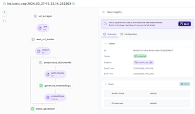
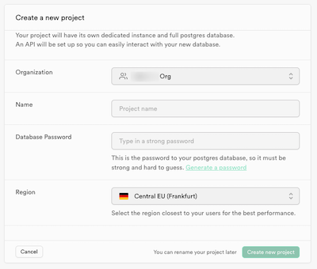
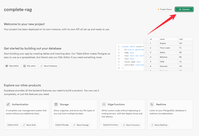
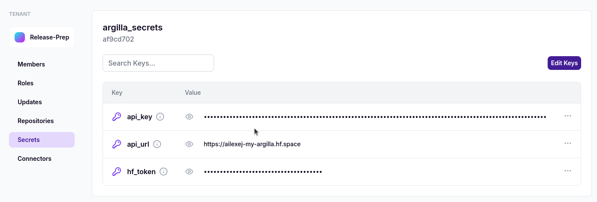

# 🦜 Production-ready RAG pipelines for chat applications

This project showcases how you can work up from a simple RAG pipeline to a more
complex setup that involves finetuning embeddings, reranking retrieved
documents, and even finetuning the LLM itself. We'll do this all for a use case
relevant to ZenML: a question answering system that can provide answers to
common questions about ZenML. This will help you understand how to apply the
concepts covered in this guide to your own projects.



Contained within this project is all the code needed to run the full pipelines.
You can follow along [in our
guide](https://docs.zenml.io/user-guide/llmops-guide/) to understand the
decisions and tradeoffs behind the pipeline and step code contained here. You'll
build a solid understanding of how to leverage LLMs in your MLOps workflows
using ZenML, enabling you to build powerful, scalable, and maintainable
LLM-powered applications.

This project contains all the pipeline and step code necessary to follow along
with the guide. You'll need a PostgreSQL database to store the embeddings; full
instructions are provided below for how to set that up.

## 📽️ Watch the webinars

We've recently been holding some webinars about this repository and project. Watche the videos below if you want an introduction and context around the code and ideas covered in this project.

[](https://www.youtube.com/watch?v=PazRMY8bo3U)

## 🏃 How to run

This project showcases production-ready pipelines so we use some cloud
infrastructure to manage the assets. You can run the pipelines locally using a
local PostgreSQL database, but we encourage you to use a cloud database for
production use cases.

### Setup your environment

Make sure you're running from a Python 3.8+ environment. Setup a virtual
environment and install the dependencies using the following command:

```shell
pip install -r requirements.txt
```

Depending on your setup you may run into some issues when running the pip install command with the
`flash_attn` package. In that case running `FLASH_ATTENTION_SKIP_CUDA_BUILD=TRUE pip install flash-attn --no-build-isolation` could help you.

In order to use the default LLM for this query, you'll need an account and an
API key from OpenAI specified as another environment variable:

```shell
export OPENAI_API_KEY=<your-openai-api-key>
```

### Setting up Supabase

[Supabase](https://supabase.com/) is a cloud provider that provides a PostgreSQL
database. It's simple to use and has a free tier that should be sufficient for
this project. Once you've created a Supabase account and organisation, you'll
need to create a new project.



You'll want to save the Supabase database password as a ZenML secret so that it
isn't stored in plaintext. You can do this by running the following command:

```shell
zenml secret create supabase_postgres_db --password="YOUR_PASSWORD"
```

You'll then want to connect to this database instance by getting the connection
string from the Supabase dashboard.



You can use these details to populate some environment variables where the
pipeline code expects them:

```shell
export ZENML_POSTGRES_USER=<your-supabase-user>
export ZENML_POSTGRES_HOST=<your-supabase-host>
export ZENML_POSTGRES_PORT=<your-supabase-port>
```

### Running the RAG pipeline

To run the pipeline, you can use the `run.py` script. This script will allow you
to run the pipelines in the correct order. You can run the script with the
following command:

```shell
python run.py --rag
```

This will run the basic RAG pipeline, which scrapes the ZenML documentation and
stores the embeddings in the Supabase database.

### Querying your RAG pipeline assets

Once the pipeline has run successfully, you can query the assets in the Supabase
database using the `--query` flag as well as passing in the model you'd like to
use for the LLM.

When you're ready to make the query, run the following command:

```shell
python run.py --query "how do I use a custom materializer inside my own zenml steps? i.e. how do I set it? inside the @step decorator?" --model=gpt4
```

Alternative options for LLMs to use include:

- `gpt4`
- `gpt35`
- `claude3`
- `claudehaiku`

Note that Claude will require a different API key from Anthropic. See [the
`litellm` docs](https://docs.litellm.ai/docs/providers/anthropic) on how to set
this up.

### Run the LLM RAG evaluation pipeline

To run the evaluation pipeline, you can use the following command:

```shell
python run.py --evaluation
```

You'll need to have first run the RAG pipeline to have the necessary assets in
the database to evaluate.

## Embeddings finetuning

For embeddings finetuning we first generate synthetic data and then finetune the
embeddings. Both of these pipelines are described in [the LLMOps guide](https://docs.zenml.io/v/docs/user-guide/llmops-guide/finetuning-embeddings) and
instructions for how to run them are provided below.

### Run the `distilabel` synthetic data generation pipeline

To run the `distilabel` synthetic data generation pipeline, you can use the following commands:

```shell
pip install -r requirements-argilla.txt # special requirements
python run.py --synthetic
```

You will also need to have set up and connected to an Argilla instance for this
to work. Please follow the instructions in the [Argilla
documentation](https://docs.argilla.io/latest/getting_started/quickstart/)
to set up and connect to an Argilla instance on the Hugging Face Hub. [ZenML's
Argilla integration
documentation](https://docs.zenml.io/v/docs/stack-components/annotators/argilla)
will guide you through the process of connecting to your instance as a stack
component.

### Finetune the embeddings

As with the previous pipeline, you will need to have set up and connected to an Argilla instance for this
to work. Please follow the instructions in the [Argilla
documentation](https://docs.argilla.io/latest/getting_started/quickstart/)
to set up and connect to an Argilla instance on the Hugging Face Hub. [ZenML's
Argilla integration
documentation](https://docs.zenml.io/v/docs/stack-components/annotators/argilla)
will guide you through the process of connecting to your instance as a stack
component.

The pipeline assumes that your argilla secret is stored within a ZenML secret called `argilla_secrets`. 


To run the pipeline for finetuning the embeddings, you can use the following
commands:

```shell
pip install -r requirements-argilla.txt # special requirements
python run.py --embeddings
```

*Credit to Phil Schmid for his [tutorial on embeddings finetuning with Matryoshka
loss function](https://www.philschmid.de/fine-tune-embedding-model-for-rag) which we adapted for this project.*

## ☁️ Running in your own VPC

The basic RAG pipeline will run using a local stack, but if you want to improve
the speed of the embeddings step you might want to consider using a cloud
orchestrator. Please follow the instructions in [documentation on popular integrations](https://docs.zenml.io/how-to/popular-integrations) (currently available for
[AWS](https://docs.zenml.io/how-to/popular-integrations/aws-guide) and
[GCP](https://docs.zenml.io/how-to/popular-integrations/gcp-guide)) to learn how you
can run the pipelines on a remote stack.

If you run the pipeline using a cloud artifact store, logs from all the steps as
well as assets like the visualizations will all be shown in the ZenML dashboard.

### BONUS: Connect to ZenML Pro

If you run the pipeline using ZenML Pro you'll have access to the managed
dashboard which will allow you to get started quickly. We offer a free trial so
you can try out the platform without any cost. Visit the [ZenML Pro
dashboard](https://cloud.zenml.io/) to get started.

You can also self-host the ZenML dashboard. Instructions are available in our
[documentation](https://docs.zenml.io/getting-started/deploying-zenml).

## 📜 Project Structure

The project loosely follows [the recommended ZenML project structure](https://docs.zenml.io/how-to/setting-up-a-project-repository/best-practices):

```
.
├── LICENSE                                             # License file
├── README.md                                           # Project documentation
├── __init__.py
├── constants.py                                        # Constants used throughout the project
├── materializers
│   ├── __init__.py
│   └── document_materializer.py                        # Document materialization logic
├── most_basic_eval.py                                  # Basic evaluation script
├── most_basic_rag_pipeline.py                          # Basic RAG pipeline script
├── notebooks
│   └── visualise_embeddings.ipynb                      # Notebook to visualize embeddings
├── pipelines
│   ├── __init__.py
│   ├── generate_chunk_questions.py                     # Pipeline to generate chunk questions
│   ├── llm_basic_rag.py                                # Basic RAG pipeline using LLM
│   └── llm_eval.py                                     # Pipeline for LLM evaluation
├── requirements.txt                                    # Project dependencies
├── run.py                                              # Main script to run the project
├── steps
│   ├── __init__.py
│   ├── eval_e2e.py                                     # End-to-end evaluation step
│   ├── eval_retrieval.py                               # Retrieval evaluation step
│   ├── eval_visualisation.py                           # Evaluation visualization step
│   ├── populate_index.py                               # Step to populate the index
│   ├── synthetic_data.py                               # Step to generate synthetic data
│   ├── url_scraper.py                                  # Step to scrape URLs
│   ├── url_scraping_utils.py                           # Utilities for URL scraping
│   └── web_url_loader.py                               # Step to load web URLs
├── structures.py                                       # Data structures used in the project
├── tests
│   ├── __init__.py
│   └── test_url_scraping_utils.py                      # Tests for URL scraping utilities
└── utils
    ├── __init__.py
    └── llm_utils.py                                    # Utilities related to the LLM
```

## 🙏🏻 Inspiration and Credit

The RAG pipeline relies on code from [this Timescale
blog](https://www.timescale.com/blog/postgresql-as-a-vector-database-create-store-and-query-openai-embeddings-with-pgvector/)
that showcased using PostgreSQL as a vector database. We adapted it for our use
case and adapted it to work with Supabase.
