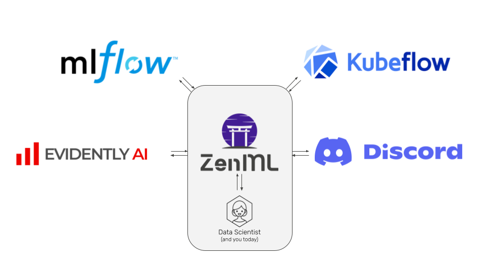

# Building and Using an MLOps Stack with ZenML

[](https://pypi.org/project/zenml/)

The purpose of this repository is to demonstrate how [ZenML](https://github.com/zenml-io/zenml) enables your machine
learning projects in a multitude of ways:

- By offering you a framework or template to develop within
- By seamlessly integrating into the tools you love and need
- By allowing you to easily switch orchestrator for your pipelines
- By bringing much needed Zen into your machine learning

**ZenML** is an extensible, open-source MLOps framework to create production-ready machine learning pipelines. Built for
data scientists, it has a simple, flexible syntax, is cloud- and tool-agnostic, and has interfaces/abstractions that
are catered towards ML workflows.

At its core, **ZenML pipelines execute ML-specific workflows** from sourcing data to splitting, preprocessing, training,
all the way to the evaluation of results and even serving. There are many built-in batteries to support common ML
development tasks. ZenML is not here to replace the great tools that solve these individual problems. Rather, it
**integrates natively with popular ML tooling** and gives standard abstraction to write your workflows.

Within this repo we will use ZenML to build pipelines that seamlessly use [Evidently](https://evidentlyai.com/),
[MLFlow](https://mlflow.org/), [Kubeflow Pipelines](https://www.kubeflow.org/) and post
results to our [Discord](https://discord.com/).



[](https://www.youtube.com/watch?v=Ne-dt9tu11g)

_Come watch along as Hamza Tahir, Co-Founder and CTO of ZenML showcases an early version of this repo
to the MLOps.community._

## :computer: System Requirements

In order to run this demo you need to have some packages installed on your machine.

Currently, this will only run on UNIX systems.

| package | MacOS installation                                                               | Linux installation                                                                 |
| ------- | -------------------------------------------------------------------------------- | ---------------------------------------------------------------------------------- |
| docker  | [Docker Desktop for Mac](https://docs.docker.com/desktop/mac/install/)           | [Docker Engine for Linux ](https://docs.docker.com/engine/install/ubuntu/)         |
| kubectl | [kubectl for mac](https://kubernetes.io/docs/tasks/tools/install-kubectl-macos/) | [kubectl for linux](https://kubernetes.io/docs/tasks/tools/install-kubectl-linux/) |
| k3d     | [Brew Installation of k3d](https://formulae.brew.sh/formula/k3d)                 | [k3d installation linux](https://k3d.io/v5.2.2/)                                   |

## :snake: Python Requirements

Once you've got the system requirements figured out, let's jump into the Python packages you need.
Within the Python environment of your choice, run:

```bash
git clone https://github.com/zenml-io/zenfiles
cd nba-pipeline
pip install -r requirements.txt
```

If you are running the `run_pipeline.py` script, install the following integrations by running the following commands in your terminal:

```bash
zenml integration install sklearn -y
zenml integration install aws -y
zenml integration install evidently -y
zenml integration install mlflow -y
zenml integration install kubeflow -y
```

## :basketball: The Task

A couple of weeks ago, we were looking for a fun project to work on for the next chapter of our ZenHacks. During our
initial discussions, we realized that it would be really great to work with an NBA dataset, as we could quickly get
close to a real-life application like a "3-Pointer Predictor" while simultaneously entertaining ourselves with one
of the trending topics within our team.

As we were building the dataset around a "3-Pointer Predictor", we realized that there is one factor that we need to
take into consideration first: Stephen Curry, The Baby Faced Assassin. In our opinion, there is no denying that he
changed the way that the games are played in the NBA and we wanted to actually prove that this was the case first.

That's why our story in this ZenHack will start with a pipeline dedicated to drift detection. As the breakpoint of this
drift, we will be using the famous "Double Bang" game that the Golden State Warriors played against Oklahoma City
Thunder back in 2016. Following that, we will build a training pipeline which will generate a model that predicts
the number of three-pointers made by a team in a single game, and ultimately, we will use these trained models and
create an inference pipeline for the upcoming matches in the NBA.


## :notebook: Diving into the code

We're ready to go now. You have two options:

### Notebook

You can spin up a step-by-step guide in `Building and Using An MLOPs Stack With ZenML.ipynb`:

```python
jupyter notebook
```

### Script

You can also directly run the code, using the `run_pipeline.py` script.

```python
python run_pipeline.py drift  # Run one-shot drift pipeline
python run_pipeline.py train  # Run training pipeline
python run_pipeline.py infer  # Run inference pipeline
```

## :rocket: From Local to Cloud Stack
In ZenML you can choose to run your pipeline on any infrastructure of your choice.
The configuration of the infrastructure is called a [Stack](https://docs.zenml.io/getting-started/core-concepts#stacks-and-stack-components). 
By switching the Stack, you can choose to run your pipeline locally or in the cloud.

In any Stack, there must be at least two basic [Stack Components](https://docs.zenml.io/getting-started/core-concepts#stacks-and-stack-components): 
* [Orchestrator](https://docs.zenml.io/getting-started/core-concepts#orchestrator) - Coordinates all the steps to run in a pipeline.
* [Artifact Store](https://docs.zenml.io/getting-started/core-concepts#orchestrator) - Stores all data that pass through the pipeline. 

ZenML comes with a default local stack with a local orchestrator and local artifact store.


Let's first run the pipeline locally. 


There are limited things we can do running pipelines locally. Now, let's run the same pipeline on a remote Kubeflow orchestrator, with the MLflow experiment tracker, secrets manager and container registry hosted on AWS.

First authenticate your credentials by with:

```shell
aws ecr get-login-password --region us-east-1 | docker login --username AWS --password-stdin 715803424590.dkr.ecr.us-east-1.amazonaws.com
aws eks --region us-east-1 update-kubeconfig --name zenhacks-cluster --alias zenml-eks
```

Set the following environment variables with your namespace, username and password.
```
export KUBEFLOW_NAMESPACE="your-namespace"
export KUBEFLOW_USERNAME="yourusername@yours.io"
export KUBEFLOW_PASSWORD="yourpassword"
```

Now let's register each stack component

Secrets Manager
```
zenml secrets-manager register aws_secrets_manager --flavor=aws --region_name=eu-central-1
```


MLflow Experiment Tracker on AWS
```
zenml experiment-tracker register aws_mlflow_tracker  --flavor=mlflow --tracking_insecure_tls=true --tracking_uri="https://ac8e6c63af207436194ab675ee71d85a-1399000870.us-east-1.elb.amazonaws.com/mlflow" --tracking_username="{{mlflow_secret.tracking_username}}" --tracking_password="{{mlflow_secret.tracking_password}}" 
```

Evidently Data Validator
```
zenml data-validator register evidently --flavor=evidently
```

Kubeflow Orchestrator - make sure to pass in your own `kubernetes_context` and `kubeflow_hostname`:
```
zenml orchestrator register multi_tenant_kubeflow \
  --flavor=kubeflow \
  --kubernetes_context=zenml-eks \
  --kubeflow_hostname=https://www.kubeflowshowcase.zenml.io/pipeline
```

Artifact store on S3 bucket
```
zenml artifact-store register s3_store -f s3 --path=s3://zenfiles
```

Container registry on ECR
```
zenml container-registry register ecr_registry --flavor=aws --uri=715803424590.dkr.ecr.us-east-1.amazonaws.com 
```

We should register the stack

```
zenml stack register kubeflow_gitflow_stack \
    -a s3_store \
    -c ecr_registry \
    -o multi_tenant_kubeflow \
    -x aws_secrets_manager \
    -e aws_mlflow_tracker \
    -dv evidently
```

Set the active stack
```
zenml stack set kubeflow_gitflow_stack
```

Let's register our secrets to the secrets manager

```
zenml secrets-manager secret register mlflow_secret -i
```

Provision the infra

```
zenml stack up
```

You'll be prompted to enter the username and password.


You are now ready to run the pipeline!

```
python run_pipeline.py drift
```

And head over to your [Kubeflow central dashboard](https://www.kubeflow.org/docs/components/central-dash/overview/).


<!-- The following illustrates an example of a local stack to run the pipeline on a local machine.
 -->

<!-- To transition from running our pipelines locally (see diagram above) to running them on Kubeflow Pipelines, we only need to register a new stack: -->


<!-- ```bash
zenml container-registry register local_registry  --flavor=default --uri=localhost:5000
zenml orchestrator register kubeflow_orchestrator  --flavor=kubeflow
zenml stack register local_kubeflow_stack \
    -a local_artifact_store \
    -o kubeflow_orchestrator \
    -c local_registry
``` -->

<!-- To reduce the amount of manual setup steps, we decided to work with a local Kubeflow Pipelines deployment in this repository (if you're interested in running your ZenML pipelines remotely, check out [our docs](https://docs.zenml.io/component-gallery/orchestrators/kubeflow#how-to-use-it).

For the local setup, our kubeflow stack keeps the existing `local_metadata_store` and `local_artifact_store` but replaces the orchestrator and adds a local container registry (see diagram below).

Once the stack is registered we can activate it and provision resources for the local Kubeflow Pipelines deployment:

```bash
zenml stack set local_kubeflow_stack
zenml stack up
```


## :checkered_flag: Cleaning up when you're done

Once you are done running this notebook you might want to stop all running processes. For this, run the following command.
(This will tear down your `k3d` cluster and the local docker registry.)

```shell
zenml stack set local_kubeflow_stack
zenml stack down -f
```

## :question: FAQ

1. **MacOS** When starting the container registry for Kubeflow, I get an error about port 5000 not being available.
   `OSError: [Errno 48] Address already in use`

Solution: In order for Kubeflow to run, the docker container registry currently needs to be at port 5000. MacOS, however, uses
port 5000 for the Airplay receiver. Here is a guide on how to fix this [Freeing up port 5000](https://12ft.io/proxy?q=https%3A%2F%2Fanandtripathi5.medium.com%2Fport-5000-already-in-use-macos-monterey-issue-d86b02edd36c). -->
