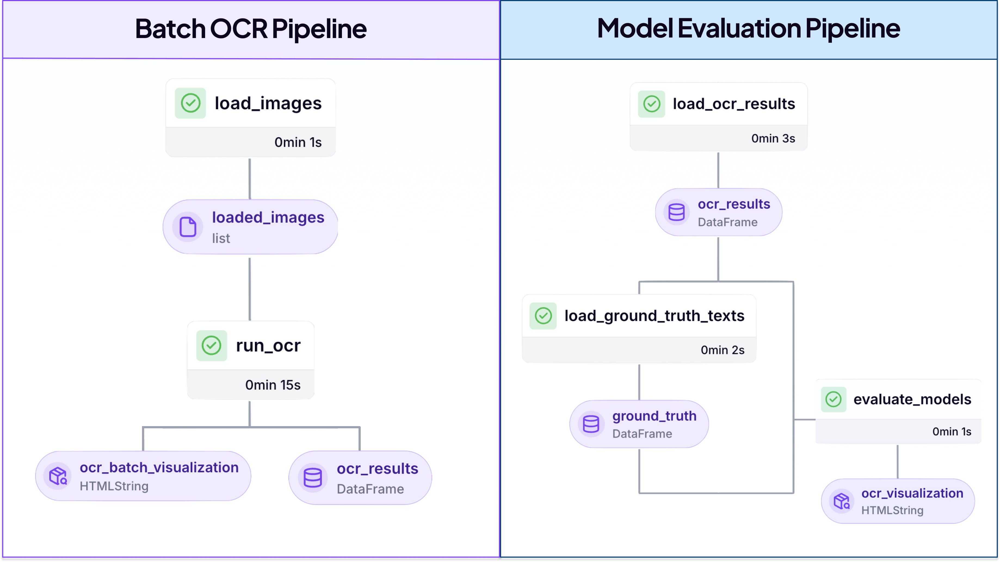
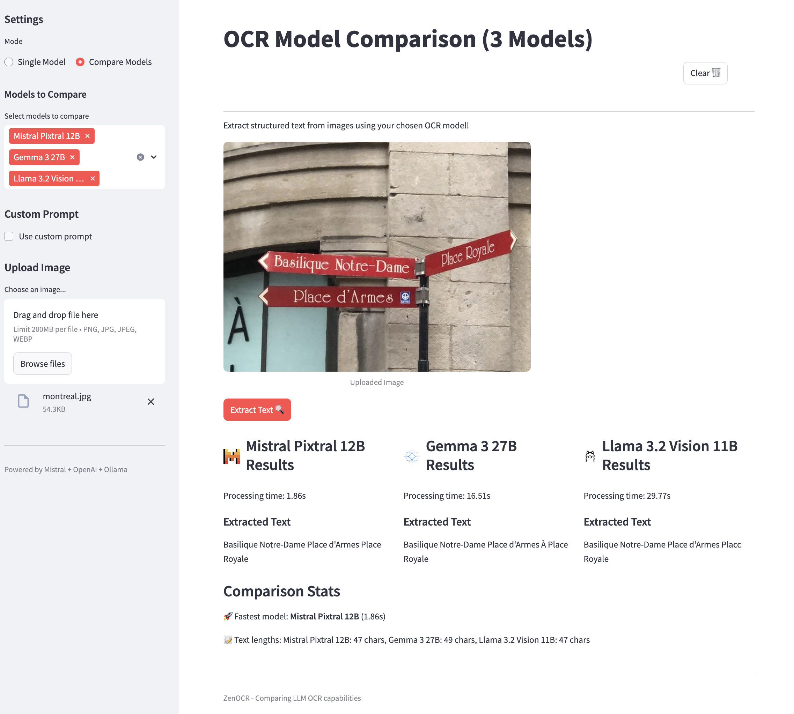

# OmniReader

A scalable multi-model text extraction solution for unstructured documents.

<div align="center">
  
</div>

✨ **Extract Structured Text from Any Document**
OmniReader is built for teams who routinely work with unstructured documents (e.g., PDFs, images, scanned forms) and want a scalable workflow for structured text extraction. It provides an end-to-end batch OCR pipeline with optional multi-model comparison to help ML engineers evaluate different OCR solutions before deployment.

<div align="center">
  
  <p><em>HTML visualization showing metrics and comparison results from the OCR pipeline</em></p>
</div>

## 🌟 Key Features

- **End-to-end workflow management** from evaluation to production deployment
- **Multi-model comparison** to identify the best model for your specific document types
- **Scalable batch processing** that can handle enterprise document volumes
- **Quantitative evaluation metrics** to inform business and technical decisions
- **ZenML integration** providing reproducibility, cloud-agnostic deployment, and monitoring

## 🎭 How It Works

OmniReader provides two primary pipeline workflows that can be run separately:

1. **Batch OCR Pipeline**: Run large batches of documents through a single model to extract structured text and metadata.
2. **Evaluation Pipeline**: Compare multiple OCR models side-by-side and generate evaluation reports using CER/WER and HTML visualizations against ground truth text files.

Behind the scenes, OmniReader leverages state-of-the-art vision-language models and ZenML's MLOps framework to create a reproducible, scalable document processing system.

## 📚 Supported Models

OmniReader supports a wide range of OCR models, including:

- **Mistral/pixtral-12b-2409**: Mistral AI's vision-language model specializing in document understanding with strong OCR capabilities for complex layouts.
- **GPT-4o-mini**: OpenAI's efficient vision model offering a good balance of accuracy and speed for general document processing tasks.
- **Gemma3:27b**: Google's open-source multimodal model supporting 140+ languages with a 128K context window, optimized for text extraction from diverse document types.
- **Llava:34b**: Large multilingual vision-language model with strong performance on document understanding tasks requiring contextual interpretation.
- **Llava-phi3**: Microsoft's efficient multimodal model combining phi-3 language capabilities with vision understanding, ideal for mixed text-image documents.
- **Granite3.2-vision**: Specialized for visual document understanding, offering excellent performance on tables, charts, and technical diagrams.

> ⚠️ Note: For production deployments, we recommend using the non-GGUF hosted model versions via their respective APIs for better performance and accuracy. The Ollama models mentioned here are primarily for convenience.

## 🚀 Getting Started

### Prerequisites

- Python 3.9+
- Mistral API key (set as environment variable `MISTRAL_API_KEY`)
- OpenAI API key (set as environment variable `OPENAI_API_KEY`)
- ZenML >= 0.80.0
- Ollama (required for running local models)

### Quick Start

```bash
# Clone the repository
git clone https://github.com/yourusername/omni-reader.git

# Navigate to OmniReader
cd omni-reader

# Install dependencies
pip install -r requirements.txt

# Start Ollama (if using local models)
ollama serve
```

### Prepare Your Models

If using local models, ensure any Ollama models you want to use are pulled:

```bash
ollama pull gemma3:27b
ollama pull llava-phi3
ollama pull granite3.2-vision
```

### Set Up Your Environment

Configure your API keys:

```bash
export OPENAI_API_KEY=your_openai_api_key
export MISTRAL_API_KEY=your_mistral_api_key
export OLLAMA_HOST=base_url_for_ollama_host # defaults to "http://localhost:11434/api/generate" if not set
```

### Run OmniReader

```bash
# Use the default config (config.yaml)
python run.py

# Run with a custom config file
python run.py --config my_config.yaml
```

### Interactive UI

The project also includes a Streamlit app that allows you to:

- Upload documents for instant OCR processing
- Compare results from multiple models side-by-side
- Experiment with custom prompts to improve extraction quality

```bash
# Launch the Streamlit interface
streamlit run app.py
```

<div align="center">
  
  <p><em>Side-by-side comparison of OCR results across different models</em></p>
</div>

## ☁️ Cloud Deployment

OmniReader supports storing artifacts remotely and executing pipelines on cloud infrastructure:

### Set Up Cloud Provider Integrations

```bash
# For AWS
zenml integration install aws s3

# For Azure
zenml integration install azure

# For Google Cloud
zenml integration install gcp gcs
```

Run your pipeline in the cloud:

```bash
# Configure your cloud stack
zenml stack register my-cloud-stack -a cloud-artifact-store -o cloud-orchestrator
```

For detailed configuration options and other components, refer to the ZenML documentation:

- [AWS Integration Guide](https://docs.zenml.io/how-to/popular-integrations/aws-guide)
- [GCP Integration Guide](https://docs.zenml.io/how-to/popular-integrations/gcp-guide)
- [Azure Integration Guide](https://docs.zenml.io/how-to/popular-integrations/azure-guide)

## 🛠️ Project Structure

```
omni-reader/
│
├── app.py                 # Streamlit UI for interactive document processing
├── assets/                # Sample images for ocr
├── configs/               # YAML configuration files
├── ground_truth_texts/    # Text files containing ground truth for evaluation
├── pipelines/             # ZenML pipeline definitions
│   ├── batch_pipeline.py  # Batch OCR pipeline (single or multiple models)
│   └── evaluation_pipeline.py # Evaluation pipeline (multiple models)
├── steps/                 # Pipeline step implementations
│   ├── evaluate_models.py # Model comparison and metrics
│   ├── loaders.py         # Loading images and ground truth texts
│   ├── run_ocr.py         # Running OCR with selected models
│   └── save_results.py    # Saving results and visualizations
├── utils/                 # Utility functions and helpers
│   ├── ocr_processing.py  # OCR processing core logic
│   ├── config.py          # Configuration utilities
│   └── model_configs.py   # Model configuration and registry
├── run.py                 # Main entrypoint for running the pipeline
└── README.md              # Project documentation
```

## 🔮 Use Cases

- **Document Processing Automation**: Extract structured data from invoices, receipts, and forms
- **Content Digitization**: Convert scanned documents and books into searchable digital content
- **Regulatory Compliance**: Extract and validate information from compliance documents
- **Data Migration**: Convert legacy paper documents into structured digital formats
- **Research & Analysis**: Extract data from academic papers, reports, and publications

## 📚 Documentation

For more information about ZenML and building MLOps pipelines, refer to the [ZenML documentation](https://docs.zenml.io/).

For model-specific documentation:

- [Mistral AI Vision Documentation](https://docs.mistral.ai/capabilities/vision/)
- [Ollama Models Library](https://ollama.com/library)
