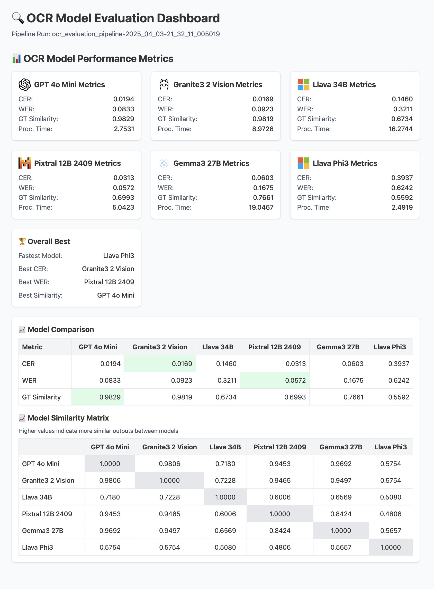

# OmniReader

A scalable multi-model text extraction solution for unstructured documents.

<div align="center">
  
</div>

✨ **Extract Structured Text from Any Document**
OmniReader is built for teams who routinely work with unstructured documents (e.g., PDFs, images, scanned forms) and want a scalable workflow for structured text extraction. It provides an end-to-end batch OCR pipeline with optional multi-model comparison to help ML engineers evaluate different OCR solutions before deployment.

<div align="center">
  
  <p><em>HTML visualization showing metrics and comparison results from the OCR pipeline</em></p>
</div>

## 🔮 Use Cases

- **Document Processing Automation**: Extract structured data from invoices, receipts, and forms
- **Content Digitization**: Convert scanned documents and books into searchable digital content
- **Regulatory Compliance**: Extract and validate information from compliance documents
- **Data Migration**: Convert legacy paper documents into structured digital formats
- **Research & Analysis**: Extract data from academic papers, reports, and publications

## 🌟 Key Features

- **End-to-end workflow management** from evaluation to production deployment
- **Multi-model comparison** to identify the best model for your specific document types
- **Scalable batch processing** that can handle enterprise document volumes
- **Quantitative evaluation metrics** to inform business and technical decisions
- **ZenML integration** providing reproducibility, cloud-agnostic deployment, and monitoring

## 🎭 How It Works

OmniReader provides two primary pipeline workflows that can be run separately:

1. **Batch OCR Pipeline**: Run large batches of documents through a single model to extract structured text and metadata.
2. **Evaluation Pipeline**: Compare multiple OCR models side-by-side and generate evaluation reports using CER/WER and HTML visualizations against ground truth text files.

Behind the scenes, OmniReader leverages state-of-the-art vision-language models and ZenML's MLOps framework to create a reproducible, scalable document processing system.

## 📚 Supported Models

OmniReader supports a wide range of OCR models, including:

- **Mistral/pixtral-12b-2409**: Mistral AI's vision-language model specializing in document understanding with strong OCR capabilities for complex layouts.
- **GPT-4o-mini**: OpenAI's efficient vision model offering a good balance of accuracy and speed for general document processing tasks.
- **Gemma3:27b**: Google's open-source multimodal model supporting 140+ languages with a 128K context window, optimized for text extraction from diverse document types.
- **Llava:34b**: Large multilingual vision-language model with strong performance on document understanding tasks requiring contextual interpretation.
- **Llava-phi3**: Microsoft's efficient multimodal model combining phi-3 language capabilities with vision understanding, ideal for mixed text-image documents.
- **Granite3.2-vision**: Specialized for visual document understanding, offering excellent performance on tables, charts, and technical diagrams.

> ⚠️ Note: For production deployments, we recommend using the non-GGUF hosted model versions via their respective APIs for better performance and accuracy. The Ollama models mentioned here are primarily for convenience.

### 🔧 OCR Processor Configuration

OmniReader supports multiple OCR processors to handle different models:

1. **litellm**: For using LiteLLM-compatible models including those from Mistral and other providers.

- Set API keys for your providers (e.g., `MISTRAL_API_KEY`)
- **Important**: When using `litellm` as the processor, you must specify the `provider` field in your model configuration.

2. **ollama**: For running local models through Ollama.

   - Requires: [Ollama](https://ollama.com/) installed and running
   - Set `OLLAMA_HOST` (defaults to "http://localhost:11434/api/generate")
   - If using local models, they must be pulled before use with `ollama pull model_name`

3. **openai**: For using OpenAI models like GPT-4o.
   - Set `OPENAI_API_KEY` environment variable

Example model configurations in your `configs/batch_pipeline.yaml`:

```yaml
models_registry:
  - name: "gpt-4o-mini"
    shorthand: "gpt4o"
    ocr_processor: "openai"
    # No provider needed for OpenAI

  - name: "gemma3:27b"
    shorthand: "gemma3"
    ocr_processor: "ollama"
    # No provider needed for Ollama

  - name: "mistral/pixtral-12b-2409"
    shorthand: "pixtral"
    ocr_processor: "litellm"
    provider: "mistral" # Provider field required for litellm processor
```

To add your own models, extend the `models_registry` with the appropriate processor and provider configurations based on the model source.

## 🛠️ Project Structure

```
omni-reader/
│
├── app.py                 # Streamlit UI for interactive document processing
├── assets/                # Sample images for ocr
├── configs/               # YAML configuration files
├── ground_truth_texts/    # Text files containing ground truth for evaluation
├── pipelines/             # ZenML pipeline definitions
│   ├── batch_pipeline.py  # Batch OCR pipeline (single or multiple models)
│   └── evaluation_pipeline.py # Evaluation pipeline (multiple models)
├── steps/                 # Pipeline step implementations
│   ├── evaluate_models.py # Model comparison and metrics
│   ├── loaders.py         # Loading images and ground truth texts
│   └── run_ocr.py         # Running OCR with selected models
├── utils/                 # Utility functions and helpers
│   ├── ocr_processing.py  # OCR processing core logic
│   ├── metrics.py         # Metrics for evaluation
│   ├── visualizations.py  # Visualization utilities for the evaluation pipeline
│   ├── encode_image.py    # Image encoding utilities for OCR processing
│   ├── prompt.py          # Prompt template for vision models
│   ├── config.py          # Utilities for loading and validating configs
│   └── model_configs.py   # Model configuration and registry
├── run.py                 # Main entrypoint for running the pipeline
└── README.md              # Project documentation
```

## 🚀 Getting Started

### Prerequisites

- Python 3.9+
- Mistral API key (set as environment variable `MISTRAL_API_KEY`)
- OpenAI API key (set as environment variable `OPENAI_API_KEY`)
- ZenML >= 0.80.0
- Ollama (required for running local models)

### Quick Start

```bash
# Install dependencies
pip install -r requirements.txt

# Start Ollama (if using local models)
ollama serve
```

### Set Up Your Environment

Configure your API keys:

```bash
export OPENAI_API_KEY=your_openai_api_key
export MISTRAL_API_KEY=your_mistral_api_key
export OLLAMA_HOST=base_url_for_ollama_host # defaults to "http://localhost:11434/api/generate" if not set
```

### Run OmniReader

```bash
# Run the batch pipeline (default)
python run.py

# Run the evaluation pipeline
python run.py --eval

# Run with a custom config file
python run.py --config my_custom_config.yaml

# Run with custom input
python run.py --image-folder ./my_images

# List ground truth files
python run.py --list-ground-truth-files
```

### Interactive UI

The project also includes a Streamlit app that allows you to:

- Upload documents for instant OCR processing
- Compare results from multiple models side-by-side
- Experiment with custom prompts to improve extraction quality

```bash
# Launch the Streamlit interface
streamlit run app.py
```

<div align="center">
  
  <p><em>Side-by-side comparison of OCR results across different models</em></p>
</div>

## ☁️ Cloud Deployment

OmniReader supports storing artifacts remotely and executing pipelines on cloud infrastructure. For this example, we'll use AWS, but you can use any cloud provider you want. You can also refer to the [AWS Integration Guide](https://docs.zenml.io/stacks/popular-stacks/aws-guide) for detailed instructions.

### AWS Setup

1. **Install required integrations**:

   ```bash
   zenml integration install aws s3
   ```

2. **Set up your AWS credentials**:

   - Create an IAM role with appropriate permissions (S3, ECR, SageMaker)
   - Configure your role ARN and region

3. **Register an AWS service connector**:

   ```bash
   zenml service-connector register aws_connector \
     --type aws \
     --auth-method iam-role \
     --role_arn=<ROLE_ARN> \
     --region=<YOUR_REGION> \
     --aws_access_key_id=<YOUR_ACCESS_KEY_ID> \
     --aws_secret_access_key=<YOUR_SECRET_ACCESS_KEY>
   ```

4. **Configure stack components**:

   a. **S3 Artifact Store**:

   ```bash
   zenml artifact-store register s3_artifact_store \
     -f s3 \
     --path=s3://<YOUR_BUCKET_NAME> \
     --connector aws_connector
   ```

   b. **SageMaker Orchestrator**:

   ```bash
   zenml orchestrator register sagemaker_orchestrator \
     --flavor=sagemaker \
     --region=<YOUR_REGION> \
     --execution_role=<ROLE_ARN>
   ```

   c. **ECR Container Registry**:

   ```bash
   zenml container-registry register ecr_registry \
     --flavor=aws \
     --uri=<ACCOUNT_ID>.dkr.ecr.<YOUR_REGION>.amazonaws.com \
     --connector aws_connector
   ```

5. **Register and activate your stack**:
   ```bash
   zenml stack register aws_stack \
     -a s3_artifact_store \
     -o sagemaker_orchestrator \
     -c ecr_registry \
     --set
   ```

### Other Cloud Providers

Similar setup processes can be followed for other cloud providers:

- **Azure**: Install the Azure integration (`zenml integration install azure`) and set up Azure Blob Storage, AzureML, and Azure Container Registry
- **Google Cloud**: Install the GCP integration (`zenml integration install gcp gcs`) and set up GCS, Vertex AI, and GCR
- **Kubernetes**: Install the Kubernetes integration (`zenml integration install kubernetes`) and set up a Kubernetes cluster

For detailed configuration options for these providers, refer to the ZenML documentation:

- [GCP Integration Guide](https://docs.zenml.io/stacks/popular-stacks/gcp-guide)
- [Azure Integration Guide](https://docs.zenml.io/stacks/popular-stacks/azure-guide)
- [Kubernetes Integration Guide](https://docs.zenml.io/stacks/popular-stacks/kubernetes)

### 🐳 Docker Settings for Cloud Deployment

For cloud execution, you'll need to configure Docker settings in your pipeline:

```python
from zenml.config import DockerSettings

# Create Docker settings
docker_settings = DockerSettings(
    required_integrations=["aws", "s3"],  # Based on your cloud provider
    requirements="requirements.txt",
    python_package_installer="uv", # Optional, defaults to "pip"
    environment={
        "OPENAI_API_KEY": os.getenv("OPENAI_API_KEY"),
        "MISTRAL_API_KEY": os.getenv("MISTRAL_API_KEY"),
    },
)

# Use in your pipeline definition
@pipeline(settings={"docker": docker_settings})
def batch_ocr_pipeline(...):
    ...
```

## 📚 Documentation

For more information about ZenML and building MLOps pipelines, refer to the [ZenML documentation](https://docs.zenml.io/).

For model-specific documentation:

- [Mistral AI Vision Documentation](https://docs.mistral.ai/capabilities/vision/)
- [LiteLLM Providers Documentation](https://docs.litellm.ai/docs/providers)
- [Gemma3 Documentation](https://ai.google.dev/gemma/docs/integrations/ollama)
- [Ollama Models Library](https://ollama.com/library)
