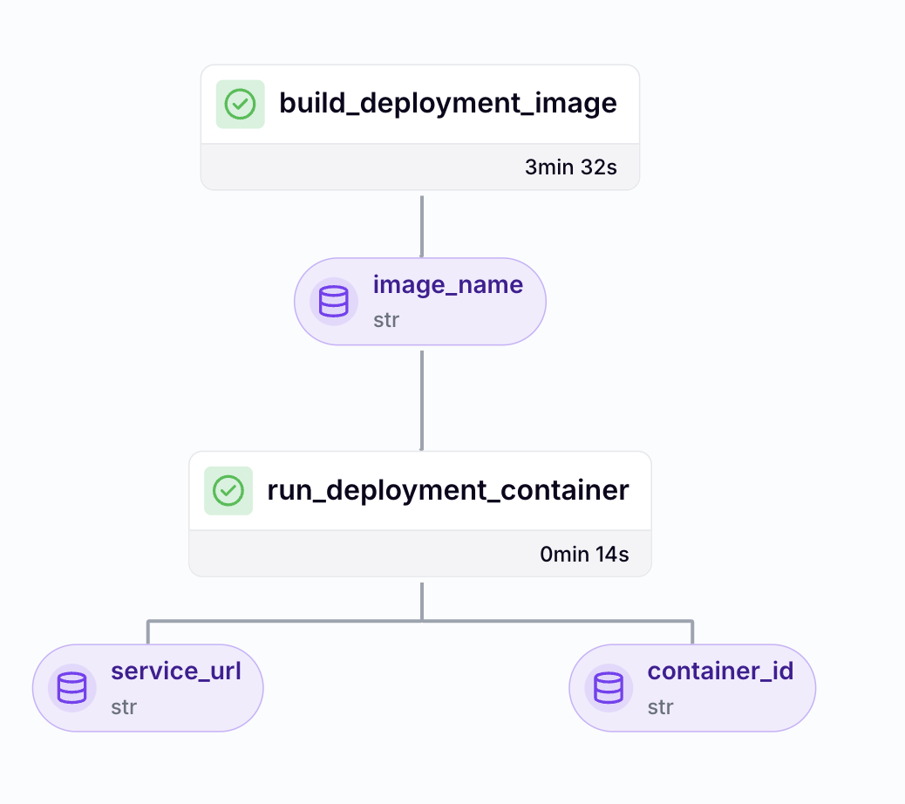
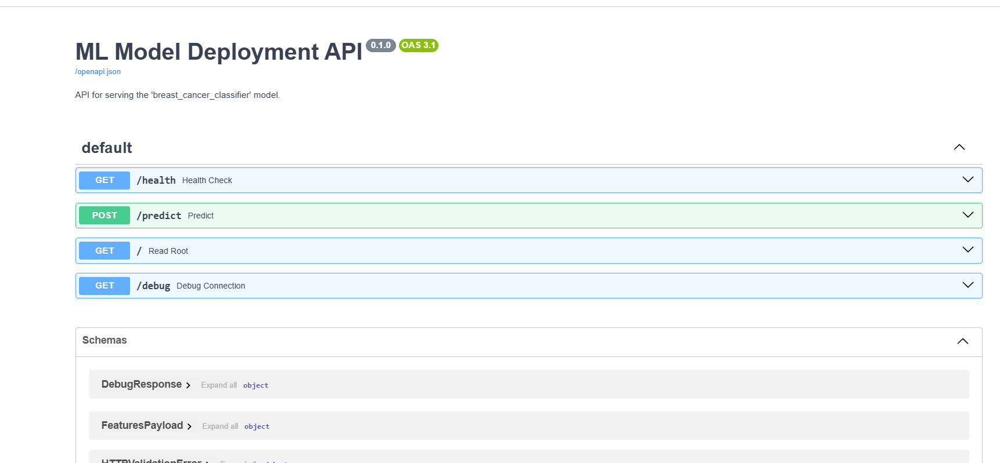
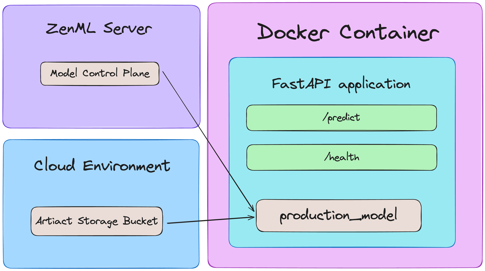
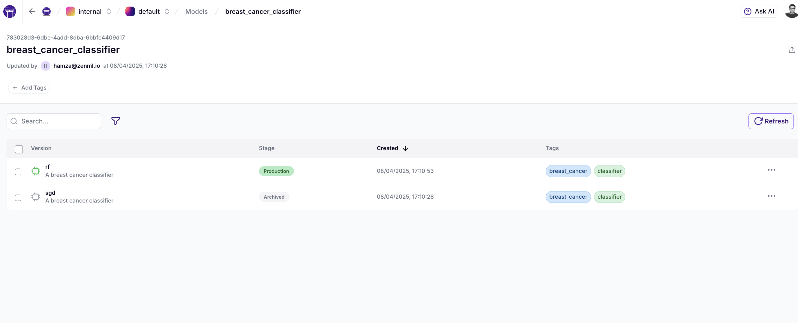

# 🔬 OncoClear

A production-ready MLOps pipeline for accurate breast cancer classification using machine learning.

## 🚀 Product Overview

OncoClear is an end-to-end MLOps solution that transforms raw diagnostic measurements into reliable cancer classification predictions. Built with ZenML's robust framework, it delivers enterprise-grade machine learning pipelines that can be deployed in both development and production environments.

<div align="center">
  <br/>
    
  <br/>
</div>

### Key Features

- **End-to-End MLOps Pipeline**: From feature engineering to model deployment
- **Automatic Model Versioning**: Track and compare different model versions
- **Model Promotion Workflow**: Automatically promote best-performing models to production
- **Batch Inference Pipeline**: Run predictions on new data with production models
- **Local API Deployment**: Serve models through a FastAPI endpoint

## 💡 How It Works

The OncoClear project consists of four integrated pipelines:

1. **Feature Engineering Pipeline**
   - Loads the Wisconsin Breast Cancer diagnostic dataset
   - Performs data preprocessing and cleaning
   - Splits data into training and testing sets
   - Versions and tracks datasets in the ZenML artifact store

   <div align="center">
     <br/>
       
     <br/>
   </div>

2. **Training Pipeline**
   - Trains multiple classification models (SGD and Random Forest)
   - Evaluates models on test data using accuracy, precision, recall, and F1 score
   - Registers models in the ZenML Model Control Plane
   - Automatically promotes the best performer to production

   <div align="center">
     <br/>
       
     <br/>
   </div>

3. **Inference Pipeline**
   - Uses the production model to generate predictions on new data
   - Leverages the same preprocessing pipeline used during training
   - Tracks predictions as model artifacts

   <div align="center">
     <br/>
       
     <br/>
   </div>

4. **Deployment Pipeline**
   - Deploys the production model as a FastAPI service
   - Makes the model accessible via REST API
   - Provides interactive Swagger documentation

   <div align="center">
     <br/>
       
     <br/>
   </div>

## 🔧 Getting Started

### Prerequisites

- Python 3.9+
- ZenML installed and configured

### Installation

1. Set up your environment:

```bash
# Clone the repository
git clone https://github.com/zenml-io/zenml-projects.git
cd zenml-projects/oncoclear

# Create and activate a Python virtual environment
python -m venv .venv
source .venv/bin/activate  # On Windows: .venv\Scripts\activate

# Install dependencies
pip install -r requirements.txt

# Install required integrations
zenml integration install sklearn pandas -y

# Initialize ZenML (if not already initialized)
zenml init
```

### Running the Pipelines

Execute the pipelines in sequence to train and deploy your breast cancer detection model:

```bash
# Start the ZenServer to enable dashboard access (optional)
zenml login

# Run the feature engineering pipeline
python run.py --feature-pipeline

# Run the training pipeline
python run.py --training-pipeline

# Run the training pipeline with versioned artifacts
python run.py --training-pipeline --train-dataset-version-name=1 --test-dataset-version-name=1

# Run the inference pipeline
python run.py --inference-pipeline

# Deploy model locally with FastAPI
python run.py --deploy-locally --deployment-model-name=breast_cancer_classifier
```

After execution, access your model at http://localhost:8000 and view API documentation at http://localhost:8000/docs.

<div align="center">
  <br/>
    
  <br/>
</div>

## 🚢 Deployment Options

OncoClear provides flexible options for deploying your trained models in various environments.

### Understanding Local Deployment

When you run `python run.py --deploy-locally`, the deployment pipeline performs the following steps:

1. **Build Docker Image**: Creates a containerized FastAPI application with the selected model
   - The pipeline executes `build_deployment_image` step which:
     - Copies necessary code from the project to the Docker build context
     - Builds a Docker image using the Dockerfile in the `api/` directory
     - Tags the image with the model name and stage

2. **Run Container**: Deploys the container locally with appropriate environment variables
   - The pipeline executes `run_deployment_container` step which:
     - Configures the container with ZenML server details and API key
     - Maps the specified ports for access (default: 8000)
     - Sets environment variables for model access
     - Outputs the service URL and API documentation URL

The Dockerfile in the `api/` directory contains the instructions for building the deployment image. The core of the deployment is a FastAPI application in `api/main.py` that:

- Loads the specified model from the ZenML Model Control Plane
- Loads the preprocessing pipeline to ensure consistent data transformations
- Exposes endpoints for predictions and model information
- Includes Swagger/OpenAPI documentation for easy testing

<div align="center">
  <br/>
    
  <br/>
</div>

### Configuring Artifact Store Dependencies

By default, the API service is configured to work with AWS S3 artifact storage, which is reflected in `api/requirements.txt`:

```
# AWS dependencies for S3 artifact store
aws-profile-manager
boto3
s3fs>=2022.3.0
```

To adapt the deployment for different artifact stores:

1. **For GCP Cloud Storage**: Replace the AWS dependencies with:
   ```
   # GCP dependencies for GCS artifact store
   google-cloud-storage>=2.9.0
   gcsfs>=2022.3.0
   ```

2. **For Azure Blob Storage**: Replace the AWS dependencies with:
   ```
   # Azure dependencies for Blob Storage artifact store
   azure-storage-blob>=12.17.0
   adlfs>=2021.10.0
   ```

3. **For local filesystem**: Remove the cloud storage dependencies.

### Extending to Kubernetes Deployment

To deploy OncoClear on Kubernetes:

1. **Create Kubernetes Deployment Manifest**: Create a file named `k8s/deployment.yaml`:
   ```yaml
   apiVersion: apps/v1
   kind: Deployment
   metadata:
     name: oncoclear-api
   spec:
     replicas: 3
     selector:
       matchLabels:
         app: oncoclear-api
     template:
       metadata:
         labels:
           app: oncoclear-api
       spec:
         containers:
         - name: oncoclear-api
           image: ${YOUR_REGISTRY}/oncoclear:production
           ports:
           - containerPort: 8000
           env:
           - name: ZENML_SERVER_URL
             value: "${ZENML_SERVER_URL}"
           - name: ZENML_API_KEY
             valueFrom:
               secretKeyRef:
                 name: zenml-api-secret
                 key: api_key
           - name: MODEL_NAME
             value: "breast_cancer_classifier"
           - name: MODEL_STAGE
             value: "production"
           resources:
             limits:
               cpu: "1"
               memory: "512Mi"
             requests:
               cpu: "0.5"
               memory: "256Mi"
   ```

2. **Create Kubernetes Service Manifest**: Create a file named `k8s/service.yaml`:
   ```yaml
   apiVersion: v1
   kind: Service
   metadata:
     name: oncoclear-api
   spec:
     selector:
       app: oncoclear-api
     ports:
     - port: 80
       targetPort: 8000
     type: LoadBalancer
   ```

3. **Create Kubernetes Secret for ZenML API Key**:
   ```bash
   kubectl create secret generic zenml-api-secret --from-literal=api_key=YOUR_ZENML_API_KEY
   ```

4. **Deploy to Kubernetes**:
   ```bash
   kubectl apply -f k8s/deployment.yaml
   kubectl apply -f k8s/service.yaml
   ```

## 🌍 Running on Remote ZenML Stacks

OncoClear pipelines can run on various cloud environments using ZenML stacks. Here's how to set up and run on remote infrastructure:

### Setting Up Remote Stacks

1. **Register Stack Components**:
   ```bash
   # Register a remote artifact store (e.g., S3)
   zenml artifact-store register s3_store --flavor=s3 --path=s3://your-bucket-name

   # Register an orchestrator (e.g., Kubeflow)
   zenml orchestrator register kubeflow_orchestrator --flavor=kubeflow \
     --kubernetes_context=your-context --namespace=zenml

   # Register a container registry
   zenml container-registry register ecr_registry --flavor=aws --uri=your-ecr-uri

   # Register the stack with these components
   zenml stack register remote_stack \
     -a s3_store \
     -o kubeflow_orchestrator \
     -c ecr_registry
   
   # Activate the stack
   zenml stack set remote_stack
   ```

2. **Cloud-Specific Configurations**:

   For **AWS**:
   ```yaml
   # configs/aws_training.yaml
   settings:
     docker:
       required_integrations:
         - s3
         - sklearn
         - pandas
         - aws
       requirements:
         - pyarrow
         - boto3
   ```

   For **GCP**:
   ```yaml
   # configs/gcp_training.yaml
   settings:
     docker:
       required_integrations:
         - gcp
         - sklearn
         - pandas
       requirements:
         - pyarrow
         - google-cloud-storage
   ```

3. **Run Pipelines on Remote Stack**:
   ```bash
   # Run with cloud-specific config
   python run.py --training-pipeline --config gcp_training.yaml
   ```

## 📊 Model Control Plane

OncoClear leverages ZenML's Model Control Plane to:

- Track all trained model versions
- Compare model performance metrics
- Promote models to production based on performance
- Link models to their training artifacts and code

```shell
# List all models
zenml model list

# Get details about a specific model version
zenml model version describe breast_cancer_classifier rf

# Promote a model to production
zenml model version update breast_cancer_classifier rf --stage production
```

If you are a [ZenML Pro](https://zenml.io/pro) user, you can visualize the entire model lifecycle in the dashboard.

<div align="center">
  <br/>
    
  <br/>
</div>

## 📁 Project Structure

OncoClear follows a modular architecture:

```
├── api/                     # API components for model serving
├── configs/                 # Pipeline configuration profiles
│   ├── feature_engineering.yaml
│   ├── inference.yaml
│   ├── training_rf.yaml
│   └── training_sgd.yaml
├── pipelines/               # Core pipeline definitions
│   ├── feature_engineering.py
│   ├── inference.py
│   ├── training.py
│   └── local_deployment.py
├── steps/                   # Individual pipeline components
│   ├── data_loader.py
│   ├── data_preprocessor.py
│   ├── model_trainer.py
│   └── ...
├── utils/                   # Shared utility functions
├── run.py                   # Command-line interface
└── requirements.txt         # Project dependencies
```

## 📚 Learn More

For detailed documentation on building MLOps pipelines with ZenML, visit the [ZenML Documentation](https://docs.zenml.io/). In particular, the [Production Guide](https://docs.zenml.io/user-guides/production-guide/) goes into more detail about transitioning pipelines to production in the cloud.

The best way to get a production ZenML instance up and running with all batteries included is with [ZenML Pro](https://zenml.io/pro). Check it out!

Also, make sure to join our <a href="https://zenml.io/slack" target="_blank">
    
    <b>Slack Community</b> 
</a> to become part of the ZenML family! 
