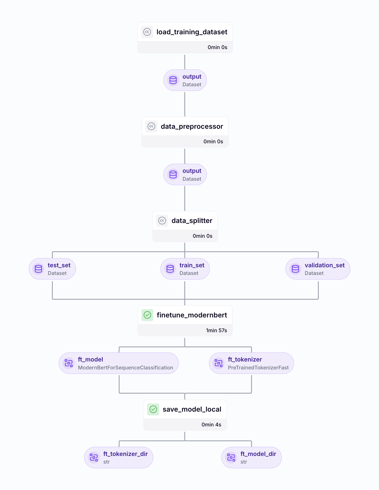
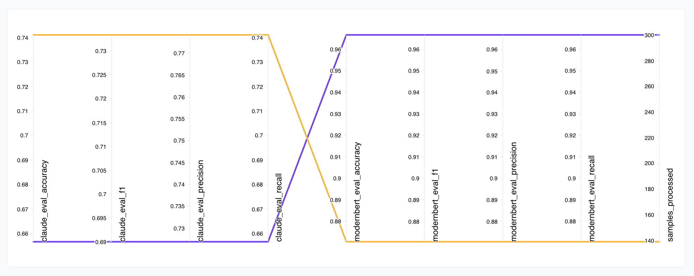

# 🚀 ResearchRadar: AI Literature Discovery and Classification Pipeline

This project demonstrates how AI researchers can build an automated pipeline to discover, classify, and organize research papers relevant to their specific subfields. Using ZenML's end-to-end ML pipelines, researchers can train models to automatically identify papers that align with their research interests—whether it's reinforcement learning, computer vision, NLP, or emerging areas like multimodal models—from across various sources including preprint servers, journals, and conference proceedings.

<div align="center">
  
</div>

The system showcases how researchers can fine-tune models to recognize subtle distinctions between related subfields, saving countless hours normally spent manually filtering through the overwhelming volume of AI research being published daily. The comparative analysis pipeline demonstrates whether custom-trained models outperform commercial APIs when identifying highly specialized technical content, helping research teams make informed decisions about their literature review infrastructure.

This framework is ideal for academic labs, industry research groups, and individual AI researchers who need to maintain comprehensive awareness of relevant publications without spending hours each week manually sifting through papers. By deploying the trained model to Hugging Face, teams can create shared resources that help all members stay current with literature relevant to their collective research agenda, streamlining collaboration and reducing duplicate effort in literature reviews.

This specific example showcases how to build an end-to-end ML pipeline that automatically classifies LLMOps-related research papers for the [ZenML LLMOps Database](https://www.zenml.io/llmops-database). You can adapt it for your specific use case. Our implementation showcases a complete workflow that:

- Classifies articles using DeepSeek R1 (Classification Pipeline)
- Fine-tunes [ModernBERT](https://www.answer.ai/posts/2024-12-19-modernbert.html) for the classification task (Training Pipeline)
- Provides comprehensive metrics tracking (Training Pipeline)
- Compares the fine-tuned model against Claude Haiku (Comparison Pipeline)
- Deploys the fine-tuned model to Hugging Face (Deployment Pipeline)

The project is designed to be user-friendly, accommodating users with or without GPUs and providing flexible training options. It handles all aspects of the MLOps lifecycle from data preparation to model deployment.

## 🌟 Key Features

- **Datasets for Evaluation, Augmentation, and Training**:
  - Composite dataset of manually labeled positive and negative examples
  - Non-classified (unlabeled) examples for augmentation
- **Multi-environment Training Support**: Run training locally or on remote infrastructure via step operators
- **Comprehensive Metrics**: Track accuracy, F1 score, latency, memory usage, and cost analysis
- **Comparative Analysis**: Benchmark your fine-tuned model against Claude Haiku

## 📋 Demo Workflow

### Step 1: Run the classification pipeline in evaluation or augmentation mode

```bash
# For evaluation: Test classification on known articles
python run.py classify --mode evaluation

# For augmentation: Classify new articles to expand your training dataset
python run.py classify --mode augmentation
```

### Step 2: Train the classifier model

```bash
# With default config (`base_config.yaml`):
python run.py train
```

> **Note**: The training pipeline automatically prioritizes the augmented dataset (if created in Step 1 with `--mode augmentation`), falling back to the composite dataset if no augmented dataset exists.

#### Remote Training

The LLMOps Article Classifier can also be trained and served remotely on your cloud infrastructure:

1. **Set up your cloud environment**:

   - Register an [orchestrator](https://docs.zenml.io/stack-components/orchestrators) or [step operator](https://docs.zenml.io/stack-components/step-operators) with GPU access (at least 24GB VRAM)
   - Register a remote [artifact store](https://docs.zenml.io/stack-components/artifact-stores) and [container registry](https://docs.zenml.io/stack-components/container-registries)
   - To access GPUs with sufficient VRAM, you may need to increase your GPU quota ([AWS](https://docs.aws.amazon.com/servicequotas/latest/userguide/request-quota-increase.html), [GCP](https://console.cloud.google.com/iam-admin/quotas), [Azure](https://learn.microsoft.com/en-us/azure/machine-learning/how-to-manage-quotas?view=azureml-api-2#request-quota-and-limit-increases))
   - If the CUDA version on your GPU instance is incompatible with the default Docker image, modify it in the configuration file. See [available PyTorch images](https://hub.docker.com/r/pytorch/pytorch/tags)

   ```shell
   # Register a complete stack with GPU support
   zenml stack register your-gcp-gpu-stack -o <ORCHESTRATOR_NAME> \
       -a <ARTIFACT_STORE_NAME> \
       -c <CONTAINER_REGISTRY_NAME> \
       [-s <STEP_OPERATOR_NAME>]
   ```

   - Install the ZenML integration (`gcp`, `aws`, or `azure`):

     ```shell
     zenml integration install <INTEGRATION_NAME>
     ```

2. **Update the config file**:

   - Modify the `remote_finetune.yaml` file to use your remote stack.
   - You may also specify/modify the docker settings in the config file.

3. **Launch remote training**:
   ```shell
   python run.py train --config remote_finetune.yaml
   ```

#### Additional training options:

- `--config`: Path to YAML config file (defaults to "base_config.yaml")
- `--save-test`: Save test set to disk for later evaluation
- `--no-cache`: Disable caching for the pipeline run

### Step 3: Evaluate and compare the fine-tuned ModernBERT model against Claude Haiku

```bash
python run.py compare
```

<p align="center">
  
</p>

### Step 4: Deploy your model (Optional)

- Deploys the fine-tuned ModernBERT model to Hugging Face Hub
- Requires a Hugging Face account with API token (+ write access)
- Modify `huggingface_repo` in the `base_config.yaml` file with your own repo name

```bash
python run.py deploy
```

## 🛠️ Getting Started

### Prerequisites

- Python 3.11+
- ZenML 0.80.0+
- Hugging Face account with API token
- Anthropic API key (optional, for model comparison)

### Installation

1. Install LLMops Article Classifier

```bash
# Set up a Python virtual environment
python3 -m venv venv
source venv/bin/activate  # On Windows: venv\Scripts\activate

# Install requirements
pip install -r requirements.txt
```

2. Set up environment variables
```bash
cp .env.example .env  # add your HF_TOKEN and ANTHROPIC_API_KEY
```


### Configuration

The project uses `base_config.yaml` for configuration, with sensible defaults for demo purposes. Key settings include:

- **Remote Execution**: Configure Docker settings and GPU preferences
- **Sample Dataset**: Control size and characteristics of sample data
- **Training Parameters**: Adjust learning rate, batch size, etc.
- **Model Parameters**: Specify base model and deployment details

## 📈 Pipeline Details

### Classification Pipeline

Processes articles from various sources:

- LLMOps Database for positive examples
- Manually labeled negative examples
- DeepSeek-generated synthetic examples

### Training Pipeline

Fine-tunes ModernBERT with:

- Automatic hardware optimization
- Early stopping and learning rate scheduling
- Comprehensive metrics logging
- Test set evaluation

### Comparison Pipeline

Evaluates fine-tuned model against Claude Haiku:

- Performance metrics (accuracy, F1, precision, recall)
- Latency measurements
- Cost analysis
- Memory usage

### Deployment Pipeline

Prepares model for serving:

- Hugging Face Hub deployment
- Local artifact export
- Metadata tracking

## 📁 Project Structure

The project follows the recommended ZenML project structure:

```
.
├── pipelines/          # Core pipeline definitions
│   ├── classification.py   # Classification pipeline
│   ├── training.py         # Training pipeline
│   ├── deployment.py       # Deployment pipeline
│   └── model_comparison.py # Model comparison pipeline
├── steps/              # Individual pipeline components
│   ├── data_loader.py             # Load datasets
│   ├── data_preprocessor.py       # Preprocess articles
│   ├── finetune_modernbert.py     # Finetune ModernBERT
│   ├── classify_articles.py       # Classify articles
│   ├── compare_models.py          # Compare models
│   ├── load_test_set.py           # Load test set
│   ├── save_classifications.py    # Save classifications
│   ├── save_model_local.py        # Export model artifacts
│   └── ...                        # Additional steps
├── schemas/            # Data models and validation
│   ├── classification_output.py   # Output schema
│   ├── input_article.py           # Input schema
│   ├── training_config.py         # Training arguments schema
│   ├── config_models.py           # Config models
│   ├── claude_response.py         # Claude response schema
│   └── zenml_project.py           # ZenML model (renamed to project) metadata
├── utils/              # Helper functions
│   ├── checkpoint.py              # Training checkpoints
│   ├── claude_evaluator.py        # Claude API integration
│   ├── classification_helpers.py  # Classification utilities
│   └── ...                        # Additional utilities
├── materializers/      # Custom ZenML materializers
├── data/               # Dataset storage
├── models/             # Output model directory
└── run.py              # CLI entrypoint
```

## 📚 Additional Documentation

The project includes detailed documentation in various subdirectories:
- **[Data Documentation](data/README.md)**: Details on dataset storage and processing.
- **[Classification Results Documentation](classification_results/README.md)**: Explanation of classification outputs, metrics, and the checkpoint system.
- **[Model Comparison Metrics Documentation](model_compare_metrics/README.md)**: Details on the model comparison.
- **[Pipelines Documentation](pipelines/README.md)**: Details on the pipeline definitions.
- **[Prompts Documentation](prompts/README.md)**: Details on the prompts used in the pipeline.
- **[Schemas Documentation](schemas/README.md)**: Details on data models and validation.
- **[Steps Documentation](steps/README.md)**: Information about individual pipeline components including model comparison and metrics.
- **[Utils Documentation](utils/README.md)**: Details on helper functions, checkpoint system, classification utilities, and data processing.

## 📜 License

This project is licensed under the Apache License 2.0 - see the [LICENSE](LICENSE) file for details.

Copyright 2025 ZenML GmbH
