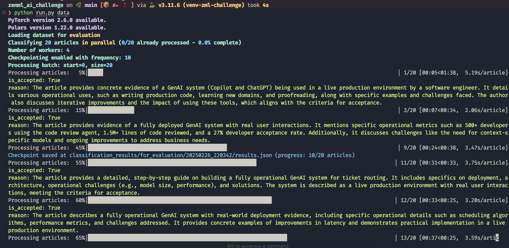
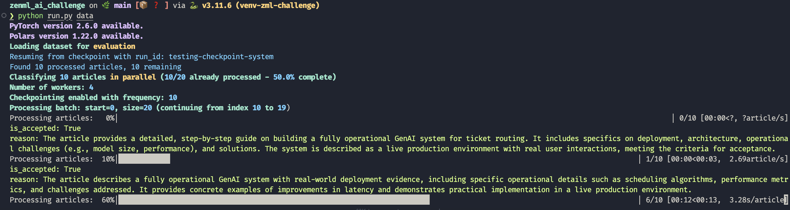

# Utils Directory

This directory contains utility functions and helper modules used throughout the project.

## Classification Utilities

- [`checkpoint.py`](checkpoint.py): Checkpoint utilities
  - Checkpointing utility file for long running tasks so that they can be resumed from the same point if interrupted
  - Includes functions for saving and loading classification results from checkpoints
  - Provides detailed logging of checkpoint progress, including percentage completion
- [`classification_helpers.py`](classification_helpers.py): Core utilities for article classification
  - Functions for interacting with the HuggingFace inference API
  - Error handling and retry mechanisms
  - Support for both sequential and parallel processing
  - Parallel processing implementation using ThreadPoolExecutor for efficient I/O-bound tasks
  - Sequential processing with built-in progress tracking and error handling
  - Contains safe processing wrappers that ensure errors in one article don't affect others
- [`classification_metrics.py`](classification_metrics.py): Metrics calculation for classification results
  - Calculates agreement metrics between ground truth and model classifications
  - Filters out error entries for accurate metrics
  - Generates detailed reports in both JSON and Markdown formats
  - Tracks error frequencies and types
- [`prompt.py`](prompt.py): Utilities for prompt engineering
  - Text cleaning and preprocessing
  - Standardized prompt formatting for DeepSeek
  - System and user prompt templates

## Training and Evaluation Utilities

- [`training_eval_metrics.py`](training_eval_metrics.py): Model training evaluation metrics
  - Computing classification performance metrics (accuracy, F1, precision, recall)
  - Measuring inference latency and estimating costs
  - Calculating resource usage (memory, time)
  - Flattening nested metrics for compatibility with ZenML tracking
- [`claude_evaluator.py`](claude_evaluator.py): Claude Haiku evaluation utilities
  - API interaction with Claude Haiku
  - Response parsing and validation
  - Caching mechanisms to reduce redundant API calls
  - Error handling for API reliability

## Data Processing Utilities

- [`json_parser.py`](json_parser.py): JSON extraction and parsing
  - Reliable JSON extraction from model responses
  - Error handling for malformed JSON
- [`merge.py`](merge.py): Dataset merging utilities
  - Transformation of classification results
  - Identifier generation for consistent tracking

## Configuration and Logging

- [`load_config.py`](load_config.py): Configuration management
  - YAML settings loading
  - Configuration validation using Pydantic
  - Environment-specific configuration handling
- [`logger.py`](logger.py): Custom logging utilities
  - Colorized console output
  - Structured logging functions for different message types
  - Process tracking and success/error indicators
  - Comprehensive reporting for classification progress with percentage-based tracking

## Checkpoint System

### Starting a New Classification Pipeline Run

_During execution, the system creates checkpoints at the specified frequency (default: every 10 articles), saving progress to the `results.json` file in the appropriate `classification_results` directory._

### Resuming from Checkpoint

_Resuming from a checkpoint allows the pipeline to continue from where it left off, useful for long running tasks in case of interruptions._

> The image above shows the pipeline successfully resuming from an existing checkpoint with `run_id: "testing-checkpoint-system"`, continuing from where it left off with 10 articles already processed (50% complete).

## Parallel and Sequential Processing

The classification system offers two processing modes:

### Parallel Processing (`process_articles_parallel`)

- Uses Python's `ThreadPoolExecutor` to process multiple articles concurrently
- Designed for I/O-bound tasks (like API calls) rather than CPU-bound tasks
- Features:
  - Configurable worker count to control parallelism
  - Built-in progress tracking with tqdm
  - Fault tolerance: errors in one article don't affect others
  - Checkpoint integration at configurable intervals
  - Detailed logging of success and failure cases

### Sequential Processing (`process_articles_sequential`)

- Processes articles one at a time in a simple loop
- Features:
  - Same progress tracking interface as parallel processing
  - Same error handling and checkpoint integration
  - Useful for debugging or when API rate limits are strict
  - Simpler execution flow and potentially more predictable behavior

Both processing methods maintain the same interface and return the same type of results, making them interchangeable based on configuration.
