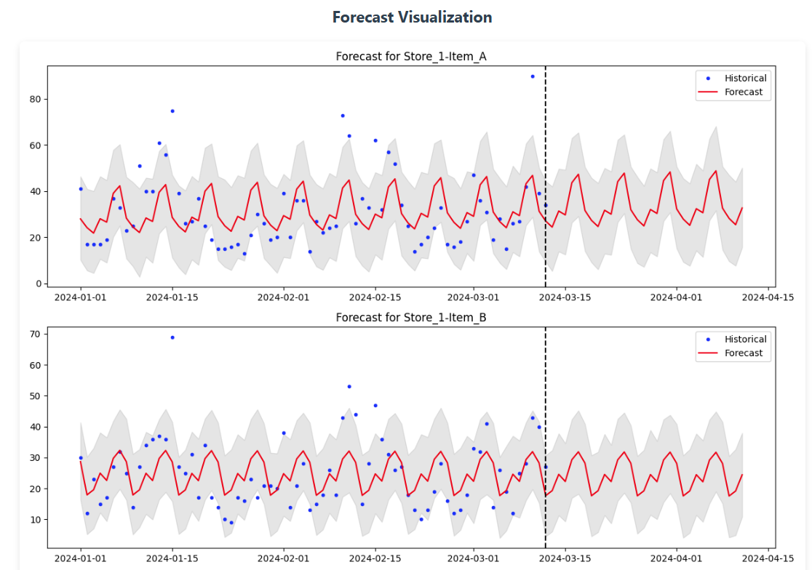
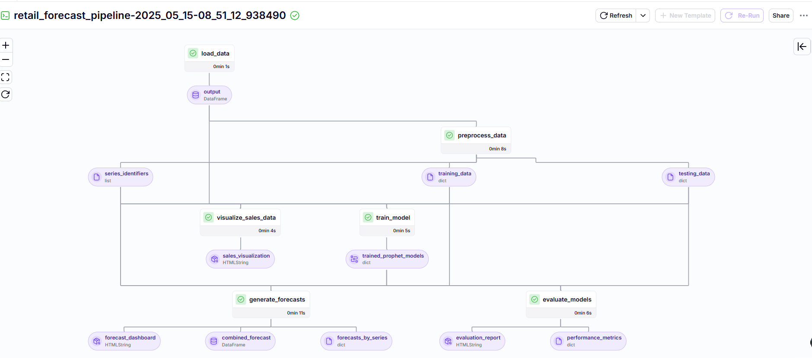
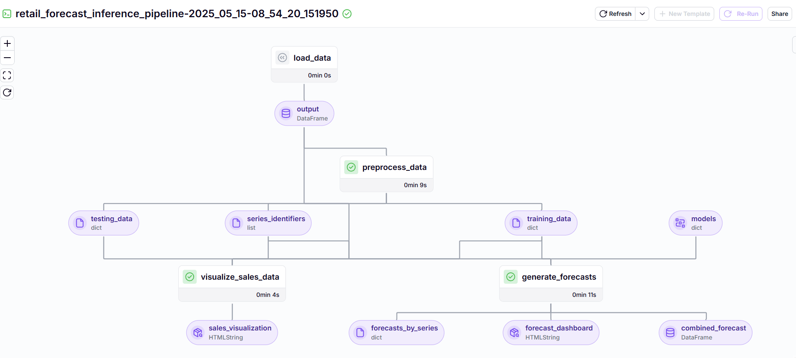
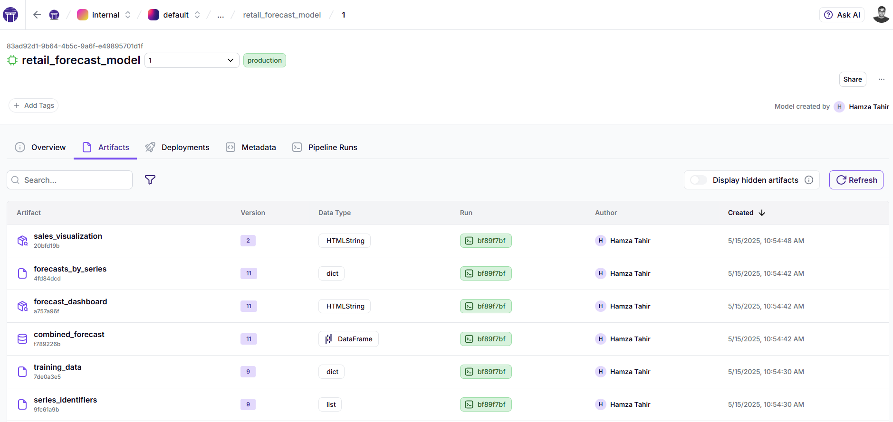

# RetailForecast: Production-Ready Sales Forecasting with ZenML and Prophet

A robust MLOps pipeline for retail sales forecasting designed for retail data scientists and ML engineers.

## 📊 Business Context

In retail, accurate demand forecasting is critical for optimizing inventory, staff scheduling, and financial planning. This project provides a production-ready sales forecasting solution that can be immediately deployed in retail environments to:

- Predict future sales volumes across multiple stores and products
- Capture seasonal patterns and trends in customer purchasing behavior
- Support data-driven inventory management and purchasing decisions
- Provide actionable insights through visual forecasting dashboards

<div align="center">
  <br/>
    
  <br/>
  <p><em>HTML dashboard visualization showing forecasts with uncertainty intervals</em></p>
</div>

## 🔍 Data Overview

The pipeline works with time-series retail sales data structured as follows:

| Field | Description |
|-------|-------------|
| date | Date of sales record (YYYY-MM-DD) |
| store | Store identifier (e.g., Store_1, Store_2) |
| item | Product identifier (e.g., Item_A, Item_B) |
| sales | Number of units sold |
| price | Unit price |

The system automatically handles:
- Multiple store/item combinations as separate time series
- Train/test splitting for model validation
- Proper data transformations required by Prophet
- Missing value imputation and outlier detection

<div align="center">
  <br/>
    
  <br/>
  <p><em>Interactive visualization of historical sales patterns</em></p>
</div>

## 🚀 Pipeline Architecture

The project includes two primary pipelines:

### 1. Training Pipeline

The training pipeline performs the following steps:

1. **Data Loading**: Imports historical sales data from CSV files
2. **Data Preprocessing**: 
   - Transforms data into Prophet-compatible format
   - Creates separate time series for each store-item combination
   - Performs train/test splitting based on configurable ratio
3. **Model Training**: 
   - Trains multiple Facebook Prophet models simultaneously, one for each store-item combination
   - Configures seasonality parameters based on domain knowledge
   - Handles price changes as regressors when available
4. **Model Evaluation**:
   - Calculates MAPE, RMSE, and MAE metrics on test data
   - Generates visual diagnostics for model performance
5. **Forecasting**:
   - Produces forecasts with uncertainty intervals
   - Creates interactive HTML visualizations

<div align="center">
  <br/>
    
  <br/>
  <p><em>ZenML visualization of the training pipeline DAG</em></p>
</div>

### 2. Inference Pipeline

The inference pipeline enables fast forecasting with pre-trained models:

1. **Data Loading**: Imports the most recent sales data
2. **Data Preprocessing**: Transforms data into Prophet format
3. **Forecasting**: Generates predictions using production models
4. **Visualization**: Creates interactive dashboards with forecasts

<div align="center">
  <br/>
    
  <br/>
  <p><em>ZenML visualization of the inference pipeline DAG</em></p>
</div>

## 📈 Model Details

The forecasting solution uses Facebook Prophet, chosen specifically for its combination of accuracy and simplicity in retail forecasting scenarios:

- **Multiple Models Approach**: Rather than a one-size-fits-all model, we generate individual Prophet models for each store-item combination, allowing forecasts that capture the unique patterns of each product in each location
- **Components**: Prophet automatically decomposes time series into trend, seasonality, and holidays
- **Seasonality**: Captures weekly, monthly, and yearly patterns in sales data
- **Special Events**: Handles holidays and promotions as custom seasonality effects
- **Uncertainty Estimation**: Provides prediction intervals for better inventory planning
- **Extensibility**: Supports additional regressors like price and marketing spend

Prophet was selected for this solution because it excels at:
- Handling missing data and outliers common in retail sales data
- Automatically detecting seasonal patterns without extensive feature engineering
- Providing intuitive parameters that business users can understand
- Scaling to thousands of individual time series efficiently


## 💻 Technical Implementation

The project leverages ZenML's MLOps framework to provide:

- **Model Versioning**: Track all model versions and their performance metrics
- **Reproducibility**: All experiments are fully reproducible with tracked parameters
- **Pipeline Caching**: Speed up experimentation with intelligent caching of pipeline steps
- **Artifact Tracking**: All data and models are properly versioned and stored
- **Deployment Ready**: Models can be directly deployed to production environments

A key innovation in this project is the custom ProphetMaterializer that enables:
- Serialization/deserialization of Prophet models for ZenML artifact storage
- Handling dictionaries of multiple Prophet models in a single artifact
- Efficient model loading for batch inference at scale

<div align="center">
  <br/>
    
  <br/>
  <p><em>ZenML model registry tracking model versions and performance</em></p>
</div>

## 🛠️ Getting Started

### Prerequisites

- Python 3.8+
- ZenML installed and configured

### Installation

```bash
# Clone the repository
git clone https://github.com/zenml-io/zenml-projects.git
cd zenml-projects/retail-forecast

# Install dependencies
pip install -r requirements.txt

# Initialize ZenML (if needed)
zenml init
```

### Running the Pipelines

To train models and generate forecasts:

```bash
# Run the training pipeline (default)
python run.py

# Run with custom parameters
python run.py --forecast-periods 60 --test-size 0.3 --weekly-seasonality True
```

To make predictions using existing models:

```bash
# Run the inference pipeline
python run.py --inference
```

### Viewing Results

Start the ZenML dashboard:

```bash
zenml login
```

Navigate to the dashboard to explore:
- Pipeline runs and their status
- Model performance metrics
- Interactive forecast visualizations
- Version history of all models

## 🔄 Integration with Retail Systems

This solution can be integrated with existing retail systems:

- **Inventory Management**: Connect forecasts to automatic reordering systems
- **ERP Systems**: Feed forecasts into financial planning modules
- **BI Dashboards**: Export forecasts to Tableau, Power BI, or similar tools
- **Supply Chain**: Share forecasts with suppliers via API endpoints

## 📊 Example Use Case: Store-Level Demand Planning

A retail chain with 50 stores and 500 products uses this pipeline to:

1. Train models on 2 years of historical sales data
2. Generate daily forecasts for the next 30 days for each store-item combination
3. Aggregate forecasts to support central purchasing decisions
4. Update models weekly with new sales data

The result: 15% reduction in stockouts and 20% decrease in excess inventory.


## 📄 License

This project is licensed under the Apache License 2.0.
