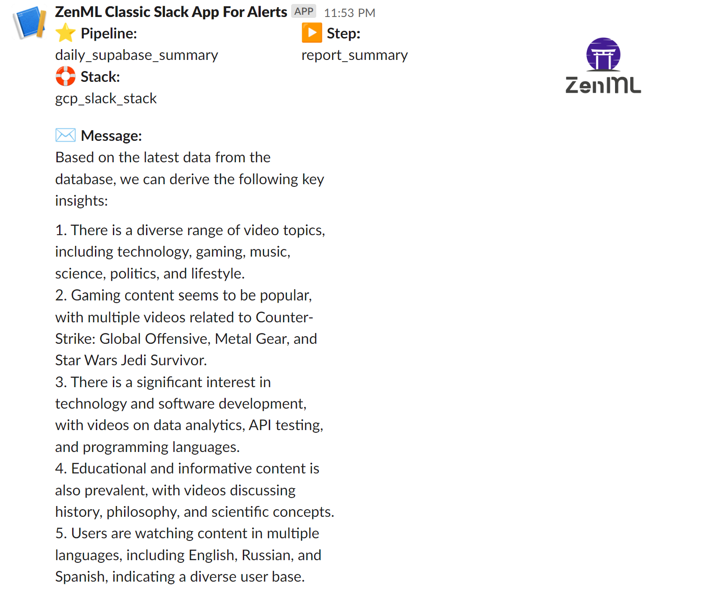

# Generate Daily Summary of Supabase Database using GPT-4 and ZenML

This project demonstrates how to create a daily summary of a [Supabase](https://supabase.com) database using [OpenAI GPT-4](https://openai.com/gpt4) and [ZenML](https://zenml.io). We use the YouTube video titles from [you-tldr](https://you-tldr.com) as an example and generate a summary of the last 24 hours of visitor activity. ZenML versions all data, allowing GPT-4 to compare the current summary to the previous one. The pipeline is executed daily using GitHub Actions and [a deployed ZenML instance in Hugging Face Spaces](https://huggingface.co/docs/hub/spaces-sdks-docker-zenml).

The output of the pipeline posts the summary to a Slack channel:



An example report might be:

1. There is a significant interest in technology and software development, with topics such as data analytics, programming languages, software tools, and game development being popular among users.

2. Users are also interested in educational and informative content, including tutorials, lectures, and discussions on various subjects such as ethics, philosophy, and economics.

3. There is a noticeable trend in content related to personal development and self-improvement, with videos on productivity, decision-making, and life advice.

The key advantage of this project is its ability to analyze enterprise datasets and generate summaries over time. By integrating ZenML, GPT-4, and Supabase, we can create a versatile system applicable to various use cases. For example, one compelling application is in customer support. Imagine using this pipeline to analyze and summarize customer feedback, support tickets, or product reviews. The summaries could help identify common pain points, trends, or areas for improvement, providing valuable insights for product development teams to prioritize features and enhancements based on real customer feedback.

You can easily modify or send different parameters to your database by modifying the [`importer` step](src/steps/importers.py) and change the preset prompts and system inputs, or even the LLM service used in the [`generate_summary` step](src/steps/summarizers.py)

## Installation

Install the required packages using the `requirements.txt` file in the `/src` directory:

```bash
pip install -r src/requirements.txt
```

## Connect to Your Deployed ZenML

In order to run a ZenML pipeline remotely (e.g. on the cloud), we first need to
[deploy ZenML](https://docs.zenml.io/user-guide/production-guide/deploying-zenml#connecting-to-a-deployed-zenml). One of the
easiest ways to do this is to [deploy ZenML with HuggingFace spaces](https://docs.zenml.io/deploying-zenml/deploy-using-huggingface-spaces).

Afterward, establish a connection with your deployed ZenML instance:

```bash
zenml connect --url https://*** --username *** --password ***
```

## Create Secrets

Create the necessary secrets for Supabase and OpenAI:

```bash
# These are supplied when you create a new project in your project dashboard.
zenml secret create supabase \
    --supabase_url=$SUPABASE_URL \
    --supabase_key=$SUPABASE_KEY

# Make sure to have access to GPT-4 (https://openai.com/gpt4)
# You can get your keys at https://platform.openai.com/account/api-keys
zenml secret create openai --api_key=$OPENAPI_API_KEY   
```

## Run the Pipeline Locally

Once the installation is complete, you can run the pipeline locally:

```bash
python run.py
```

Note that the pipeline uses parameters for a private Supabase database for a particular use-case for you-tldr.com. However, you can easily modify or send different parameters to the [`importer` step](src/steps/importers.py) for your own database needs.

You can also modify the preset prompts and system inputs in the [`generate_summary` step](src/steps/summarizers.py)

## Run the Pipeline on a Remote Stack with Alerter

To run the pipeline on a remote stack with [an artifact store](https://docs.zenml.io/stack-components/artifact-stores) and [a Slack alerter](https://docs.zenml.io/stack-components/alerters/slack), follow these steps:

1. Install the GCP and Slack integrations for ZenML:

    ```bash
    zenml integration install gcp slack -y
    ```

2. Register the GCP artifact store:

    ```bash
    zenml artifact-store register gcp_store -f gcp --path=gs://PATH_TO_STORE
    ```

3. Register the Slack alerter:

    ```bash
    zenml alerter register slack_alerter -f slack --slack_token=<YOUR_SLACK_TOKEN> --default_slack_channel_id=<YOUR_SLACK_CHANNEL_ID>
    ```

4. Register the stack with the GCP artifact store and Slack alerter:

    ```bash
    zenml stack register -a gcp_store -o default --alerter=slack_alerter --active
    ```

Once the stack is registered and set active, the pipeline will run on the remote stack with the GCP artifact store and send alerts to the specified Slack channel.

## Running in production: Choose your MLOps stack

ZenML simplifies scaling this pipeline by allowing seamless deployment on production-ready orchestrators like [Airflow](https://docs.zenml.io/stack-components/orchestrators/airflow) or [Kubeflow](https://docs.zenml.io/stack-components/orchestrators/kubeflow). With [native versioning on cloud storage](https://docs.zenml.io/user-guide/starter-guide/cache-previous-executions) and experiment tracking through ZenML's integration with [MLflow](https://docs.zenml.io/stack-components/experiment-trackers/mlflow), you can start locally and effortlessly transition to robust and efficient MLOps pipelines in production, unlocking valuable insights from your enterprise data.

## Example: Automate Pipeline Execution with GitHub Actions

To automate the pipeline execution every day, you can use GitHub Actions. First, store your secrets [in the GitHub repository's secrets settings](https://docs.github.com/en/codespaces/managing-codespaces-for-your-organization/managing-encrypted-secrets-for-your-repository-and-organization-for-github-codespaces). Add the following secrets:

- `GCP_SA_KEY`: Your GCP service account key in JSON format.
- `ZENML_URL`: The URL of your deployed ZenML instance.
- `ZENML_USERNAME`: The username for your deployed ZenML instance.
- `ZENML_PASSWORD`: The password for your deployed ZenML instance.
- `ZENML_STACK`: The name of the ZenML stack you registered earlier.

Next, create a `.github/workflows/main.yml` file in your project and add the following content:

```yaml
name: Daily Summary

on:
  schedule:
    - cron: '0 0 * * *'

jobs:
  run_pipeline:
    runs-on: ubuntu-latest

    steps:
    - name: Checkout repository
      uses: actions/checkout@v3

    - name: Set up Python
      uses: actions/setup-python@v2
      with:
        python-version: 3.8

    - name: Log into GCP
      uses: 'google-github-actions/auth@v1'
      with:
        credentials_json: ${{ secrets.GCP_SA_KEY }}

    - name: Install dependencies
      run: |
        python -m pip install --upgrade pip
        pip install -r src/requirements.txt
        zenml init
        zenml integration install gcp slack -y
        zenml connect --url ${{ secrets.ZENML_URL }} --username ${{ secrets.ZENML_USERNAME }} --password ${{ secrets.ZENML_PASSWORD }}
        zenml stack set ${{ secrets.ZENML_STACK }}
        python src/run.py

    - name: Run pipeline
      run: |
        python run.py
```

This configuration runs the pipeline every day at midnight. The workflow checks out the repository, sets up Python, logs into GCP, installs dependencies, connects to the deployed ZenML instance, sets the ZenML stack, and runs the pipeline.