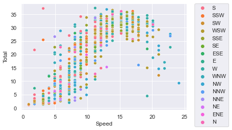

# 🍃 :arrow_right: 🔌 Predict Electricity Power Generation Based On Wind Forecast In Orkney, Scotland

By its nature, renewable energy is highly weather-dependent, and the ongoing expansion of renewables is making our global power supply more vulnerable to changing weather conditions. Predicting how much power will be generated based on the weather forecast might be crucial, especially for areas such as Orkney in Scotland.


In this repository I showcase how to:

- Build a retrainable ZenML pipeline
- Feature engineering: build numerical 2-dimensional vectors from the corresponding wind cardinal directions
- Load data from Google Cloud BigQuery as a part of a ZenML pipeline
- Train your model remotely in Google Cloud Vertex AI

## :notebook: Explanation of code

The goal is to create a pipeline that can load electricity power production and wind forecast data from Google BigQuery. We then wish to prepare and transform this data for a suitable model. The model will be trained to predict how much electricity power will be generated based on wind weather forecast (wind speed and its direction).

<p align="center">
  
</p>

The figure above explains the data that we are going to work with. We can see that with increasing wind speed the electricity power production follows a sigmoid curve as expected.

🪜 Steps of the pipeline:

- `importer.py`: Imports weather forecast and electricity power production from Google BigQuery
- `preparator.py`: Cleans and prepares the dataset
- `transformer.py`: Transforms cardinal directions (North, South...) into 2-dimensional feature vectors
- `trainer.py`: Trains a Random Forest Regressor
- `evaluator.py` Evaluates the regressor on test data

*Note: The data is included in this repository, you can therefore upload it to your own GCP project's BigQuery and follow the rest of this tutorial.*

## 🐍 Python Requirements

Using `poetry` ([install](https://python-poetry.org/docs/)):

```shell
git clone https://github.com/zenml-io/zenfiles.git
cd zenfiles/time-series-forecast
poetry install
```

Using `requirements.txt`:

```shell
git clone https://github.com/zenml-io/zenfiles.git
cd zenfiles/time-series-forecast
pip install -r requirements.txt
```

ZenML integrations:

```shell
# if using ZenML v0.8.1
zenml integration install -y sklearn gcp vertex

# if using ZenML >0.9
zenml integration install -y sklearn gcp
```

Initialize ZenML repository:

```shell
zenml init
```

## 👣  Step-by-Step on how to set up your GCP project

I will show how to create Google Cloud resources for this project using `gcloud cli`. [Follow this](https://cloud.google.com/sdk/docs/install) if you don't have it set up.

### 1. Make sure you are in the correct GCP project

List the current configurations and check that `project_id` is set to your GCP project:

```shell
gcloud config list
```

If not, use:

```shell
gcloud config set project <PROJECT_ID>
```

### 2. Import data to BigQuery

Create a bucket:

```shell
gsutil mb -p PROJECT ID gs://BUCKET_NAME

# Example:
gsutil mb -p zenml-vertex-ai gs://time-series-bucket
```

Upload the data set:

```shell
gsutil cp data/wind_forecast.csv gs://time-series-bucket
```

Create a dataset in BigQuery (BQ):

```shell
bq mk --dataset <PROJECT-ID>:<DATASET-NAME>

# Example:
bq mk --dataset computas-project-345810:zenml_dataset
```

Import data from Cloud Storage into BQ:

```shell
 bq load \
    --autodetect \
    --source_format=CSV \
    zenml_dataset.windforecast \
    gs://time-series-bucket/wind_forecast.csv
```

### 3. Set permissions to create and manage Vertex AI custom jobs and to access data from BigQuery

Create a service account:

```shell
gcloud iam service-accounts create <NAME>

# Example:
gcloud iam service-accounts create zenml-sa
```

Grant permission to the service account ([list](https://cloud.google.com/bigquery/docs/access-control) of BQ roles):

```shell
gcloud projects add-iam-policy-binding <PROJECT_ID> --member="serviceAccount:<SA-NAME>@<PROJECT_ID>.iam.gserviceaccount.com" --role=<ROLE>

# Example:
gcloud projects add-iam-policy-binding zenml-vertex-ai --member="serviceAccount:zenml-sa@zenml-vertex-ai.iam.gserviceaccount.com" --role=roles/storage.admin
gcloud projects add-iam-policy-binding zenml-vertex-ai --member="serviceAccount:zenml-sa@zenml-vertex-ai.iam.gserviceaccount.com" --role=roles/aiplatform.admin
gcloud projects add-iam-policy-binding zenml-vertex-ai --member="serviceAccount:zenml-sa@zenml-vertex-ai.iam.gserviceaccount.com" --role=roles/bigquery.admin
```

Generate a key file:

```shell
gcloud iam service-accounts keys create <FILE-NAME>.json --iam-account=<SA-NAME>@<PROJECT_ID>.iam.gserviceaccount.com

# Example:
gcloud iam service-accounts keys create credentials.json --iam-account=zenml-sa@zenml-vertex-ai.iam.gserviceaccount.com
```

Set the environment variable. To use service accounts with the Google Cloud CLI, you need to set an environment variable where your code runs:

```shell
export GOOGLE_APPLICATION_CREDENTIALS=<KEY-FILE-LOCATION>
```

For the BigQuery step you also need to point to the same file:

```python
class BigQueryImporterConfig(BaseStepConfig):
    query: str = 'SELECT * FROM `computas_dataset.windforecast`'
    project_id: str = 'computas-project-345810'

@step
def bigquery_importer(config: BigQueryImporterConfig) -> pd.DataFrame:
    credentials = service_account.Credentials.from_service_account_file('credentials.json')
    return pandas_gbq.read_gbq(config.query, project_id = config.project_id, credentials = credentials)
```

*NOTE*: You also need to change the `query` and your `project_id` accordingly.

### 4. Create a GCP bucket

Vertex AI and ZenML will use this bucket for output of any artifacts from the training run:

```shell
gsutil mb -l <REGION> gs://bucket-name

# Example:
gsutil mb -l europe-west1 gs://zenml-bucket
```

### 5. Configure and enable Container Registry in GCP

ZenML will use this registry to push your job images that Vertex will use.

a) [Enable](https://cloud.google.com/container-registry/docs) Container Registry


b) [Authenticate](https://cloud.google.com/container-registry/docs/advanced-authentication) your local `docker` cli with your GCP container registry:

```shell
docker pull busybox
docker tag busybox gcr.io/<PROJECT-ID/busybox
docker push gcr.io/<PROJECT-ID>/busybox
```

### 6. [Enable](https://console.cloud.google.com/marketplace/product/google/aiplatform.googleapis.com?q=search&referrer=search&project=cloudguru-test-project) `Vertex AI API`

To be able to use custom Vertex AI jobs, you first need to enable their API inside Google Cloud console.

### 7. Build a custom image from ZenML that will be used in the Vertex step operator

```shell
cd src
docker build --tag zenmlcustom:0.1 .
```

## 👣  Step-by-Step on how to set up the components required for ZenML stack

Set a GCP bucket as your artifact store:

```shell
zenml artifact-store register <NAME> --type=gcp --path=<GCS_BUCKET_PATH>

# Example:
zenml artifact-store register gcp-store --type=gcp --path=gs://zenml-bucket
```

Create a Vertex step operator:

```shell
zenml step-operator register <NAME> \
    --type=vertex \
    --project=<PROJECT-ID> \
    --region=<REGION> \
    --machine_type=<MACHINE-TYPE> \
    --base_image=<CUSTOM_BASE_IMAGE> #this can be left out if you wish to use zenml's default image

# Example:
zenml step-operator register vertex \
    --type=vertex \
    --project=zenml-vertex-ai \
    --region=europe-west1 \
    --machine_type=n1-standard-4 \
    --base_image=zenmlcustom:0.1
```

List of [available machines](https://cloud.google.com/vertex-ai/docs/training/configure-compute#machine-types)

Register a container registry:

```shell
zenml container-registry register <NAME> --type=default --uri=gcr.io/<PROJECT-ID>/<IMAGE>

# Example:
zenml container-registry register gcr_registry --type=default --uri=gcr.io/zenml-vertex-ai/busybox
```

Register the new stack (change names accordingly):

```shell
zenml stack register vertex_training_stack \
    -m default \
    -o default \
    -c gcr_registry \
    -a gcp-store \
    -s vertex
```

View all your stacks: `zenml stack list`

Activate the stack:

```shell
zenml stack set vertex_training_stack
```

### ▶️ Run the Code

Now we're ready. Execute:

```bash
python main.py
```

# 📜 References

Documentation on [Step Operators](https://docs.zenml.io/mlops-stacks/step-operators)

Example of [Step Operators](https://github.com/zenml-io/zenml/tree/main/examples/step_operator_remote_training)

More on [Step Operators](https://blog.zenml.io/step-operators-training/)

Documentation on how to create a GCP [service account](https://cloud.google.com/docs/authentication/getting-started#create-service-account-gcloud)

ZenML CLI [documentation](https://apidocs.zenml.io/latest/cli/)
